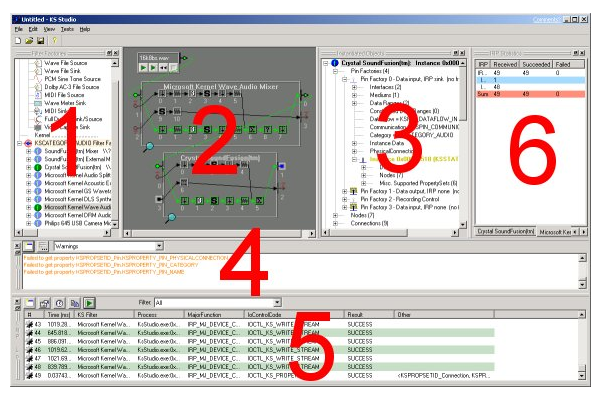

# KsStudio Utility

The KsStudio utility is a kernel streaming tool that can be used to build, examine, and test WDM KS filter graphs in Windows. One of KsStudio's most useful features is its ability to construct a graphical representation of a filter graph that shows both the pin-to-pin connections between filters and the filters' internal nodes. Although KsStudio is designed primarily for audio filter graphs, it can be used to build and explore graphs containing any type of WDM KS filter.

## Purpose of KSStudio 

Several classes of Windows drivers, particularly those in the domain of multimedia, are implemented as AVStream (formerly Kernel Streaming or KS) filters. Technologies that rely on AVStream architecture include: 

- Audio drivers, including USB and PCI device drivers, as well as effects and other intermediate filters. 

- Video capture 

KSStudio is a tool which gives the AVStream filter driver direct access to the filter under development. Its strength lies in part to the fact that it does not use any Multimedia APIs such as DirectSound, MMSystem, or DirectShow, and can, therefore be used to troubleshoot problems seen with those APIs. 

KSStudio provides the following features: 

- Filter factory enumeration 

- Filter and pin instantiation (including graph building) 

- Filter and pin profiling 

- Intra-filter topology diagramming 

- Pin connecting 

- Property setting and getting 

- Event enabling and signal indication 

- Data streaming (audio and vidcap only) 

- Basic functionality tests 

## KsStudio utility (Ksstudio.exe) installation

The KsStudio utility (Ksstudio.exe) is included with the software tools in the Microsoft Windows Driver Kit (WDK). 

To install KsStudio:

-   Run the WDK setup application.

-   From the list of components, click **Driver Development Kit**, click **Tools for Driver Developers**, and then click **Audio/Video streaming tools**.

Setup installs the platform-specific versions of KsStudio.exe in the x86, and amd64 subdirectories of the \\tools\\avstream directory.

## KsStudio menu layout and structure

#### 1) Filter Factory View

This window shows the filter factories that are installed on the system, organized by KSCATEGORY. "Test Filters" are also shown here. See Enumeration Options and Filter Factories for more information. The Filter Factory View is dockable and resizable. 

#### 2) Topology View and 3) Object Details View

These two windows show representations of all instantiated filters and their child objects (pin factories, pins, nodes, and connections). The Topology View is a conceptual representation which emphasizes the layout (topology) of filters and graphs of filters. It shows connections between pins, data paths through filters, and indicates current pin state. The *Object Details View* is a hierarchical textual representation which emphasises object relations, current values of properties, and pin and event states. These two views are cooperative in the sense that clicking on an object in one view selects the representation of the object in the other. The Object Details View is dockable and resizable. 

#### 4) Logging Window

All operations done on kernel objects in KSStudio will produce some amount of logging. This logging can go to any of 3 logging targets, namely (a) the Logging Window, (b) a log file, and/or (c) the debugger. The amount of logging can be specified for each by going to the View.Logging Options menu item. The Logging Window is dockable and resizable. 

#### 5) KSMonitor IRP Log View and 6) KSMonitor IRP Stats View

These two windows show details and statistics on the IRPs received by all specified filters. 

## See also

[KSStudio - Filters and Filter Factories](ksstudio-utility-filters-and-filter-factories.md)

[KSStudio - Pins and Nodes](ksstudio-utility-pins-and-nodes.md)

[KSStudio - KSProperties and Events](ksstudio-utility-ksproperties-and-events.md)

[KSStudio - KS Monitor](ksstudio-utility-ks-monitor.md)

[KSStudio - Usage Examples](ksstudio-utility-usage-examples.md)

 

