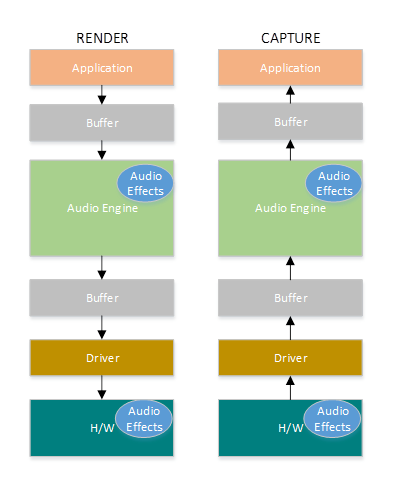
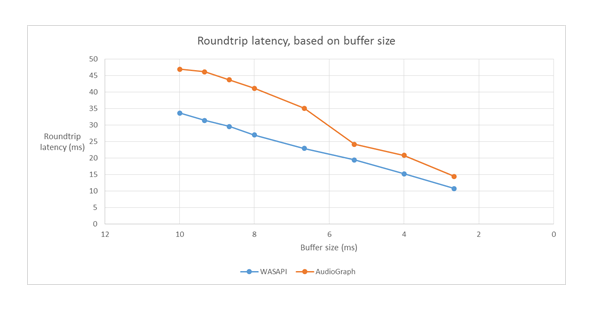

# Low Latency Audio


This topic discusses audio latency changes in Windows 10. It covers API options for application developers as well as changes in drivers that can be made to support low latency audio.

This topic contains the following sections.

-   [Overview](#overview)
-   [Definitions](#definitions)
-   [Windows Audio Stack](#windows_audio_stack)
-   [Audio Stack Improvements in Windows 10](#audio_stack_improvements_in_windows_10)
-   [API Improvements](#api_improvements)
-   [AudioGraph](#audiograph)
-   [Windows Audio Session API (WASAPI)](#windows_audio_session_api_wasapi)
-   [Driver Improvements](#driver_improvements)
-   [Measurement Tools](#measurement_tools)
-   [Samples](#samples)
-   [FAQ](#faq)

## <span id="Overview"></span><span id="overview"></span><span id="OVERVIEW"></span>Overview


Audio latency is the delay between that time that sound is created and when it is heard. Having low audio latency is very important for several key scenarios, such as the following.

-   Pro Audio
-   Music Creation
-   Communications
-   Virtual Reality
-   Games

Windows 10 includes changes to reduce the audio latency. The goals of this document are to:

1. Describe the sources of audio latency in Windows.
2. Explain the changes that reduce audio latency in the Windows 10 audio stack.
3. Provide a reference on how application developers and hardware manufacturers can take advantage of the new infrastructure, in order to develop applications and drivers with low audio latency. This topic covers these items:
4. The new [**AudioGraph**](https://msdn.microsoft.com/library/windows/apps/dn914176) API for interactive and media creation scenarios.
5. Changes in WASAPI to support low latency.
6. Enhancements in the driver DDIs.

## <span id="Definitions"></span><span id="definitions"></span><span id="DEFINITIONS"></span>Definitions


<table>
<colgroup>
<col width="50%" />
<col width="50%" />
</colgroup>
<tbody>
<tr class="odd">
<td align="left"><p>Term</p></td>
<td align="left"><p>Description</p></td>
</tr>
<tr class="even">
<td align="left"><p>Render latency</p></td>
<td align="left"><p>Delay between the time that an application submits a buffer of audio data to the render APIs, until the time that it is heard from the speakers.</p></td>
</tr>
<tr class="odd">
<td align="left"><p>Capture latency</p></td>
<td align="left"><p>Delay between the time that a sound is captured from the microphone, until the time that it is sent to the capture APIs that are being used by the application.</p></td>
</tr>
<tr class="even">
<td align="left"><p>Roundtrip latency</p></td>
<td align="left"><p>Delay between the time that a sound is captured from the microphone, processed by the application and submitted by the application for rendering to the speakers. It is roughly equal to render latency + capture latency.</p></td>
</tr>
<tr class="odd">
<td align="left"><p>Touch-to-app latency</p></td>
<td align="left"><p>Delay between the time that a user taps the screen until the time that the signal is sent to the application.</p></td>
</tr>
<tr class="even">
<td align="left"><p>Touch-to-sound latency</p></td>
<td align="left"><p>Delay between the time that a user taps the screen, the event goes to the application and a sound is heard via the speakers. It is equal to render latency + touch-to-app latency.</p></td>
</tr>
</tbody>
</table>

 

## <span id="Windows_Audio_Stack"></span><span id="windows_audio_stack"></span><span id="WINDOWS_AUDIO_STACK"></span>Windows Audio Stack


The following diagram shows a simplified version of the Windows audio stack.



Here is a summary of the latencies in the render path:

1. The application writes the data into a buffer
2. The Audio Engine reads the data from the buffer and processes it. It also loads audio effects in the form of Audio Processing Objects (APOs). For more information about APOs, see [Windows Audio Processing Objects](windows-audio-processing-objects.md).
3. The latency of the APOs varies based on the signal processing within the APOs.
4. Before Windows 10, the latency of the Audio Engine was equal to ~12ms for applications that use floating point data and ~6ms for applications that use integer data
5. In Windows 10, the latency has been reduced to 1.3ms for all applications

6. The Audio Engine writes the processed data to a buffer.
7. Before Windows 10, this buffer was always set to ~10ms.
8. Starting with Windows 10, the buffer size is defined by the audio driver (more details on this are described later in this topic).

9. The Audio driver reads the data from the buffer and writes them to the H/W.
10. The H/W also has the option to process the data again (in the form of additional audio effects).
11. The user hears audio from the speaker.

Here is a summary of latency in the capture path:

1. Audio is captured from the microphone.
2. The H/W has the option to process the data (i.e. to add audio effects).
3. The driver reads the data from the H/W and writes the data into a buffer.
4. Before Windows 10, this buffer was always set to 10ms.
5. Starting with Windows 10, the buffer size is defined by the audio driver (more details on this below).

6. The Audio Engine reads the data from the buffer and processes them. It also loads audio effects in the form of Audio Processing Objects (APOs).
7. The latency of the APOs varies based on the signal processing within the APOs.
8. Before Windows 10, the latency of the Audio Engine was equal to ~6ms for applications that use floating point data and ~0ms for applications that use integer data.
9. In Windows 10, the latency has been reduced to ~0ms for all applications.

10. The application is signaled that data is available to be read, as soon as the audio engine finishes with its processing.
    The audio stack also provides the option of Exclusive Mode. In that case, the data bypasses the Audio Engine and goes directly from the application to the buffer where the driver reads it from. However, if an application opens an endpoint in Exclusive Mode, then there is no other application that can use that endpoint to render or capture audio.

Another popular alternative for applications that need low latency is to use the ASIO (Audio Stream Input/Output) model, which utilizes exclusive mode. After a user installs a 3rd party ASIO driver, applications can send data directly from the application to the ASIO driver. However, the application has to be written in such a way that it talks directly to the ASIO driver.

Both alternatives (exclusive mode and ASIO) have their own limitations. They provide low latency, but they have their own limitations (some of which were described above). As a result, Audio Engine has been modified, in order to lower the latency, while retaining the flexibility.

## <span id="Audio_Stack_Improvements_in_Windows_10"></span><span id="audio_stack_improvements_in_windows_10"></span><span id="AUDIO_STACK_IMPROVEMENTS_IN_WINDOWS_10"></span>Audio Stack Improvements in Windows 10


Windows 10 has been enhanced in three areas to reduce latency:

1. All applications that use audio will see a 4.5-16ms reduction in round-trip latency (as was explained in the section above) without any code changes or driver updates, compared to Windows 8.1.
   a. Applications that use floating point data will have 16ms lower latency.
   b. Applications that use integer data will have 4.5ms lower latency.
2. Systems with updated drivers will provide even lower round-trip latency:
   a. Drivers can use new DDIs to report the supported sizes of the buffer that is used to transfer data between the OS and the H/W. This means that data transfers do not have to always use 10ms buffers (as they did in previous OS versions). Instead, the driver can specify if it can use small buffers, e.g. 5ms, 3ms, 1ms, etc.
   b. Applications that require low latency can use new audio APIs (AudioGraph or WASAPI), in order to query the buffer sizes that are supported by the driver and select the one that will be used for the data transfer to/from the H/W.
3. When an application uses buffer sizes below a certain threshold to render and capture audio, the OS enters a special mode, where it manages its resources in a way that avoids interference between the audio streaming and other subsystems. This will reduce the interruptions in the execution of the audio subsystem and minimize the probability of audio glitches. When the application stops streaming, the OS returns to its normal execution mode. The audio subsystem consists of the following resources:
   a. The audio engine thread that is processing low latency audio.
   b. All the threads and interrupts that have been registered by the driver (using the new DDIs that are described in the section about driver resource registration).
   c. Some or all of the audio threads from the applications that request small buffers, as well as from all applications that share the same audio device graph (e.g. same signal processing mode) with any application that requested small buffers:
4. AudioGraph callbacks on the streaming path.
5. If the application uses WASAPI, then only the work items that were submitted to the [Real-Time Work Queue API](https://msdn.microsoft.com/library/windows/desktop/dn271897) or [**MFCreateMFByteStreamOnStreamEx**](https://msdn.microsoft.com/library/windows/desktop/hh162754) and were tagged as "Audio" or "ProAudio".

## <span id="API_Improvements"></span><span id="api_improvements"></span><span id="API_IMPROVEMENTS"></span>API Improvements


The following two Windows 10 APIs provide low latency capabilities:

-   [**AudioGraph**](https://msdn.microsoft.com/library/windows/apps/dn914176)
-   [Windows Audio Session API (WASAPI)](https://msdn.microsoft.com/library/windows/desktop/dd371455.aspx)

This is how an application developer can determine which of the two APIs to use:

-   Favor AudioGraph, wherever possible for new application development.
-   Only use WASAPI, if:
    -   You need additional control than that provided by AudioGraph.
    -   You need lower latency than that provided by AudioGraph.

The [measurement tools](#measurement_tools) section of this topic, shows specific measurements from a Haswell system using the inbox HDAudio driver.

The following sections will explain the low latency capabilities in each API. As it was noted in the previous section, in order for the system to achieve the minimum latency, it needs to have updated drivers that support small buffer sizes.

### <span id="AudioGraph"></span><span id="audiograph"></span><span id="AUDIOGRAPH"></span>AudioGraph

AudioGraph is a new Universal Windows Platform API in Windows 10 that is aimed at realizing interactive and music creation scenarios with ease. AudioGraph is available in several programming languages (C++, C#, JavaScript) and has a simple and feature-rich programming model.

In order to target low latency scenarios, AudioGraph provides the [AudioGraphSettings::QuantumSizeSelectionMode property](https://msdn.microsoft.com/library/windows/apps/windows.media.audio.audiographsettings.quantumsizeselectionmode.aspx). This property can any of the following values shown in the table below:

<table>
<colgroup>
<col width="50%" />
<col width="50%" />
</colgroup>
<tbody>
<tr class="odd">
<td align="left"><p>Value</p></td>
<td align="left"><p>Description</p></td>
</tr>
<tr class="even">
<td align="left"><p>SystemDefault</p></td>
<td align="left"><p>Sets the buffer to the default buffer size (~10ms)</p></td>
</tr>
<tr class="odd">
<td align="left"><p>LowestLatency</p></td>
<td align="left"><p>Sets the buffer to the minimum value that is supported by the driver</p></td>
</tr>
<tr class="even">
<td align="left"><p>ClosestToDesired</p></td>
<td align="left"><p>Sets the buffer size to be either equal either to the value defined by the DesiredSamplesPerQuantum property or to a value that is as close to DesiredSamplesPerQuantum as is supported by the driver.</p></td>
</tr>
</tbody>
</table>

 

The AudioCreation sample (available for download on GitHub: <https://github.com/Microsoft/Windows-universal-samples/tree/master/Samples/AudioCreation>) shows how to use AudioGraph for low latency. The following code snippet shows how to set the minimum buffer size:

```cpp
AudioGraphSettings settings = new AudioGraphSettings(AudioRenderCategory.Media);
settings.QuantumSizeSelectionMode = QuantumSizeSelectionMode.LowestLatency;
CreateAudioGraphResult result = await AudioGraph.CreateAsync(settings);
```

### <span id="Windows_Audio_Session_API_WASAPI"></span><span id="windows_audio_session_api_wasapi"></span><span id="WINDOWS_AUDIO_SESSION_API_WASAPI"></span>Windows Audio Session API (WASAPI)

Starting in Windows 10 , WASAPI has been enhanced to:

-   Allow an application to discover the range of buffer sizes (i.e. periodicity values) that are supported by the audio driver of a given audio device. This makes it possible for an application to choose between the default buffer size (10ms) or a small buffer (&lt;10ms) when opening a stream in shared mode. If an application does not specify a buffer size, then it will use the default buffer size.
-   Allow an application to discover the current format and periodicity of the audio engine. This allows applications to snap to the current settings of the audio engine.
-   Allow an app to specify that it wishes to render/capture in the format it specifies without any re-sampling by the audio engine

The above features will be available on all Windows devices. However, certain devices with enough resources and updated drivers will provide a better user experience than others.

The above functionality is provided by a new interface, called [**IAudioClient3**](https://msdn.microsoft.com/library/windows/desktop/dn911487), which derives from [**IAudioClient2**](https://msdn.microsoft.com/library/windows/desktop/hh404179).

[**IAudioClient3**](https://msdn.microsoft.com/library/windows/desktop/dn911487) defines the following 3 methods:

<table>
<colgroup>
<col width="50%" />
<col width="50%" />
</colgroup>
<tbody>
<tr class="odd">
<td align="left"><p>Method</p></td>
<td align="left"><p>Description</p></td>
</tr>
<tr class="even">
<td align="left"><p>GetCurrentSharedModeEnginePeriod</p></td>
<td align="left"><p>Returns the current format and periodicity of the audio engine</p></td>
</tr>
<tr class="odd">
<td align="left"><p>GetSharedModeEnginePeriod</p></td>
<td align="left"><p>Returns the range of periodicities supported by the engine for the specified stream format</p></td>
</tr>
<tr class="even">
<td align="left"><p>InitializeSharedAudioStream</p></td>
<td align="left"><p>Initializes a shared stream with the specified periodicity</p></td>
</tr>
</tbody>
</table>

 

The WASAPIAudio sample (available on GitHub: <https://github.com/Microsoft/Windows-universal-samples/tree/master/Samples/WindowsAudioSession>) shows how to use IAudioClient3 for low latency.

The following code snippet shows how a music creation app can operate in the lowest latency setting that is supported by the system.

```cpp
// 1. Activation

// Get a string representing the Default Audio (Render|Capture) Device
m_DeviceIdString = MediaDevice::GetDefaultAudio(Render|Capture)Id( 
Windows::Media::Devices::AudioDeviceRole::Default );

// This call must be made on the main UI thread.  Async operation will call back to 
// IActivateAudioInterfaceCompletionHandler::ActivateCompleted, which must be an agile // interface implementation
hr = ActivateAudioInterfaceAsync( m_DeviceIdString->Data(), __uuidof(IAudioClient3), 
nullptr, this, &asyncOp );

// 2. Setting the audio client properties – note that low latency offload is not supported

AudioClientProperties audioProps = {0};
audioProps.cbSize = sizeof( AudioClientProperties );
audioProps.eCategory = AudioCategory_Media;

// if the device has System.Devices.AudioDevice.RawProcessingSupported set to true and you want to use raw mode
// audioProps.Options |= AUDCLNT_STREAMOPTIONS_RAW;
//
// if it is important to avoid resampling in the audio engine, set this flag
// audioProps.Options |= AUDCLNT_STREAMOPTIONS_MATCH_FORMAT;


hr = m_AudioClient->SetClientProperties( &audioProps ); if (FAILED(hr)) { ... }

// 3. Querying the legal periods

hr = m_AudioClient->GetMixFormat( &mixFormat ); if (FAILED(hr)) { ... }

hr = m_AudioClient->GetSharedModeEnginePeriod(wfx, &defaultPeriodInFrames, &fundamentalPeriodInFrames, &minPeriodInFrames, &maxPeriodInFrames); if (FAILED(hr)) { ... }

// legal periods are any multiple of fundamentalPeriodInFrames between 
// minPeriodInFrames and maxPeriodInFrames, inclusive
// the Windows shared-mode engine uses defaultPeriodInFrames unless an audio client // has specifically requested otherwise

// 4. Initializing a low-latency client

hr = m_AudioClient->InitializeSharedAudioStream(
         AUDCLNT_STREAMFLAGS_EVENTCALLBACK,
         desiredPeriodInFrames,
         mixFormat,
         nullptr); // audio session GUID
         if (AUDCLNT_E_ENGINE_PERIODICITY_LOCKED == hr) {
         /* engine is already running at a different period; call m_AudioClient->GetSharedModeEnginePeriod to see what it is */
         } else if (FAILED(hr)) {
             ...
         }

// 5. Initializing a client with a specific format (if the format needs to be different than the default format)

AudioClientProperties audioProps = {0};
audioProps.cbSize = sizeof( AudioClientProperties );
audioProps.eCategory = AudioCategory_Media;
audioProps.Options |= AUDCLNT_STREAMOPTIONS_MATCH_FORMAT;

hr = m_AudioClient->SetClientProperties( &audioProps ); 
if (FAILED(hr)) { ... }

hr = m_AudioClient->IsFormatSupported(AUDCLNT_SHAREMODE_SHARED, appFormat, &closest);
if (S_OK == hr) {
       /* device supports the app format */
} else if (S_FALSE == hr) {
       /* device DOES NOT support the app format; closest supported format is in the "closest" output variable */
} else {
       /* device DOES NOT support the app format, and Windows could not find a close supported format */
}

hr = m_AudioClient->InitializeSharedAudioStream(
       AUDCLNT_STREAMFLAGS_EVENTCALLBACK,
       defaultPeriodInFrames,
       appFormat,
       nullptr); // audio session GUID
if (AUDCLNT_E_ENGINE_FORMAT_LOCKED == hr) {
       /* engine is already running at a different format */
} else if (FAILED(hr)) {
       ...
}
```

Also, it is recommended for applications that use WASAPI to also use the [Real-Time Work Queue API](https://msdn.microsoft.com/library/windows/desktop/dn271897) or the [**MFCreateMFByteStreamOnStreamEx**](https://msdn.microsoft.com/library/windows/desktop/hh162754) to create work items and tag them as Audio or Pro Audio, instead of their own threads. This will allow the OS to manage them in a way that will avoid interference non-audio subsystems. In contrast, all AudioGraph threads are automatically managed correctly by the OS. The following code snippet from the WASAPIAudio sample shows how to use the MF Work Queue APIs.

```cpp
// Specify Source Reader Attributes 
Attributes->SetUnknown( MF_SOURCE_READER_ASYNC_CALLBACK, static_cast<IMFSourceReaderCallback *>(this) ); 
    if (FAILED( hr )) 
    { 
        goto exit; 
    } 
    Attributes->SetString( MF_READWRITE_MMCSS_CLASS_AUDIO, L"Audio" ); 
    if (FAILED( hr )) 
    { 
        goto exit; 
    } 
    Attributes->SetUINT32( MF_READWRITE_MMCSS_PRIORITY_AUDIO, 0 ); 
    if (FAILED( hr )) 
    { 
        goto exit; 
    } 
    // Create a stream from IRandomAccessStream 
    hr = MFCreateMFByteStreamOnStreamEx (reinterpret_cast<IUnknown*>(m_ContentStream), &ByteStream ); 
    if ( FAILED( hr ) ) 
    { 
        goto exit; 
    } 
    // Create source reader 
    hr = MFCreateSourceReaderFromByteStream( ByteStream, Attributes, &m_MFSourceReader );
```

Alternatively, the following code snippet shows how to use the RT Work Queue APIs.

```cpp
#define INVALID_WORK_QUEUE_ID 0xffffffff
DWORD g_WorkQueueId = INVALID_WORK_QUEUE_ID;
//#define MMCSS_AUDIO_CLASS    L"Audio"
//#define MMCSS_PROAUDIO_CLASS L"ProAudio"

STDMETHODIMP TestClass::GetParameters(DWORD* pdwFlags, DWORD* pdwQueue)
{
       HRESULT hr = S_OK;
       *pdwFlags = 0;
       *pdwQueue = g_WorkQueueId;
       return hr;
}

//-------------------------------------------------------
STDMETHODIMP TestClass::Invoke(IRtwqAsyncResult* pAsyncResult)
{
       HRESULT hr = S_OK;
       IUnknown *pState = NULL;
       WCHAR className[20];
       DWORD  bufferLength = 20;
       DWORD taskID = 0;
       LONG priority = 0;

       printf("Callback is invoked pAsyncResult(0x%0x)  Current process id :0x%0x Current thread id :0x%0x\n", (INT64)pAsyncResult, GetCurrentProcessId(), GetCurrentThreadId());

       hr = RtwqGetWorkQueueMMCSSClass(g_WorkQueueId, className, &bufferLength);
       IF_FAIL_EXIT(hr, Exit);

       if (className[0])
       {
              hr = RtwqGetWorkQueueMMCSSTaskId(g_WorkQueueId, &taskID);
              IF_FAIL_EXIT(hr, Exit);

              hr = RtwqGetWorkQueueMMCSSPriority(g_WorkQueueId, &priority);
              IF_FAIL_EXIT(hr, Exit);
              printf("MMCSS: [%ws] taskID (%d) priority(%d)\n", className, taskID, priority);
       }
       else
       {
              printf("non-MMCSS\n");
       }
       hr = pAsyncResult->GetState(&pState);
       IF_FAIL_EXIT(hr, Exit);

Exit:
       return S_OK;
}
//-------------------------------------------------------

int _tmain(int argc, _TCHAR* argv[])
{
       HRESULT hr = S_OK;
       HANDLE signalEvent;
       LONG Priority = 1;
       IRtwqAsyncResult *pAsyncResult = NULL;
       RTWQWORKITEM_KEY workItemKey = NULL;;
       IRtwqAsyncCallback *callback = NULL;
       IUnknown *appObject = NULL;
       IUnknown *appState = NULL;
       DWORD taskId = 0;
       TestClass cbClass;
       NTSTATUS status;

       hr = RtwqStartup();
       IF_FAIL_EXIT(hr, Exit);

       signalEvent = CreateEvent(NULL, true, FALSE, NULL);
       IF_TRUE_ACTION_EXIT(signalEvent == NULL, hr = E_OUTOFMEMORY, Exit);

       g_WorkQueueId = RTWQ_MULTITHREADED_WORKQUEUE;

       hr = RtwqLockSharedWorkQueue(L"Audio", 0, &taskId, &g_WorkQueueId);
       IF_FAIL_EXIT(hr, Exit);

       hr = RtwqCreateAsyncResult(NULL, reinterpret_cast<IRtwqAsyncCallback*>(&cbClass), NULL, &pAsyncResult);
       IF_FAIL_EXIT(hr, Exit);

       hr = RtwqPutWaitingWorkItem(signalEvent, Priority, pAsyncResult, &workItemKey);
       IF_FAIL_EXIT(hr, Exit);

       for (int i = 0; i < 5; i++)
       {
              SetEvent(signalEvent);
              Sleep(30);
              hr = RtwqPutWaitingWorkItem(signalEvent, Priority, pAsyncResult, &workItemKey);
              IF_FAIL_EXIT(hr, Exit);
    }

Exit:
       if (pAsyncResult)
       {
              pAsyncResult->Release();
       }

      if (INVALID_WORK_QUEUE_ID != g_WorkQueueId)
      {
        hr = RtwqUnlockWorkQueue(g_WorkQueueId);
        if (FAILED(hr))
        {
            printf("Failed with RtwqUnlockWorkQueue 0x%x\n", hr);
        }

        hr = RtwqShutdown();
        if (FAILED(hr))
        {
            printf("Failed with RtwqShutdown 0x%x\n", hr);
        }
      }

       if (FAILED(hr))
       {
          printf("Failed with error code 0x%x\n", hr);
       }
       return 0;
}
```

Finally, application developers that use WASAPI need to tag their streams with the audio category and whether to use the raw signal processing mode, based on the functionality of each stream. It is recommended that all audio streams do not use the raw signal processing mode, unless the implications are understood. Raw mode bypasses all the signal processing that has been chosen by the OEM, so:

-   The render signal for a particular endpoint might be sub-optimal.
-   The capture signal might come in a format that the application cannot understand.
-   The latency might be improved.

## <span id="Driver_Improvements"></span><span id="driver_improvements"></span><span id="DRIVER_IMPROVEMENTS"></span>Driver Improvements


In order for audio drivers to support low latency, Windows 10 provides the following 3 new features:

1. \[Mandatory\] Declare the minimum buffer size that is supported in each mode.
2. \[Optional, but recommended\] Improve the coordination for the data flow between the driver and the OS.
3. \[Optional, but recommended\] Register the driver resources (interrupts, threads), so that they can be protected by the OS in low latency scenarios.
HDAudio miniport function drivers that are enumerated by the inbox HDAudio bus driver hdaudbus.sys do not need to register the HDAudio interrupts, as this is already done by hdaudbus.sys. However, if the miniport driver creates its own threads, then it needs to register them.

The following three sections will explain each new feature in more depth.

**1. Declare the minimum buffer size.**

A driver operates under various constraints when moving audio data between the OS, the driver, and the hardware. These constraints may be due to the physical hardware transport that moves data between memory and hardware, and/or due to the signal processing modules within the hardware or associated DSP.

In Windows 10 the driver can express its buffer size capabilities using the DEVPKEY\_KsAudio\_PacketSize\_Constraints device property. This property allows the user to define the absolute minimum buffer size that is supported by the driver, as well as specific buffer size constraints for each signal processing mode (the mode-specific constraints need to be higher than the drivers minimum buffer size, otherwise they are ignored by the audio stack). For example, the following code snippet shows how a driver can declare that the absolute minimum supported buffer size is 1ms, but default mode supports 128 frames (which corresponds to 3 ms, if we assume 48 kHz sample rate).

```cpp
// Describe constraints for small buffers
static struct
{
    KSAUDIO_PACKETSIZE_CONSTRAINTS TransportPacketConstraints;
    KSAUDIO_PACKETSIZE_PROCESSINGMODE_CONSTRAINT AdditionalProcessingConstraints[1];
} SysvadWaveRtPacketSizeConstraintsRender =
{
    {
        1 * HNSTIME_PER_MILLISECOND,                // 1 ms minimum processing interval
        FILE_256_BYTE_ALIGNMENT,                    // 256 byte packet size alignment
        0,                                          // reserved
        1,                                          // 1 processing constraint below
        {
            STATIC_AUDIO_SIGNALPROCESSINGMODE_DEFAULT,          // constraint for default processing mode
            128,                                  // 128 samples per processing frame
            0,                                    // N/A hns per processing frame    
       },
    },
};
```

See the following topics for more in-depth information regarding these structures:

-   [**KSAUDIO\_PACKETSIZE\_CONSTRAINTS structure**](https://msdn.microsoft.com/library/windows/hardware/dn965561)
-   [**KSAUDIO\_PACKETSIZE\_PROCESSINGMODE\_CONSTRAINT structure**](https://msdn.microsoft.com/library/windows/hardware/dn965562)

Also, the sysvad sample (<https://github.com/Microsoft/Windows-driver-samples/tree/master/audio/sysvad>) shows how to use these properties, in order for a driver to declare the minimum buffer for each mode.

**2. Improve the coordination between driver and OS.**

The DDIs that are described in this section allow the driver to:

-   Clearly indicate which half (packet) of the buffer is available to the OS, rather than the OS guessing based on a codec link position. This helps the OS to recover from audio glitches faster.
-   Optionally optimize or simplify its data transfers in and out of the WaveRT buffer. The amount of benefit here depends on DMA engine design or other data transfer mechanism between the WaveRT buffer and (possibly DSP) hardware.
-   "Burst" captured data faster than real-time if the driver has internally accumulated captured data. This is primarily intended for voice activation scenarios but can apply during normal streaming as well.
-   Provide timestamp information about its current stream position rather than the OS guessing, potentially allowing for extremely accurate position information.

This DDI is very useful in the case, where an DSP is used. However, a standard HD Audio driver or other simple circular DMA buffer designs might not find much benefit in these new DDIs listed here.

-   [IMiniportWaveRTInputStream](https://msdn.microsoft.com/library/windows/hardware/dn946532)
-   [IMiniportWaveRTOutputStream](https://msdn.microsoft.com/library/windows/hardware/dn946534)

Several of the driver routines return Windows performance counter timestamps reflecting the time at which samples are captured or presented by the device.

In devices that have complex DSP pipelines and signal processing, calculating an accurate timestamp may be challenging and should be done thoughtfully. The timestamps should not simply reflect the time at which samples were transferred to or from the OS to the DSP.

To calculate the performance counter values, the driver and DSP might employ some of the following methods.

-   Within the DSP, track sample timestamps using some internal DSP wall clock.
-   Between the driver and DSP, calculate a correlation between the Windows performance counter and the DSP wall clock. Procedures for this can range from very simple (but less precise) to fairly complex or novel (but more precise).
-   Factor in any constant delays due to signal processing algorithms or pipeline or hardware transports, unless these delays are otherwise accounted for.

The sysvad sample (<https://github.com/Microsoft/Windows-driver-samples/tree/master/audio/sysvad>) shows how to use the above DDIs.

**3. Register the driver resources**

To help ensure glitch-free operation, audio drivers must register their streaming resources with portcls. This allows the OS to manage resources to avoid interference between audio streaming and other subystems.

Stream resources are any resources used by the audio driver to process audio streams or ensure audio data flow. At this time, only two type of stream resources are supported: interrupts and driver-owned threads. Audio drivers should register a resource after creating the resource, and unregister the resource before deleted it.

Audio drivers can register resources at initialization time when the driver is loaded, or at run-time, for example when there is an I/O resource rebalance. Portcls uses a global state to keep track of all the audio streaming resources.

In some use cases, such as those requiring very low latency audio, the OS attempts to isolate the audio driver's registered resources from interference from other OS, application, and hardware activity. The OS and audio subsystem do this as-needed without interacting with the audio driver, except for the audio driver's registration of the resources.

This requirement to register stream resources implies that all drivers that are in the streaming pipeline path must register their resources directly or indirectly with Portcls. The audio miniport driver has these options:

-   The audio miniport driver is the bottom driver of its stack (interfacing the h/w directly), in this case, the driver knows its stream resources and it can register them with Portcls.
-   The audio miniport driver is streaming audio with the help of other drivers (example audio bus drivers). These other drivers also use resources that must be registered with Portcls. These parallel/bus driver stacks can expose a public (or private interface, if a single vendor owns all the drivers) that audio miniport drivers use to collect this info.
-   The audio miniport driver is streaming audio with the help of other drivers (example hdaudbus). These other drivers also use resources that must be registered with Portcls. These parallel/bus drivers can link with Portcls and directly register their resources. Note that the audio miniport drivers must let Portcls know that they depend on the resources of these other parallel/bus devices (PDOs). The hd-audio infrastructure uses this option, i.e., the hd-audio-bus driver links with Portcls and automatically performs the following steps:
    -   registers its bus driver's resources, and
    -   notifies Portcls that the children's resources depend on the parent's resources. In the HD audio architecture, the audio miniport driver just needs to register its own driver-owned thread resources.

Notes:

-   HDAudio miniport function drivers that are enumerated by the inbox HDAudio bus driver hdaudbus.sys do not need to register the HDAudio interrupts, as this is already done by hdaudbus.sys. However, if the miniport driver creates its own threads, then it needs to register them.
-   Drivers that link with Portcls only for the purpose of registering streaming resources must update their INFs to include/needs wdmaudio.inf and copy portcls.sys (and dependent files). A new INF copy section is defined in wdmaudio.inf to only copy those files.
-   Audio drivers that only run in Windows 10 can hard-link to:
    -   [**PcAddStreamResource**](https://msdn.microsoft.com/library/windows/hardware/mt298188)
    -   [**PcRemoveStreamResource**](https://msdn.microsoft.com/library/windows/hardware/mt298189)
-   Audio drivers that must run on a down-level OS can use the following interface (the miniport can call QueryInterface for the IID\_IPortClsStreamResourceManager interface and register its resources only when PortCls supports the interface).
    -   [IPortClsStreamResourceManager](https://msdn.microsoft.com/library/windows/hardware/mt270106)
        -   [**AddStreamResource**](https://msdn.microsoft.com/library/windows/hardware/mt270107)
        -   [**RemoveStreamResource**](https://msdn.microsoft.com/library/windows/hardware/mt270108)
-   These DDIs, use this enumeration and structure:
    -   [**PcStreamResourceType**](https://msdn.microsoft.com/library/windows/hardware/mt298190)
    -   [**PCSTREAMRESOURCE\_DESCRIPTOR**](https://msdn.microsoft.com/library/windows/hardware/mt298191)

Finally, drivers that link-in PortCls for the sole purpose of registering resources must add the following two lines in their inf's DDInstall section. Audio miniport drivers do not need this because they already have include/needs in wdmaudio.inf.

```inf
[<install-section-name>]
Include=wdmaudio.inf
Needs=WDMPORTCLS.CopyFilesOnly
```

The above lines make sure that PortCls and its dependent files are installed.

## <span id="Measurement_Tools"></span><span id="measurement_tools"></span><span id="MEASUREMENT_TOOLS"></span>Measurement Tools


In order to measure roundtrip latency, user can user utilize tools that play pulses via the speakers and capture them via the microphone. They measure the delay of the following path:

1. The application calls the render API (AudioGraph or WASAPI) to play the pulse
2. The audio is played via the speakers
3. The audio is captured from the microphone
4. The pulse is detected by the capture API (AudioGraph or WASAPI)
In order to measure the roundtrip latency for different buffer sizes, users need to install a driver that supports small buffers. The inbox HDAudio driver has been updated to support buffer sizes between 128 samples (2.66ms@48kHz) and 480 samples (10ms@48kHz). The following steps show how to install the inbox HDAudio driver (which is part of all Windows 10 SKUs):

-   Start Device Manager.
-   Under **Sound video and game controllers**, double click on the device that corresponds to your internal speakers.
-   In the next window, go to the **Driver** tab.
-   Select **Update driver** -&gt; **Browse my computer for driver software** -&gt; **Let me pick from a list of device drivers in this computer** -&gt; **Select High Definition Audio Device** and click **Next**.
-   If a window titled "Update driver warning" appears, click **Yes**.
-   Select **close**.
-   If you are asked to reboot the system, select **Yes** to reboot.
-   After reboot, the system will be using the inbox Microsoft HDAudio driver and not the 3rd-party codec driver. Remember which driver you were using before, so that you can fallback to that driver, if you want to use the optimal settings for your audio codec.



The differences in the latency between WASAPI and AudioGraph are due to the following reasons:

-   AudioGraph adds one buffer of latency in the capture side, in order to synchronize render and capture (which is not provided by WASAPI). This addition simplifies the code for applications written using AudioGraph.
-   There is an additional buffer of latency in AudioGraph's render side when the system is using &gt; 6ms buffers.
-   AudioGraph does not have the option to disable capture audio effects

## <span id="Samples"></span><span id="samples"></span><span id="SAMPLES"></span>Samples


-   WASAPI Audio sample: <https://github.com/Microsoft/Windows-universal-samples/tree/master/Samples/WindowsAudioSession>
-   AudioCreation sample (AudioGraph): <https://github.com/Microsoft/Windows-universal-samples/tree/master/Samples/AudioCreation>
-   Sysvad driver sample: <https://github.com/Microsoft/Windows-driver-samples/tree/master/audio/sysvad>

## <span id="FAQ"></span><span id="faq"></span>FAQ


**1. Wouldn't it be better, if all applications use the new APIs for low latency? Doesn't low latency always guarantee a better user experience for the user?**

Not necessarily. Low latency has its tradeoffs:

-   Low latency means higher power consumption. If the system uses 10ms buffers, it means that the CPU will wake up every 10ms, fill the data buffer and go to sleep. However, if the system uses 1ms buffers, it means that the CPU will wake up every 1ms. In the second scenario, this means that the CPU will wake up more often and the power consumption will increase. This will decrease battery life.
-   Most applications rely on audio effects to provide the best user experience. For example, media players want to provide high-fidelity audio. Communication applications want to minimum echo and noise. Adding these types of audio effects to a stream increases its latency. These applications are more interested in audio quality than in audio latency.

In summary, each application type has different needs regarding audio latency. If an application does not need low latency, then it should not use the new APIs for low latency.

**2. Will all systems that update to Windows 10 be automatically update to support small buffers? Also, will all systems support the same minimum buffer size?**

No. In order for a system to support small buffers, it needs to have updated drivers. It is up to the OEMs to decide which systems will be updated to support small buffers. Also, newer systems are more likey to support smaller buffers than older systems (i.e. the latency in new systems will most likely be lower than older systems).

**3. If a driver supports small buffer sizes (&lt;10ms buffers), will all applications in Windows 10 automatically use small buffers to render and capture audio?**

No. By default, all applications in Windows 10 will use 10ms buffers to render and capture audio. If an application needs to use small buffers, then it needs to use the new AudioGraph settings or the WASAPI IAudioClient3 interface, in order to do so. However, if one application in Windows 10 requests the usage of small buffers, then the Audio Engine will start transferring audio using that particular buffer size. In that case, all applications that use the same endpoint and mode will automatically switch to that small buffer size. When the low latency application exits, the Audio Engine will switch to 10ms buffers again.

 

 


