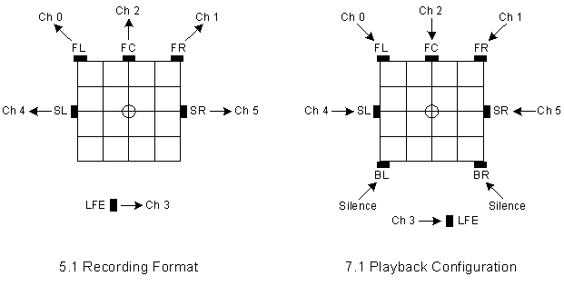
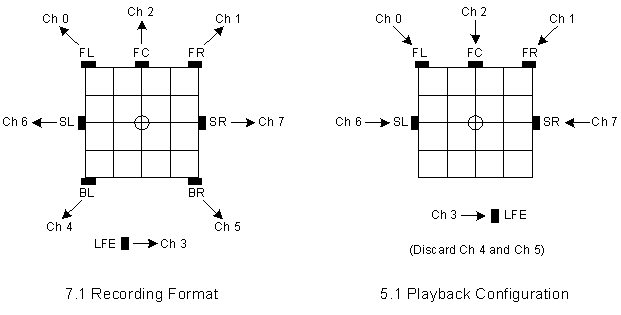

# Mapping Stream Formats to Speaker Configurations

When asked to play a stream format that does not match the audio device's speaker configuration, the audio driver has several options:

-   Decline to play the stream.

-   Play the stream by performing a one-to-one mapping of individual channels to speakers. If any channels are left over after a channel has been mapped to each speaker, discard the leftover channels. Conversely, if any speakers are left over after all of the channels have been assigned to speakers, play silence through the leftover speakers.

-   Play the stream by mixing the channels in the original stream to generate precisely the number of channels required for the speaker configuration. If there are more channels in the original stream than there are speakers, this approach avoids loss of the content that would result from simply discarding the excess channels. The mixing and format conversion can be performed in software or hardware.

Regarding the third option, the driver should avoid directly performing software mixing. Instead, the hardware vendor should install a global-effects (GFX) software module to process the stream before it reaches the audio device. In Windows Vista, global effects are implemented as GFX audio processing objects (APOs). In Windows Server 2003 and Windows XP, global effects were implemented as GFX filters. 

### Playing a 5.1-Channel Stream on a 7.1 Speaker Configuration

The following figure shows a stream that is recorded for a 5.1 surround sound speakers configuration (left) but is played through a 7.1 home theater speakers configuration (right).

In the preceding figure, the recorded 5.1 format does not contain channel information for the BL and BR speaker positions in the 7.1 speaker configuration. Thus, these two speakers are silent. (Another, more difficult alternative would be for the audio device to synthesize two additional channels for the BL and BR speakers by mixing the content from the original six channels in the recording.)

According to the definitions for the channel-mask bits, the channel mask for recording the 5.1 stream shown on the left side of the preceding figure should be 0x60F, which assigns the six channels to the following speaker positions: FL, FR, FC, LFE, SL, and SR. (This is the side-speaker 5.1 configuration discussed earlier.) In fact, the channel mask for the 5.1 stream is 0x3F rather than 0x60F for reasons that were mentioned previously and will now be explained in detail.

In earlier versions of Windows (Windows Server 2003, Windows XP with SP1, Windows 2000, and Windows Me/98), the interpretation of the channel mask 0x3F is that it assigns the six channels in the 5.1 format to the following speaker positions: FL, FR, FC, LFE, BL, and BR. (This is the back-speaker 5.1 configuration.) However, the interpretation in Windows Vista, Windows Server 2003 with SP1, and Windows XP with SP2 is different: by convention, the 5.1 format with the channel mask 0x3F is interpreted to mean the *side-speaker* 5.1 configuration instead of the *back-speaker* 5.1 configuration.

Interpreting the channel mask in this manner eliminates the requirement to introduce a second 5.1-channel format descriptor to distinguish the side-speaker 5.1 configuration from the back-speaker 5.1 configuration. These two configurations are so similar that typical users might have difficulty distinguishing between them. Although having only a single 5.1-channel format descriptor avoids confusing users, it does require hardware vendors to remember to interpret the 0x3F channel mask to mean that channels 5 and 6 are assigned to the SL and SR speaker positions instead of the BL and BR positions. In return for having to remember this special-case interpretation of the channel mask for a 5.1 stream, vendors can spare users the difficulty of distinguishing between two very similar 5.1-channel format descriptors.

Vendors who believe that at least some of their users might want to distinguish between the side-speaker 5.1 configuration and back-speaker 5.1 configuration have the option of providing a user-interface (UI) program for this purpose. Through the UI, users can select whether channels 4 and 5 in a 5.1-channel stream should drive the back speakers rather than the side speakers in a 7.1 home theater speakers configuration.

### Playing a 7.1-Channel Stream on a 5.1 Speaker Configuration

The following figure shows a stream recorded for a 7.1 home theater speakers configuration (left) being played through a 5.1 surround sound speakers configuration (right). The channel mask for the 7.1-channel stream is 0x63F.

In this example, channels 6 and 7, which contain the data for the side speaker positions in the 7.1 configuration, play through the side speaker positions in the 5.1 configuration. The audio device simply discards channels 4 and 5, which contain the data for the back speaker positions in the 7.1 configuration, when it plays the stream on the 5.1 configuration. As mentioned previously, another alternative (not shown in the preceding figure) is for the device to attempt to preserve the content in channels 4 and 5 by mixing them with channels 6 and 7 before playing them through the side speakers in the 5.1 configuration.

### System Mixer Behavior

In Windows Server 2003, Windows XP, Windows 2000, and Windows Me/98, the multichannel audio streams that the audio device plays are typically generated by the software system mixer, Kmixer.sys. Before the stream can begin playing, the system mixer and audio driver must negotiate a stream format that both mixer and driver can handle.

When asked to play a multichannel stream with a format that does not match the audio device's speaker configuration, the audio driver can decline the request, in which case the negotiation continues.

The system mixer can convert content from a 5.1-channel input stream into a 7.1-channel output stream (to the audio device), and vice versa, although it prefers to avoid such conversions to preserve the quality of the input stream. Thus, the system mixer begins the negotiation by asking the driver to accept a stream with the same format as the highest quality input stream to the system mixer. Typically, this means that if the system mixer has an input stream in a 5.1- or 7.1-channel format, it will ask the driver to accept a stream in the same format. If the driver rejects this format, the system mixer continues negotiating by asking the driver if it can handle other stream formats.

For example, if the driver for an audio device with a 5.1 speaker configuration declines a request from the system mixer to play a 7.1-channel stream, the system mixer continues the negotiation by offering to convert the 7.1-channel stream to a 5.1-channel stream. If the driver accepts this format, the system mixer performs the stream conversion for the driver.

When designing an audio driver, the driver writer must decide whether to handle its own format conversions or rely on the system mixer to do the conversions. The driver might need to handle the conversions in either of the following situations:

-   If the driver requires the conversion to be performed in a manner that differs from the conversion performed by the system mixer.

-   If the driver must play streams that bypass the system mixer.

In the second situation, a stream can bypass the system mixer if is being played from a Microsoft DirectSound hardware-accelerated buffer directly to a hardware-mixing pin on the audio device. Also, some "pro audio" applications send their streams directly to the audio device either to avoid the latency of the system mixer or to prevent the mixing process from altering the digital sample values in the original audio stream.

In Windows Server 2003 with SP1 and Windows XP with SP2, if the system mixer produces a 5.1-channel output stream, the mixer always sets the stream's channel mask to 0x3F. The system mixer behaves this way even if it receives a 5.1-channel input stream with a channel mask of 0x60F. With this behavior, an audio driver never receives a 5.1-channel stream with a channel mask of 0x60F from the mixer.

If the system mixer receives a 7.1-channel input stream with a channel mask of 0x63F and produces a 5.1-channel output stream (with a channel mask of 0x3F), the mixer copies channels 6 and 7 in the input stream to channels 4 and 5 in the output stream. The mixer discards channels 4 and 5 (for the two back speakers) from the 7.1-channel input stream. This behavior ensures that the channels containing the content for the two side speakers in the 7.1-channel stream play through the side speakers in the 5.1 speaker configuration.

 

 

