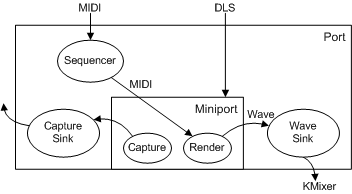

# MIDI Transport

## 

The DMus port driver is involved on the front and back sides of the DMus miniport driver's synthesizer work. The port driver inputs a MIDI stream that consists of time-stamped MIDI data and routes the stream to the sequencer. The sequencer removes the time stamps and passes the raw MIDI messages to the miniport driver when their time stamps are due. (DLS data passes right through the port driver to the miniport driver with no preprocessing.)

When DMus miniport driver's MIDI input stream gets converted to wave data, its output is managed by the wave sink (also called a "synth sink" or "render sink").

The DMus port driver implements a kernel-streaming filter with an input pin that accepts DirectMusic data from the DirectMusic user-mode component, dmusic.dll. The port driver also has a wave-output pin that emits the synthesized audio stream. The wave sink manages this pin and tells the synth where in memory to write its data. This arrangement insulates the synth from the details of kernel streaming. Your DMus miniport driver needs only to deal with the details of synthesizing wave data from the input MIDI stream. The port driver sends the wave data out to the system, and SysAudio's filter graph connects the filters to make everything flow correctly. As shown in the following diagram, MIDI data comes into the DMus port driver and, after sequencing, is passed to the DMus miniport driver.

The miniport driver converts the MIDI data to wave format, which is rendered into a buffer that is designated by another part of the port driver: the wave sink. Then, instead of going out to DirectSound as it does in user mode, the wave output goes to the audio hardware through the [KMixer system driver](kernel-mode-wdm-audio-components.md#kmixer_system_driver). DirectSound is really just an API that exposes KMixer, and DirectSound acceleration consists of the mixer functions being accelerated in hardware instead of emulated in software by KMixer.

The [SysAudio system driver](kernel-mode-wdm-audio-components.md#sysaudio_system_driver), which builds the audio filter graph, connects the DMus port driver to a piece of hardware. The wave sink portion of the port driver hands the data out through its wave-out pin, which SysAudio can connect to the hardware device. It pulls wave data from the DMus miniport driver (without regard to whether it is a hardware or software synth), and handles all timing issues. Compared to user mode, the miniport driver is analogous to the synth, whereas the wave sink is just part of the port driver.

If a DMus miniport driver can provide its output back to the host, it exposes a wave pin with a data direction of KSPIN\_DATAFLOW\_OUT (see [**KSPIN**](https://msdn.microsoft.com/library/windows/hardware/ff563483)), which SysAudio recognizes and connects to KMixer.

For more information about the wave sink, see [A Wave Sink for Kernel-Mode Software Synthesizers](a-wave-sink-for-kernel-mode-software-synthesizers.md).

This section also includes:

[IMXF Interfaces](imxf-interfaces.md)

[Allocator](allocator.md)

 

 

