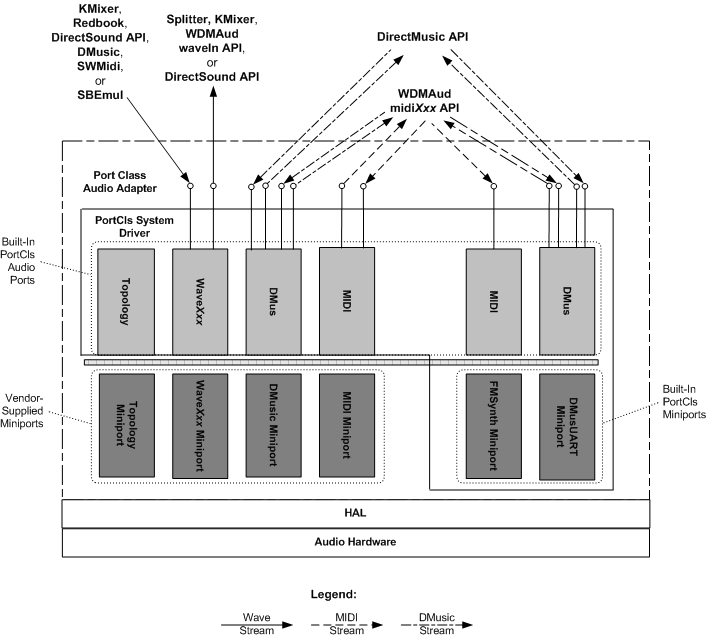

# Rendering and Capturing Audio Content by Using a Port Class Audio Adapter

## 

The following figure shows a configuration of a port class audio adapter driver that renders and captures audio content.

See the following for a description of the Microsoft Windows Driver Model (WDM) audio components:

[DirectSound System Component](user-mode-wdm-audio-components.md#directsound_system_component)

[DirectMusic System Component](user-mode-wdm-audio-components.md#directmusic_system_component)

[WDMAud System Driver](user-mode-wdm-audio-components.md#wdmaud_system_driver)

[SBEmul System Driver](kernel-mode-wdm-audio-components.md#sbemul_system_driver)

[KMixer System Driver](kernel-mode-wdm-audio-components.md#kmixer_system_driver)

[Redbook System Driver](kernel-mode-wdm-audio-components.md#redbook_system_driver)

[Splitter System Driver](kernel-mode-wdm-audio-components.md#splitter_system_driver)

[Port Class Adapter Driver and PortCls System Driver](kernel-mode-wdm-audio-components.md#port_class_adapter_driver_and_portcls_system_driver)

See the following for information about wave, MIDI, DirectMusic, and topology filters:

[Wave Filters](wave-filters.md)

[MIDI and DirectMusic Filters](midi-and-directmusic-filters.md)

[Topology Filters](topology-filters.md)

See the following for more detail about the filter graphs located above the port class audio adapter:

[Rendering and Capturing Wave Content](rendering-and-capturing-wave-content.md)

[Rendering and Capturing MIDI Content](rendering-and-capturing-midi-content.md)

 

 

--------------------
[Send comments about this topic to Microsoft](mailto:wsddocfb@microsoft.com?subject=Documentation%20feedback%20[audio\audio]:%20Rendering%20and%20Capturing%20Audio%20Content%20by%20Using%20a%20Port%20Class%20Audio%20Adapter%20%20RELEASE:%20%287/18/2016%29&body=%0A%0APRIVACY%20STATEMENT%0A%0AWe%20use%20your%20feedback%20to%20improve%20the%20documentation.%20We%20don't%20use%20your%20email%20address%20for%20any%20other%20purpose,%20and%20we'll%20remove%20your%20email%20address%20from%20our%20system%20after%20the%20issue%20that%20you're%20reporting%20is%20fixed.%20While%20we're%20working%20to%20fix%20this%20issue,%20we%20might%20send%20you%20an%20email%20message%20to%20ask%20for%20more%20info.%20Later,%20we%20might%20also%20send%20you%20an%20email%20message%20to%20let%20you%20know%20that%20we've%20addressed%20your%20feedback.%0A%0AFor%20more%20info%20about%20Microsoft's%20privacy%20policy,%20see%20http://privacy.microsoft.com/default.aspx. "Send comments about this topic to Microsoft")

