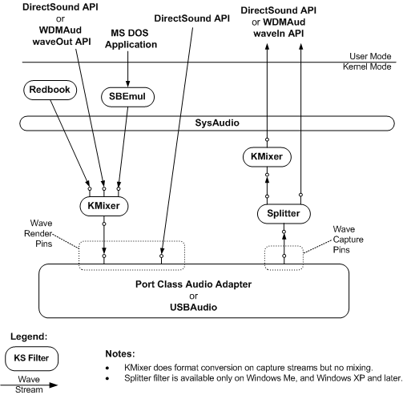

# Rendering and Capturing Wave Content

## 

The following figure shows the configuration of Microsoft Windows Driver Model (WDM) audio components that render and capture wave content.

See the following for a description of the WDM audio components:

[DirectSound System Component](user-mode-wdm-audio-components.md#directsound_system_component)

[WDMAud System Driver](user-mode-wdm-audio-components.md#wdmaud_system_driver)

[SBEmul System Driver](kernel-mode-wdm-audio-components.md#sbemul_system_driver)

[SysAudio System Driver](kernel-mode-wdm-audio-components.md#sysaudio_system_driver)

[KMixer System Driver](kernel-mode-wdm-audio-components.md#kmixer_system_driver)

[Redbook System Driver](kernel-mode-wdm-audio-components.md#redbook_system_driver)

[Splitter System Driver](kernel-mode-wdm-audio-components.md#splitter_system_driver)

[Port Class Adapter Driver and PortCls System Driver](kernel-mode-wdm-audio-components.md#port_class_adapter_driver_and_portcls_system_driver)

[USBAudio Class System Driver](kernel-mode-wdm-audio-components.md#usbaudio_class_system_driver)

See the following for more information about the configuration of the port class adapter driver and the USBAudio driver:

[Rendering and Capturing Audio Content by Using a Port Class Audio Adapter](rendering-and-capturing-audio-content-by-using-a-port-class-audio-adap.md)

[Rendering and Capturing Audio Content by Using the USBAudio Driver](rendering-and-capturing-audio-content-by-using-the-usbaudio-driver.md)

 

 

