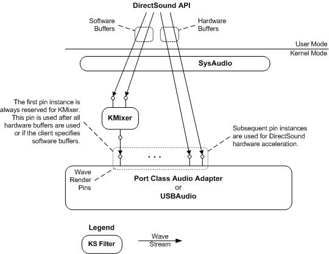

# Rendering Wave Content Using DirectSound Software and Hardware Buffers

## 

The following figure shows a configuration of Microsoft Windows Driver Model (WDM) components that renders to DirectSound software and hardware buffers.

See the following for a description of the WDM audio components:

[DirectSound System Component](user-mode-wdm-audio-components.md#directsound_system_component)

[SysAudio System Driver](kernel-mode-wdm-audio-components.md#sysaudio_system_driver)

[KMixer System Driver](kernel-mode-wdm-audio-components.md#kmixer_system_driver)

[Port Class Adapter Driver and PortCls System Driver](kernel-mode-wdm-audio-components.md#port_class_adapter_driver_and_portcls_system_driver)

[USBAudio Class System Driver](kernel-mode-wdm-audio-components.md#usbaudio_class_system_driver)

 

 

