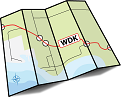

# Roadmap for Developing WDM Audio Drivers

Audio drivers are based on the Windows driver model (WDM).

To create a WDM audio driver, perform the following steps:

1.  **Learn about Windows architecture and drivers.**

    You must understand the fundamentals of how drivers work in Windows operating systems. Knowing the fundamentals will help you make appropriate design decisions and allow you to streamline your development process. See [Concepts for all driver developers](../gettingstarted/concepts-and-knowledge-for-all-driver-developers.md).

2.  **Learn the fundamentals of WDM audio drivers.**

    Audio drivers in the Windows operating system versions from Windows XP to Windows Vista conform to WDM and use the kernel streaming components. To understand the driver design decisions that you must make, see [Kernel Streaming](../stream/kernel-streaming.md), [WDM Audio Drivers Overview](getting-started-with-wdm-audio-drivers.md) and [Introduction to WDM Audio Drivers](introduction-to-wdm-audio-drivers.md).

3.  **Determine additional WDM audio driver design decisions.**

    For information about how to make design decisions, see [Custom Audio Drivers](custom-audio-drivers.md), [Audio Data Formats and Data Ranges](audio-data-formats-and-data-ranges.md). If you need help to decide the type of audio driver to learn about, see [Custom Audio Driver Type Decision Tree](custom-audio-driver-type-decision-tree.md).

4.  **Learn about Audio Processing Objects.**

    Audio processing objects (APOs), provide customizable software based digital signal processing for Windows audio streams. To learn more, see [Windows Audio Processing Objects](windows-audio-processing-objects.md).

5.  **Learn about the Windows driver build, test, and debug processes and tools.**

    Building a driver is not the same as building a user-mode application. See [Developing, Testing, and Deploying Drivers](/windows-hardware/drivers) for information about Windows driver build, debug, and test processes, and driver signing. See [Driver Development Tools](../devtest/index.md) for information about building, testing, verifying, and debugging tools.

6.  **Review audio driver samples in the WDK.**

    To access and review the audio driver samples in the WDK, see [Sample Audio Drivers](sample-audio-drivers.md).

7.  **Make design decisions about your WDM audio driver.**

    See [Audio Miniport Drivers](audio-miniport-drivers.md) and [COM in the Kernel](com-in-the-kernel.md).

8.  **Develop, build, test, and debug your WDM audio driver.**

    For information about how to develop an audio driver for your specific audio adapter, see [Adapter Driver Construction](adapter-driver-construction.md). See [Developing, Testing, and Deploying Drivers](/windows-hardware/drivers) for information about iterative building, testing, and debugging. This process will help ensure that you build a driver that works.

9.  **Create a driver package for your WDM audio driver.**

    For more information, see [Creating a Driver Package](/windows-hardware/drivers). For information about how to install an audio adapter, see [Installing a Port Class Audio Adapter](installing-a-port-class-audio-adapter.md).

10. **Sign and distribute your WDM audio driver.**

    The final step is to sign (optional) and distribute the driver. If your driver meets the quality standards that are defined for the Windows Certification Program, you can distribute it through the Microsoft Windows Update program. For more information, see [Distributing a driver package](/windows-hardware/drivers).

These are the basic steps. Additional steps might be necessary based on the needs of your individual driver.

 

