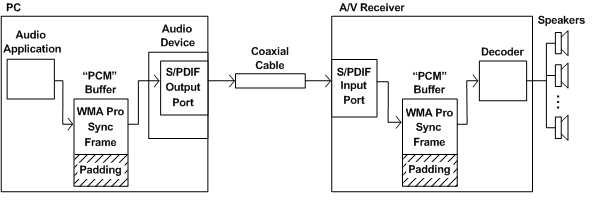

# S/PDIF Pass-Through Transmission of Non-PCM Streams

## 

The Sony/Philips digital interface (S/PDIF) format is defined primarily for transmitting PCM audio data, but it can easily be adapted to transmit non-PCM data. The principle of S/PDIF pass-through transmission is that a non-PCM data stream can pass through an S/PDIF link as though it were a PCM stream. Pass-through transmission does not require the S/PDIF sending and receiving ports to understand the encoding of the non-PCM stream.

WMA Pro and AC-3 are both compressed non-PCM formats that transmit digital audio streams in units called synchronization frames. Each sync frame contains its own header and can be decoded independently of the other sync frames in the stream. At a 48-kHz sample rate, for example, a WMA Pro sync frame contains enough data to play for 2048 ticks of the sample clock (42.67 milliseconds). At this same rate, an AC-3 sync frame contains enough data for 1536 ticks (32 milliseconds).

At a 48-kHz sample rate, a 5.1-channel WMA Pro sync frame never exceeds 8192 bytes, which is the number of bytes occupied by 2048 stereo (two-channel), 16-bit PCM samples. Similarly, a 5.1-channel AC-3 sync frame never exceeds 6144 bytes, which is the number of bytes occupied by 1536 stereo, 16-bit PCM samples. (There are exceptions to this rule, but those types of AC-3 sync frames are very uncommon, cannot be transmitted over S/PDIF, and can be ignored here.)

When a 48-kHz WMA Pro or AC-3 audio stream passes through an S/PDIF link in digital form without being decoded, the S/PDIF sending and receiving ports can treat the stream the same as a stereo, 16-bit, 48-kHz PCM stream. When specifying a data range for a pin that can transmit a WMA Pro-over-S/PDIF or AC-3-over-S/PDIF stream, the wave-format tag itself is the only thing that differs from a data range for a pin that transmits a PCM stream through the S/PDIF port. For an example, see the data range declarations in [Specifying WMA Pro Data Ranges](specifying-wma-pro-data-ranges.md).

In order to avoid delivering a WMA Pro compressed stream over the S/PDIF interface faster than real time (that is, to prevent delivery of 43 milliseconds of audio in less than 43 milliseconds), an audio application must pad a WMA Pro sync frame with zeros until the sync frame takes up the same number of bytes as 2048 stereo PCM samples. An AC-3 sync frame must similarly be padded out to the size of 1536 stereo PCM samples.

If you attempt to send unpadded WMA Pro or AC-3 sync frames to a PortCls adapter driver that uses WaveCyclic, be aware that when the port driver senses data starvation (because the data stream contains fewer bytes than a two-channel uncompressed stream would), it fills the cyclic buffer with silence. The non-PCM stream decoder will have problems interpreting these periods of silence, which are in PCM rather than the non-PCM format.

The following figure shows an example application of S/PDIF pass-through transmission.

The figure shows a PC connected to an external audio/visual (A/V) receiver through a coaxial cable. The cable connects the S/PDIF output port on the PC's audio device to the S/PDIF input port on the A/V receiver.

At the left edge of the figure, an audio application inserts a sync frame from a WMA Pro audio stream into the beginning of an 8192-byte buffer. (This buffer size is used purely for ease of illustration. In practice, a buffer size of 4096 bytes or 10240 bytes, for example, might be used instead.) The application fills any remaining space in the buffer with zeros. The audio driver programs the S/PDIF output port to transmit the contents of the buffer as though they were 8192 bytes of PCM data.

Similarly, the S/PDIF input port on the A/V receiver receives the stream as though it were 8192 bytes of PCM data. It loads the data into an input buffer, which in this example also has a size of 8192 bytes. The decoder extracts the WMA Pro sync frame from the input buffer, decodes the sync frame into a 5.1-channel audio stream, and plays the stream through the surround speakers on the right edge of the figure.

To let the decoder on the other end of the connection know that the audio stream is in a non-PCM format, the audio driver should set the /AUDIO bit on the S/PDIF transceiver. The decoder reads this bit from the S/PDIF channel-status block to determine whether the data stream is encoded in a non-PCM format. Setting this bit is the only thing special that the driver needs to do to accommodate the non-PCM stream. In every other way, the driver treats the stream as though it contains PCM data.

A number of consumer devices support S/PDIF pass-through transmission, but other digital interfaces such as USB and 1394 can also be adapted for digital pass-through transmission of non-PCM data to external audio decoders.

Dolby Laboratories introduced the AC-3 (Dolby Digital) compressed audio format in 1992. The first consumer A/V receivers to support AC-3 over S/PDIF became available in about 1997. Software support for the WMA Pro audio stream format became available with the release of the Microsoft Windows Media 9 Series technology in 2003. A/V receivers that support WMA Pro-over-S/PDIF were introduced in 2003.

In Windows XP and later, the waveOut, DirectSound, and DirectShow APIs support non-PCM formats. The DirectSound and waveOut APIs are implemented in such a way that any PCM or non-PCM format that the driver exposes is automatically available to clients of these APIs.

 

 

