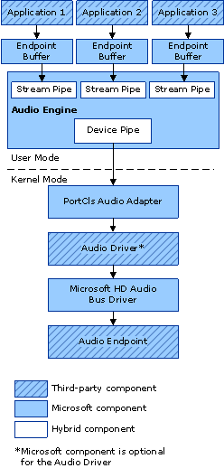

# sAPOs and the Windows Vista Audio Architecture

The 32-bit versions of Windows Server 2003 and Windows XP process digital audio data for system effects by using global effects filters (GFX filters).

The operating system does not support the Windows XP-style GFX filters. Instead, Windows Vista includes several user-mode in-process COM objects that are installed by default. These objects, called system effects audio processing objects (sAPOs), provide digital signal processing for Windows Vista audio streams. An sAPO is basically a host object that contains an algorithm that is written to provide a specific Digital Signal Processing (DSP) effect.

The following diagram is a simplified representation of the Windows Vista audio architecture. The arrows show the path of a stream of audio data.

As the diagram shows, the Windows Vista audio architecture consists of user-mode and kernel-mode components. The audio engine consists of stream and device pipes, which are built from system-supplied audio processing objects (APOs) and sAPOs.

The kernel-mode components have well-defined functionality that is isolated in each component.

Audio endpoint refers to components such as headphones and loudspeakers collectively. As shown in the diagram, an application communicates with an audio endpoint via the endpoint buffer, stream and device pipes and a stack of kernel-mode drivers.

The concepts of pipes, APOs, and sAPOs are explained in more detail in the [Exploring the Windows Vista Audio Engine](exploring-the-windows-vista-audio-engine.md) topic. For more information about the system-supplied sAPOs, see the [Windows Vista Default sAPOs](windows-vista-default-sapos.md) topic.

 

 

