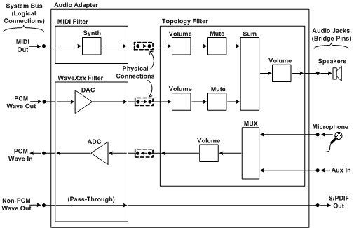

# Specifying the Topology

After a hardware vendor decides which miniport drivers to write for the wave and MIDI devices, the next step is to represent the kernel streaming (KS) topology of these devices. The KS topology consists of a set of data structures that describe the data paths that audio or MIDI streams follow as they flow through each device. Through this topology, the driver exposes the control nodes (for example, volume control) that lie along each path. Typically, an application uses the Windows multimedia mixer*Xxx* functions to explore the topology by enumerating the sequence of nodes along each path. For example, after discovering a volume-level control node, an application can set the volume level on that node. For more information about Windows multimedia, see the Microsoft Windows SDK documentation. For more information about the representation of KS topologies by the mixer*Xxx* functions, see [Kernel Streaming Topology to Audio Mixer API Translation](kernel-streaming-topology-to-audio-mixer-api-translation.md).

PortCls provides six port drivers: WavePci, WaveCyclic, WaveRT, MIDI, DMus, and Topology. (WaveRT has been available since Windows Vista and is the recommended approach.) The Topology port driver controls the portion of the audio adapter circuitry that mixes together the rendering streams from the wave and MIDI devices. It also controls the selection of capture streams from input jacks. In spite of its somewhat misleading name, the Topology port driver does not embody all of an audio adapter's topology, although typically it does contain a large portion of it. The other port drivers contribute the remaining portions of the adapter's topology.

Each port driver is paired with a corresponding miniport driver to form a [KS filter](https://msdn.microsoft.com/library/windows/hardware/ff567644) that represents a particular device (wave, MIDI, or mixer) on the audio adapter, as shown in the following table.

<table>
<colgroup>
<col width="50%" />
<col width="50%" />
</colgroup>
<thead>
<tr class="header">
<th align="left">Filter Type</th>
<th align="left">Description</th>
</tr>
</thead>
<tbody>
<tr class="odd">
<td align="left">
Wave<em>Xxx</em> filter
</td>
<td align="left">
Represents a wave device that converts a wave output stream to an analog audio signal or that converts an analog audio signal to a wave input stream.
</td>
</tr>
<tr class="even">
<td align="left">
MIDI or DMus filter
</td>
<td align="left">
Represents a MIDI device that plays or captures a MIDI stream.
</td>
</tr>
<tr class="odd">
<td align="left">
Topology filter
</td>
<td align="left">
Represents the adapter&#39;s mixer circuitry.
</td>
</tr>
</tbody>
</table>

 

The miniport driver implements the filter's device-specific functions, including the definition of the portion of the adapter topology that the device encompasses. The port driver takes care of the generic filter operations, including communication with the operating system, for each type of filter.

Each filter has one or more [KS pins](https://msdn.microsoft.com/library/windows/hardware/ff567669) that serve as pathways for streams of audio data to enter and leave the filter. Typically, the pins on the Topology filter are tied to the pins on the wave, MIDI, and DMus filters through hardwired connections in the adapter circuitry. These filters and their interconnections together form a KS filter graph that embodies the adapter's topology.

The following figure shows the topology of an example audio adapter.

In the preceding figure, the topology at the top level consists of the connections among the MIDI, Wave*Xxx*, and topology filters. In addition, each filter has its own internal topology, which consists of the data paths through the filter and the control nodes that lie along each path. The nodes are labeled as shown in the following table.

<table>
<colgroup>
<col width="33%" />
<col width="33%" />
<col width="33%" />
</colgroup>
<thead>
<tr class="header">
<th align="left">Label</th>
<th align="left">Description</th>
<th align="left">KS Node-Type GUID</th>
</tr>
</thead>
<tbody>
<tr class="odd">
<td align="left">
Synth
</td>
<td align="left">
Synthesizer node
</td>
<td align="left"><a href="https://msdn.microsoft.com/library/windows/hardware/ff537203" data-raw-source="[&lt;strong&gt;KSNODETYPE_SYNTHESIZER&lt;/strong&gt;](https://msdn.microsoft.com/library/windows/hardware/ff537203)"><strong>KSNODETYPE_SYNTHESIZER</strong></a></td>
</tr>
<tr class="even">
<td align="left">
DAC
</td>
<td align="left">
Digital-to-audio converter node
</td>
<td align="left"><a href="https://msdn.microsoft.com/library/windows/hardware/ff537158" data-raw-source="[&lt;strong&gt;KSNODETYPE_DAC&lt;/strong&gt;](https://msdn.microsoft.com/library/windows/hardware/ff537158)"><strong>KSNODETYPE_DAC</strong></a></td>
</tr>
<tr class="odd">
<td align="left">
ADC
</td>
<td align="left">
Analog-to-digital converter node
</td>
<td align="left"><a href="https://msdn.microsoft.com/library/windows/hardware/ff537153" data-raw-source="[&lt;strong&gt;KSNODETYPE_ADC&lt;/strong&gt;](https://msdn.microsoft.com/library/windows/hardware/ff537153)"><strong>KSNODETYPE_ADC</strong></a></td>
</tr>
<tr class="even">
<td align="left">
Volume
</td>
<td align="left">
Volume-level control node
</td>
<td align="left"><a href="https://msdn.microsoft.com/library/windows/hardware/ff537208" data-raw-source="[&lt;strong&gt;KSNODETYPE_VOLUME&lt;/strong&gt;](https://msdn.microsoft.com/library/windows/hardware/ff537208)"><strong>KSNODETYPE_VOLUME</strong></a></td>
</tr>
<tr class="odd">
<td align="left">
Mute
</td>
<td align="left">
Mute control node
</td>
<td align="left"><a href="https://msdn.microsoft.com/library/windows/hardware/ff537178" data-raw-source="[&lt;strong&gt;KSNODETYPE_MUTE&lt;/strong&gt;](https://msdn.microsoft.com/library/windows/hardware/ff537178)"><strong>KSNODETYPE_MUTE</strong></a></td>
</tr>
<tr class="even">
<td align="left">
Sum
</td>
<td align="left">
Summation node
</td>
<td align="left"><a href="https://msdn.microsoft.com/library/windows/hardware/ff537196" data-raw-source="[&lt;strong&gt;KSNODETYPE_SUM&lt;/strong&gt;](https://msdn.microsoft.com/library/windows/hardware/ff537196)"><strong>KSNODETYPE_SUM</strong></a></td>
</tr>
<tr class="odd">
<td align="left">
MUX
</td>
<td align="left">
Multiplexer node
</td>
<td align="left"><a href="https://msdn.microsoft.com/library/windows/hardware/ff537180" data-raw-source="[&lt;strong&gt;KSNODETYPE_MUX&lt;/strong&gt;](https://msdn.microsoft.com/library/windows/hardware/ff537180)"><strong>KSNODETYPE_MUX</strong></a></td>
</tr>
</tbody>
</table>

 

In the preceding figure, the pins on the left side of the audio adapter represent the logical connections (not physical connections) through which data streams enter the adapter from the system bus or enter the system bus from the adapter. These pins are logically connected to source and sink pins on other filters (not shown) that are external to the adapter. Typically, these filters are software modules that, together with the adapter topology, form a larger filter graph whose topology can be explored by applications using the mixer*Xxx* functions. For example, the pin labeled "PCM Wave Out" in the preceding figure is logically connected to the user-mode audio engine in Windows. These logical connections are maintained by DMA transfers over the system bus.

In contrast, the pins on the left edge of the topology filter are physically connected to pins on the MIDI and Wave*Xxx* filters. These connections are hardwired and cannot be changed by software.

The bridge pins on the right side of the audio adapter represent audio jacks on the system chassis. These pins are referred to as *bridge pins* because they bridge the boundary between the KS filter graph and the external world.

Filters, pins, and nodes typically have properties that are accessible to clients (kernel-mode components or user-mode applications) of the audio driver. A client can send a [KS property request](https://msdn.microsoft.com/library/windows/hardware/ff567671) to a filter, pin, or node either to query for the current value of a property or to change the property value. For example, a volume-level control node has a [**KSPROPERTY\_AUDIO\_VOLUMELEVEL**](https://msdn.microsoft.com/library/windows/hardware/ff537309) property, which a client can change through a KS property request. A summation node is an example of a node type that typically has no properties.

For simplicity, the Wave*Xxx* filter in the preceding figure provides only a single pin for accepting a PCM wave output stream from the system bus. In contrast, some wave devices provide multiple pins for PCM wave output and contain hardware for internally mixing the streams that enter the pins. These devices provide hardware acceleration for applications that use DirectSound by accepting PCM streams that play from the applications' sound buffers. For DirectSound to use these pins, they must provide additional nodes for two-dimensional (2-D) and three-dimensional (3-D) processing, as described in [DirectSound Hardware Acceleration in WDM Audio](directsound-hardware-acceleration-in-wdm-audio.md).

This type of hardware acceleration is supported in Windows Server 2003, Windows XP, Windows 2000, and Windows Me/98, but it is not supported in Windows Vista. Windows Vista makes no use of the hardware acceleration pins on older wave devices.

In the preceding figure, the physical connections between the MIDI, Wave*Xxx*, and topology filters all transport analog audio signals. However, a different topology device might achieve a similar effect by accepting digital output streams from the MIDI and wave devices, digitally mixing them, and converting the digital mix to an analog output signal.

The "Non-PCM Wave Out" pin at the lower-left corner of the preceding figure accepts a non-PCM output stream in an S/PDIF pass-through format, such as AC-3-over-S/PDIF or WMA Pro-over-S/PDIF. Using one of these formats, the device simply transmits the compressed data over the S/PDIF link without decoding the data. For this reason, the data path to the "S/PDIF Out" pin on the lower-right corner of the preceding figure contains no volume or mute nodes. For more information about non-PCM audio formats and S/PDIF pass-through transmission, see [Supporting Non-PCM Wave Formats](supporting-non-pcm-wave-formats.md). Additional information is available in the white paper titled *Audio Driver Support for the WMA Pro-over-S/PDIF Format* at the [audio technology](https://go.microsoft.com/fwlink/p/?linkid=8751) website.

The miniport driver presents its topology to the port driver in the form of a [**PCFILTER\_DESCRIPTOR**](https://msdn.microsoft.com/library/windows/hardware/ff537694) structure. This structure describes all of the filter's pins and nodes, and it specifies how the pins and nodes connect to each other.

Instead of designing a monolithic topology filter, as shown in the preceding figure, the mixer circuitry in the audio adapter can be partitioned into several topology filters. For example, in the preceding figure, the data paths that drive the speakers might be implemented as one topology filter, and the data paths that capture audio data from input devices can be implemented as a separate topology filter. When the data paths in a particular topology filter are not in use, that portion of the adapter can be powered down without disabling the entire adapter. For more information, see [Dynamic Audio Subdevices](dynamic-audio-subdevices.md).

 

 

