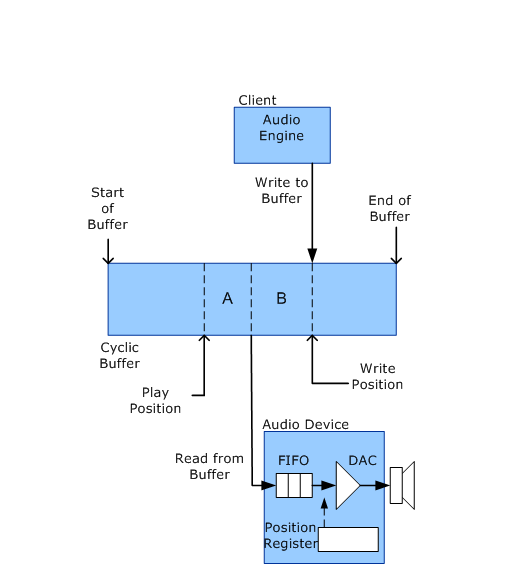

# Stream Latency During Playback

While an audio playback stream is in the Run state, the role of the WaveRT port driver is minimal. As shown in the following diagram, during playback the client of the WaveRT port driver writes its data to the cyclic buffer and the audio device then reads this data from the buffer. This activity requires no intervention from the port driver. In other words, audio data flows directly between the user-mode application and the audio hardware without being touched by any kernel-mode software components.

In the diagram, the write and play positions continually progress from left to right as the audio data stream flows through the cyclic buffer. The buffer is described as cyclic because when the play position or the write position reaches the end of the buffer it automatically wraps around to the start of the buffer.

Stream latency during playback has two main sources, designated in the following diagram as A and B.

In the preceding diagram, the *Write Position* is the location just past the last sample that the client wrote to the buffer. The *Play Position* is the sample that the audio device is currently playing through the speaker.

The latency from the time that the client writes an audio sample to the buffer until the audio device plays it is simply the separation between the write and play positions. This separation is the sum of the following two sources of latency (marked as A and B in the diagram):

**Latency A**: After the audio device reads data from the buffer, the data resides in a hardware "first in, first out" (FIFO) buffer until the audio device clocks the data through the digital-to-analog converter (DAC).

**Latency B**: After the client writes data to the cyclic buffer, the data resides in the buffer until the audio device reads the data.

The client has no control over latency A, which depends entirely on the hardware. A typical FIFO might store enough samples to feed the DAC for roughly 64 ticks of the sample clock. However, the client does control latency B. Making latency B too large introduces unnecessary delays into the system; however, making it too small risks depleting the audio device.

Although the client can set up a timer to periodically activate its buffer-writing thread, this method does not achieve the smallest latency. To further reduce latency, the client can configure the device to generate a hardware notification each time the device finishes reading a new block of playback data from the buffer. In this case, the client thread is activated by hardware notifications instead of by a timer.

By having the audio device notify the client each time it finishes reading a block of data from the buffer, the client can make the latency smaller than would otherwise be practical.

The client can obtain a summary of the delays that contribute to stream latency by sending a [**KSPROPERTY\_RTAUDIO\_HWLATENCY**](https://msdn.microsoft.com/library/windows/hardware/ff537378) request to the WaveRT port driver.

After the client determines the amount of separation to maintain between the write and play positions, the client monitors changes in the play position to determine how far to advance the write position. In Windows Server 2008 and later operating systems, the client sends out a [**KSPROPERTY\_RTAUDIO\_POSITIONREGISTER**](https://msdn.microsoft.com/library/windows/hardware/ff537381) property request to determine the play position. Support for this feature is provided by improvements in the PortCls system driver.

If the audio device has a position register as shown in the preceding diagram, the property request maps the register to a virtual memory address that is accessible to the user-mode client. After the position register is mapped, the client can read the contents of the memory address to determine the current play position.

 

 

