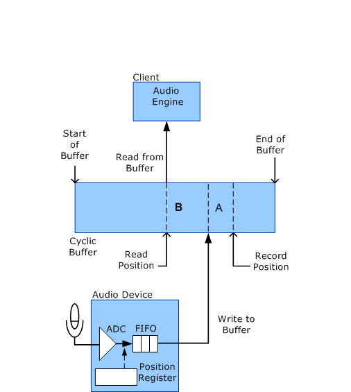

# Stream Latency During Recording

While an audio record stream is in the Run state, the role of the WaveRT port driver is minimal. As shown in the following diagram, during the recording process, the audio device captures audio data and writes it to the cyclic buffer. The audio engine then reads this data from the buffer. This activity requires no intervention from the port driver. In other words, audio data flows directly between the audio hardware and the user-mode application without being touched by any kernel-mode software components.

In the following diagram, the record and read positions continually progress from left to right as the stream flows through the buffer. When the record or the read position reaches the end of the buffer, it wraps around to the start of the buffer.

The preceding diagram identifies the *Record Position* as the buffer location of the sample that the audio device is currently recording (capturing from the microphone through the analog-to-digital converter, or ADC). Note that the record position is the future buffer location into which the audio device writes the sample after it passes through the FIFO. The *Read Position* is the buffer position from which the audio engine reads the next sample.

The latency from the time that the audio device captures an audio sample in the ADC until the client reads it is simply the separation between the record and read positions. This separation is the sum of the following sources of latency (marked as A and B in the diagram):

**Latency A**: After capturing data from the ADC, the audio device stores the data in a hardware FIFO until it can write the data to the cyclic buffer.

**Latency B**: After the audio device writes data to the cyclic buffer, the data resides in the buffer until the client reads the data.

The client has no control over latency A, which depends entirely on the hardware. A typical FIFO might store roughly 64 samples from the ADC. However, the client does control latency B. Making latency B too large introduces unnecessary delays into the system, but making it too small risks reading data too early, before the audio device has written into the buffer.

Although the client can set up a timer to periodically activate its buffer-reading thread, this method does not achieve the smallest latency. To further reduce latency, the client can configure the audio device to generate a hardware notification each time the device finishes writing a new block of capture data to the buffer. In this case, the client thread is activated by hardware notifications instead of by a timer.

By having the audio device periodically notify the audio engine, the client can make the latency smaller than would otherwise be practical.

The client (typically the audio engine) can obtain a summary of the delays that the audio device contributes to stream latency by sending a [**KSPROPERTY\_RTAUDIO\_HWLATENCY**](https://msdn.microsoft.com/library/windows/hardware/ff537378) request to the WaveRT port driver.

After the client determines the amount of separation to maintain between the record and read positions, the client monitors changes in the record position to determine how much the read position should lag. In Windows Server 2008 and later operating systems, the client sends out a [**KSPROPERTY\_AUDIO\_POSITION**](https://msdn.microsoft.com/library/windows/hardware/ff537297) or a [**KSPROPERTY\_RTAUDIO\_POSITIONREGISTER**](https://msdn.microsoft.com/library/windows/hardware/ff537381) property request to determine the record position. The latter request method is more efficient because it allows the client to read the record position directly without the transition to a kernel-mode routine for the information.

 

 

