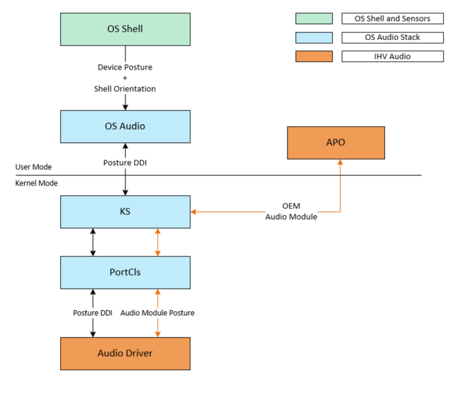

# Supporting Audio Posture

## Overview

Devices can be used in different postures. For a tablet, posture basically means the orientation that it is held, such as portrait or landscape. Audio experience for these devices can be optimized for specific postures. For example, audio endpoints can remap left/right channels for proper stereo experience in different orientations. It is also possible to calibrate microphones for noise suppression, echo cancellation, etc. based on changed speaker/microphone locations upon posture changes.

### Windows OS support

Audio posture is supported in Windows 11, version 22000 and later.

## Architecture

Posture-related scenarios for audio endpoints are based on the Shell responses to posture changes. The Shell works with Sensors and user input (e.g. orientation lock) to determine the overall system posture. The OS Audio Stack receives posture notifications from Shell and informs audio endpoints that support the Audio Posture DDI.

The Audio Stack does not alter the audio stream content in response to posture changes.  Instead, the Audio Stack informs the audio driver of these changes.  The expectation is for the IHV audio components to adapt to these changes with signal processing implemented in hardware (DSP) or as a software APO.

For desktop PCs, posture-related scenarios for audio endpoints align with the display. The OS Audio Stack receives 
posture notifications from the display and informs audio endpoints that support the Audio Posture DDI.

The following diagram shows the relationship and control flow between components involved with handling posture changes for audio devices.




## Components  

### OS shell and sensors

The Shell monitors various sensor information provided by sensor drivers. Along with the sensor information, the
Shell considers user preferences, such as orientation lock and app overrides, to determine the system posture.

### OS Audio Stack

The OS Audio Stack receives posture information from Shell.  When a change to the system posture occurs, the Audio Stack informs posture-aware audio endpoints using a KS Property.

### IHV audio driver and APO

The IHV audio driver along with an optional APO handles posture changes from the OS Audio Stack.  Only the onboard audio devices located directly on the main chassis of the machine that are impacted by posture changes should indicate support for posture.

### Audio endpoint support requirements

The following table shows audio endpoint types that should and should not provide posture support.

| Audio Endpoint Type                   | Posture Support |
|---------------------------------------|-----------------|
| Built-In Speakers                     |  Yes            |
| Built-In Microphone/Microphone Array  |  Yes            |
| Wired-Headset                         |  No             |
| HDMI/DisplayPort                      |  No             |
| External USB Audio                    |  No             |
| Bluetooth Audio                       |  No             |

### Audio driver requirements

Posture information is provided to the IHV audio driver in the form of orientation. The IHV audio driver is expected 
to have implicit knowledge about the device form factor, and it must be able to identify the default orientation and 
relative speaker/microphone positions. This information can be retrieved from ACPI or by other IHV mechanism.

## Data structures and constants

### PROPSETID

This is the GUID used for the KS property set id.

`KSPROPSETID_AudioPosture =A3FB7B0D-474E-4F51-A379-51282DD4FA8F`

### PROPERTY ID

This is the value used for KSPROPERTY ID.

`KSPROPERTY_AUDIOPOSTURE_ORIENTATION = 1`

### PROPERTY DESCRIPTION - AUDIOPOSTURE_ORIENTATION

This property specifies the current orientation of the system. The orientation is represented by the degrees of
rotation from the default orientation. The orientation information is in sync with the OS Shell, which includes 
user/app orientation lock. The audio driver receives this enumeration when handling the Set property request for 
KSPROPERTY_AUDIOPOSTURE_ORIENTATION.

```cpp
typedef enum
{
    AUDIOPOSTURE_PANEL_ORIENTATION_NOTROTATED = 0,
    AUDIOPOSTURE_PANEL_ORIENTATION_ROTATED90DEGREESCOUNTERCLOCKWISE,
    AUDIOPOSTURE_PANEL_ORIENTATION_ROTATED180DEGREESCOUNTERCLOCKWISE,
    AUDIOPOSTURE_PANEL_ORIENTATION_ROTATED270DEGREESCOUNTERCLOCKWISE,
} AUDIOPOSTURE_ORIENTATION;
```

For more information, see the [AUDIOPOSTURE_ORIENTATION enum](/windows-hardware/drivers/ddi/ksmedia/ne-ksmedia-audioposture_orientation).

### PROPERTY HANDLING

The audio driver must implement KSPROPSETID_AudioPosture – KSPROPERTY_AUDIOPOSTURE_ORIENTATION as a 
pin-wise property that is accessed through the filter handle. The property must be supported on the bridge pin, i.e., 
the pin representing the hardware endpoint, for the endpoint. 

### BASIC SUPPORT – KSPROPERTY_TYPE_BASICSUPPORT

The audio driver must return support for Set and access flags.

### SET – KSPROPERTY_TYPE_SET

The audio driver receives a pointer to AUDIOPOSTURE_ORIENTATION as the property request value parameter. In 
response to this property request, the audio driver can apply the necessary hardware or software changes for the 
new posture state. Returning success indicates that the driver has finished processing the change. If an IHV APO 
needs to receive posture information from the audio driver, Audio Modules can be used to provide the notification
mechanism. Drivers must cache the value so that it can be applied when coming out of low power/hibernate

```cpp
AUDIOPOSTURE_ORIENTATION Orientation = *((AUDIOPOSTURE_ORIENTATION*)PropertyRequest->Value);

switch (Orientation)
{
    case AUDIOPOSTURE_ORIENTATION_NOTROTATED:
    //Cache and process the orientation
    .
    .
    case AUDIOPOSTURE_ORIENTATION_ROTATED90DEGREESCOUNTERCLOCKWISE:
    //Cache and process the orientation
    .
    .
    case AUDIOPOSTURE_ORIENTATION_ROTATED180DEGREESCOUNTERCLOCKWISE:
    //Cache and process the orientation
    .
    .
    case AUDIOPOSTURE_ORIENTATION_ROTATED270DEGREESCOUNTERCLOCKWISE:
    //Cache and process the orientation
    .
    .
}
```

### See also

[Windows Driver Model (WDM)](/windows-hardware/drivers/kernel/windows-driver-model)

[Audio Drivers Overview](/windows-hardware/drivers/audio/getting-started-with-wdm-audio-drivers)
