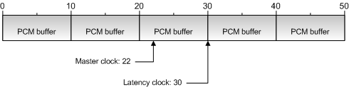

# Synthesizer Latency

## 

Another consideration in synthesizer timing is latency, which is the difference between the current time and the first time that a note can play. A MIDI message cannot be submitted to the synthesizer and rendered into the output buffer at the current sample time. Allowance should be made for data that has already been placed in the buffer but has not yet been streamed to the wave output device.

The wave sink therefore should implement a latency clock, which is an [**IReferenceClock**](https://msdn.microsoft.com/library/windows/desktop/dd743269) object (described in the Microsoft Windows SDK documentation). The latency clock's [**IReferenceClock::GetTime**](https://msdn.microsoft.com/library/windows/desktop/dd376931) method retrieves the sample time up to which data has already been written to the buffer, and converts this to reference time relative to the master clock. The wave sink does conversions between reference and sample time with [**IDirectMusicSynthSink::SampleToRefTime**](https://msdn.microsoft.com/library/windows/hardware/ff536526) and [**IDirectMusicSynthSink::RefTimeToSample**](https://msdn.microsoft.com/library/windows/hardware/ff536525), so in this case, the synth calls **IDirectMusicSynthSink::RefTimeToSample** to accomplish the conversion.

Latency time is all managed by the wave sink. Your implementation of the [**IDirectMusicSynthSink::GetLatencyClock**](https://msdn.microsoft.com/library/windows/hardware/ff536523) method should output a pointer to the latency clock, and this pointer must in turn be retrieved by [**IDirectMusicSynth::GetLatencyClock**](https://msdn.microsoft.com/library/windows/hardware/ff536536). The application uses the latency clock to determine the earliest point in time at which a MIDI message can be queued to play when it is passed to the synthesizer by calling the [**IDirectMusicSynth::PlayBuffer**](https://msdn.microsoft.com/library/windows/hardware/ff536540) method.

An example of the latency of a MIDI message is shown in the following figure.

In the preceding figure, the latency clock points to the first place in the PCM buffer loop where a note can be played. Note that the master clock is at 22 time units, which is the point where sound is currently playing from, but the space between 22 and 30 time units has already been filled with wave data and can no longer be written to. Therefore, the first place where a new time-stamped MIDI event can be scheduled to play is at time 30. Thus, the latency clock reads 30 time units.

Messages can be scheduled to play at, or any time after, this latency time. Therefore, messages that are to be rendered immediately are stamped with the latency time (not the current time) before being placed in the synthesizer's input buffer.

 

 

