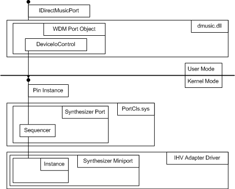

# Synthesizer Miniport Driver Overview

## 

Both a synth and a sink are necessary for DirectMusic support. Default implementations of each are provided with DirectMusic. The user-mode Microsoft Software Synthesizer is provided as the default synth and DirectSound is the default wave sink. These provide full hardware emulation, but further performance enhancements can typically be achieved with kernel-mode software or hardware implementations.

If you are implementing support for hardware, the only choice is to write a kernel-mode driver. In kernel mode, the wave sink is provided by the DMus port driver in PortCls and should not need to be replaced for custom implementations (as is sometimes done in user mode).

For kernel-mode DirectMusic drivers, the most important header file is dmusicks.h. It contains the main kernel-mode interfaces you need to implement your miniport driver. These interfaces are:

[IMiniportDMus](https://msdn.microsoft.com/library/windows/hardware/ff536699)

[ISynthSinkDMus](https://msdn.microsoft.com/library/windows/hardware/ff537011)

[IMXF](https://msdn.microsoft.com/library/windows/hardware/ff536782)

[IAllocatorMXF](https://msdn.microsoft.com/library/windows/hardware/ff536491)

[IMasterClock](https://msdn.microsoft.com/library/windows/hardware/ff536696)

[IPortDMus](https://msdn.microsoft.com/library/windows/hardware/ff536879)

The last three of these interfaces are implemented in PortCls.sys.

Two other header files that are of interest are dmusprop.h, which contains DirectMusic property items, and dmusbuff.h, which contains the main IRP structure, DMUS\_EVENTHEADER.

The following diagram shows the relationship between the IHV adapter driver and the rest of the DirectMusic system.

At the topmost level, the driver is exposed via a DirectMusic port driver (an **IDirectMusicPort** interface instance). This is how an application talks to DirectMusic. This port driver communicates downward to a pin instance via standard kernel streaming calls through the [**DeviceIoControl**](https://msdn.microsoft.com/library/windows/desktop/aa363216) function (described in the Microsoft Windows SDK documentation).

Note that the term "port" has two conflicting meanings in the figure above. Avoid confusing the usage of the term port by the DirectMusic API, in user mode above, with the kernel-mode DMus port driver. The terms have similar but slightly different meanings in the two contexts. In particular, note that the **IDirectMusicPort** interface at the top of the figure presents an abstraction of a single pin instance that the DMus port driver implements in the lower half of the figure.

Each miniport driver object is connected to a matching port driver object. The port driver object provides basic services to the miniport driver. Each pin instance that maps to one open instance of the device has services such as format conversion, sequencing, and "thruing" (for a discussion of thruing, see the description of the **IDirectMusicThru** interface in the Windows SDK documentation). Pins can be targets or sources, and can support multiple data formats and ranges. Each pin instance specifies target or source, and specifies which data format and range is supported.

The miniport driver object is created by the IHV's adapter driver. While there is one pin instance and sequencer per open instance of the driver, there is only one port-miniport driver pair per piece of hardware (or loaded kernel software synthesizer). Communication with the miniport driver is through a stream of events that is passed down to the miniport driver and by property items that are supported by the miniport driver.

The section [DirectMusic Miniport Driver Interface](directmusic-miniport-driver-interface.md) presents the details of a DirectMusic miniport driver implementation.

 

 

