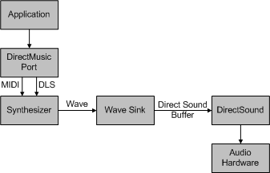

# Synthesizers and Wave Sinks

## 

The rendering engine has two parts:

-   The synthesizer, which takes MIDI messages and converts them to wave audio samples.

-   The wave sink, which provides a destination for the wave samples and helps synchronize the output.

By default, a DirectMusic application uses the Microsoft Software Synthesizer (dmsynth.dll) as the synthesizer and DirectSound as the wave-output device.

In DirectX 6.1 and DirectX 7, a DirectMusic application can override these defaults. For example, the application might use the Microsoft Software Synthesizer but direct the output to a .wav file, or it might implement a custom synthesizer that works with the default wave sink. The latter scenario is more likely because the default wave sink should work well for most synthesizers.

In DirectX 8 and later, DirectMusic always uses its built-in wave sink to output data from a user-mode synth, but an application can override the default software synth. This means that a DirectMusic application can implement a custom user-mode synthesizer, but the synthesizer must use DirectMusic's built-in wave sink.

The figure below shows how the DirectMusic architecture incorporates user-mode synthesizers and wave sinks. Note that the block labeled "DirectMusic Port" in the following figure should not be confused with the kernel-mode [DMus port driver](dmus-port-driver.md) in the PortCls system driver module, portcls.sys. A DirectMusic port is a user-mode object with an **IDirectMusicPort** interface (part of the DirectMusic API) and is implemented in dmusic.dll. For more information about DirectMusic ports, see the Microsoft Windows SDK documentation.

In the preceding figure, the application sends data to the user-mode DirectMusic port, which passes the data (MIDI or DLS) down to the software synth (dmsynth.dll by default) so that it can render the notes into wave data. The wave sink manages the timing and hands the synth a buffer to fill when it is ready to receive a burst of data. The synth fills up the buffer (an **IDirectSoundBuffer** object by default) with data so that it can be passed to DirectSound. DirectSound either plays the data through the [KMixer system driver](kernel-mode-wdm-audio-components.md#kmixer_system_driver) or plays it through a DirectSound hardware-accelerated rendering pin on the audio device, if one is available (see [Overview of DirectSound Hardware Acceleration](overview-of-directsound-hardware-acceleration.md)).

This same basic architecture also applies to kernel-mode implementations, with the exception that the wave sink hands the data buffer directly to the hardware or to the KMixer system driver. The DMus port driver implements the wave sink for a kernel-mode software synthesizer. For more information, see [A Wave Sink for Kernel-Mode Software Synthesizers](a-wave-sink-for-kernel-mode-software-synthesizers.md).

When these steps are completed, the user-mode DirectMusic port should be open and activated for use. As soon as this much of the driver code is working, you can start implementing features. Use the source code for the user-mode Microsoft Software Synthesizer as a template and begin adding the new functionality.

A user-mode software synthesizer can be implemented as an object with an [IDirectMusicSynth](https://msdn.microsoft.com/library/windows/hardware/ff536519) interface. A user-mode wave sink can be implemented as an object with an [IDirectMusicSynthSink](https://msdn.microsoft.com/library/windows/hardware/ff536520) interface. For more information, see [IDirectMusicSynth and IDirectMusicSynthSink](idirectmusicsynth-and-idirectmusicsynthsink.md).

 

 

