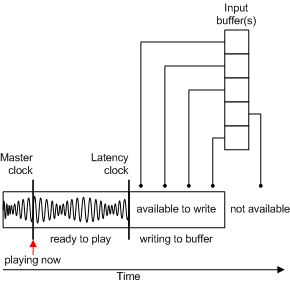

# Time-Stamped Events

## 

The big picture of the synthesizer timing is that instead of sending a note exactly when it needs to play, each note is time stamped and placed in a buffer. This buffer is then processed and played within two milliseconds of the time that is specified by the time stamp. (Although the timing resolution is in hundreds of nanoseconds, we will talk in terms of milliseconds, which are more convenient time units for this discussion.)

Because the latency is known to the system through the latency clock, time-stamped events can be waiting in a buffer to play at their proper time, rather than just dropping events into a queue and hoping the latency is low.

A master clock implements a COM [**IReferenceClock**](https://msdn.microsoft.com/library/windows/desktop/dd743269) interface (described in the Microsoft Windows SDK documentation). All of the devices on the system use this reference time.

Microsoft's wave sink implementation builds a thread that wakes up every 20 milliseconds. The thread's job is to create another buffer and hand it to DirectSound. To create that buffer, it calls into the synthesizer and asks it to render a specified amount of music data. The amount it asks for is determined by the actual time the thread wakes up, which is unlikely to be exactly 20 milliseconds.

What is actually passed into the synthesizer is simply a pointer to the location in memory at which to start writing data into the PCM buffer, and a length parameter that specifies how much data to write. The synth can then write PCM data into this buffer and fill it in up to the specified amount. That is, it renders from the start address until it reaches the specified length. That block of memory can be a DirectSoundBuffer (which is the default case), but it could also be a DirectShow graph or some other target defined by the wave sink.

The PCM buffer is conceptually cyclical (that is, it is constantly looping). The synthesizer renders the 16-bit numbers that describe the sound into successive slices of the buffer. The slice size is slightly different every time the thread awakens, because the sink cannot wake up exactly every 20 milliseconds. So every time the thread does wake up, it plays catch up to determine how far it should progress through the buffer before going back to sleep.

From the application's perspective, the synth port driver itself has a [**IDirectMusicSynth::GetLatencyClock**](https://msdn.microsoft.com/library/windows/hardware/ff536536) function that gets the clock from the wave sink. So there are two clocks:

-   The master clock that everyone, including the wave sink, listens to.

-   The latency clock that is implemented by the wave sink, which is seen by the application as a DirectMusic port providing the latency clock.

In other words, the application asks for the latency clock, but sees the clock as coming from the DirectMusic port abstraction rather than from the wave sink.

The time returned by this latency clock is the earliest time that the buffer can be rendered to, because the synth has already rendered up to that point in the buffer. If the synth had rendered a smaller buffer on its last write, the latency would also be smaller.

Therefore, the wave sink calls [**IDirectMusicSynth::Render**](https://msdn.microsoft.com/library/windows/hardware/ff536541) on the synth, presenting the buffer and requesting that it be filled with rendered data. As shown in the following figure, the synth takes all the time-stamped events that come in as a result of [**IDirectMusicSynth::PlayBuffer**](https://msdn.microsoft.com/library/windows/hardware/ff536540) function calls.

Each input buffer contains time-stamped messages. Each of these messages is put in a queue to be rendered into a buffer at the time specified by its time stamp.

One of the important things about this model is that there is no particular order other than the time stamp. These events are streamed in, so they can be added into the queue at any time before rendering. Everything is event-based with regard to time. For example, if the reference time is currently at 400 time units, then everything time-stamped to happen at time 400 is happening now. Events time-stamped to happen 10 units from now will happen at time 410.

 

 

--------------------
[Send comments about this topic to Microsoft](mailto:wsddocfb@microsoft.com?subject=Documentation%20feedback%20[audio\audio]:%20Time-Stamped%20Events%20%20RELEASE:%20%287/18/2016%29&body=%0A%0APRIVACY%20STATEMENT%0A%0AWe%20use%20your%20feedback%20to%20improve%20the%20documentation.%20We%20don't%20use%20your%20email%20address%20for%20any%20other%20purpose,%20and%20we'll%20remove%20your%20email%20address%20from%20our%20system%20after%20the%20issue%20that%20you're%20reporting%20is%20fixed.%20While%20we're%20working%20to%20fix%20this%20issue,%20we%20might%20send%20you%20an%20email%20message%20to%20ask%20for%20more%20info.%20Later,%20we%20might%20also%20send%20you%20an%20email%20message%20to%20let%20you%20know%20that%20we've%20addressed%20your%20feedback.%0A%0AFor%20more%20info%20about%20Microsoft's%20privacy%20policy,%20see%20http://privacy.microsoft.com/default.aspx. "Send comments about this topic to Microsoft")

