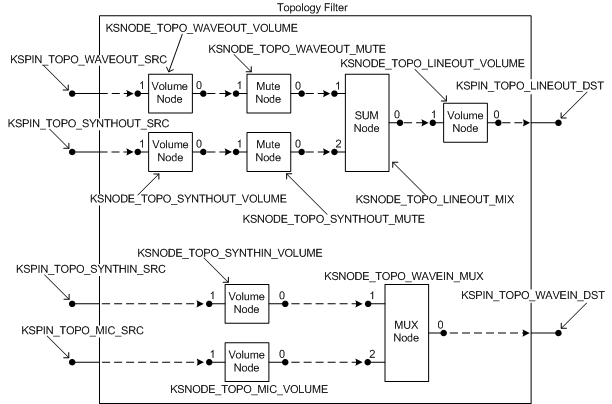

# Topology Filters


## <span id="topology_filters"></span><span id="TOPOLOGY_FILTERS"></span>


A *topology filter* represents the portion of the circuitry on an audio adapter card that handles interactions among the various wave and MIDI streams that are managed on the card. This circuitry does mixing of rendering streams and multiplexing of capture streams.

A topology filter provides the *bridge pins* (see [Audio Filter Graphs](audio-filter-graphs.md)) that represent the audio adapter's physical connections to external devices. These connections typically carry analog output signals that drive speakers and analog input signals from microphones. A topology filter's bridge pins might also represent analog linein and lineout jacks, and possibly even digital input and output connectors.

The term "topology filter" is in one sense a misnomer. In spite of its name, a topology filter is only one of several types of audio filter that expose their internal topology or layout. Although the topology filter contains key topological features, it does not necessarily contain the adapter's entire topology. Wave and MIDI filters have their own topologies. For example, a minimal WaveCyclic or WavePci filter (see [Wave Filters](wave-filters.md)) might expose a topology that consists of two pins and either a DAC (digital-to-analog converter) or ADC (analog-to-digital converter) depending on whether the underlying device does audio rendering or capture.

A topology filter is implemented as a port/miniport pair. A topology filter factory creates a topology filter as follows:

-   It instantiates a Topology miniport driver object.

-   It instantiates a Topology port driver object by calling [**PcNewPort**](https://msdn.microsoft.com/library/windows/hardware/ff537715) with GUID value **CLSID\_PortTopology**.

-   It calls the port driver's [**IPort::Init**](https://msdn.microsoft.com/library/windows/hardware/ff536943) method to bind the miniport driver to the port driver.

The code example in [Subdevice Creation](subdevice-creation.md) illustrates this process.

The Topology port and miniport drivers communicate with each other through their respective [IPortTopology](https://msdn.microsoft.com/library/windows/hardware/ff536896) and [IMiniportTopology](https://msdn.microsoft.com/library/windows/hardware/ff536712) interfaces. These interfaces are relatively simple compared to those for wave and MIDI port and miniport drivers because topology filters do not need to explicitly manage the streams that pass through their pins. A topology filter's pins represent hardwired connections in the adapter hardware. The physical connection underlying a topology filter pin typically carries an analog audio signal, but might carry a digital audio stream instead, depending on the hardware implementation.

In contrast to the [IMiniportWaveCyclic](https://msdn.microsoft.com/library/windows/hardware/ff536714), [IMiniportWavePci](https://msdn.microsoft.com/library/windows/hardware/ff536724), [IMiniportMidi](https://msdn.microsoft.com/library/windows/hardware/ff536703), and [IMiniportDMus](https://msdn.microsoft.com/library/windows/hardware/ff536699) interfaces, the [IMiniportTopology](https://msdn.microsoft.com/library/windows/hardware/ff536712) interface has no **NewStream** method.

Most of the functionality of a topology filter is provided by its property handlers. The topology filter exists primarily to provide topology information to the [SysAudio system driver](kernel-mode-wdm-audio-components.md#sysaudio_system_driver) and to applications that use the Microsoft Windows Multimedia mixer API. The property handlers in the topology filter provide access to the various controls (such as volume, equalization, and reverb) that audio adapters typically offer. Through property requests, the mixer API can enumerate the control nodes in the adapter hardware, discover connections between nodes, and both query and set the nodes' control parameters. The SndVol32 application (see [SysTray and SndVol32](systray-and-sndvol32.md)) uses the mixer API to discover the adapter's per-stream volume and mute controls.

When building a filter graph, SysAudio queries the topology filter for the [**KSPROPERTY\_PIN\_PHYSICALCONNECTION**](https://msdn.microsoft.com/library/windows/hardware/ff565205) properties at its pins to determine which wave, MIDI, or DirectMusic filter pin is connected to which topology filter pin.

Unlike a wave, MIDI, or DirectMusic filter, a topology filter does not instantiate pins. Thus, no pin objects are available to handle queries for a topology filter's pin properties. The topology filter itself handles all queries regarding the physical connections at its pins. For more information, see [KSPROPSETID\_Pin](https://msdn.microsoft.com/library/windows/hardware/ff566584).

Similar to other types of audio filters, a topology filter uses an array of [**PCCONNECTION\_DESCRIPTOR**](https://msdn.microsoft.com/library/windows/hardware/ff537688) structures to describe its internal topology. The miniport driver exposes this array in the [**PCFILTER\_DESCRIPTOR**](https://msdn.microsoft.com/library/windows/hardware/ff537694) structure that it outputs from the [**IMiniport::GetDescription**](https://msdn.microsoft.com/library/windows/hardware/ff536765) method. The array specifies the topology as a list of connections between the topology filter's nodes and pins (see [Nodes and Connections](nodes-and-connections.md)). The [WDMAud system driver](user-mode-wdm-audio-components.md#wdmaud_system_driver) translates these connections and nodes into the mixer lines and controls that the mixer API exposes to applications. As discussed in [Audio Filters](audio-filters.md), an input pin on a KS filter maps to a SRC mixer line, and an output pin on a filter maps to a DST mixer line.

A typical audio adapter can play wave and MIDI files through a speaker, and can capture audio signals from a microphone and a MIDI synthesizer. The code example below contains the PCCONNECTION\_DESCRIPTOR array for a topology filter that exposes these capabilities:

```cpp
    // topology pins
    enum
    {
        KSPIN_TOPO_WAVEOUT_SRC = 0,
        KSPIN_TOPO_SYNTHOUT_SRC,
        KSPIN_TOPO_SYNTHIN_SRC,
        KSPIN_TOPO_MIC_SRC,
        KSPIN_TOPO_LINEOUT_DST,
        KSPIN_TOPO_WAVEIN_DST
    };
 
    // topology nodes
    enum
    {
        KSNODE_TOPO_WAVEOUT_VOLUME = 0,
        KSNODE_TOPO_WAVEOUT_MUTE,
        KSNODE_TOPO_SYNTHOUT_VOLUME,
        KSNODE_TOPO_SYNTHOUT_MUTE,
        KSNODE_TOPO_MIC_VOLUME,
        KSNODE_TOPO_SYNTHIN_VOLUME,
        KSNODE_TOPO_LINEOUT_MIX,
        KSNODE_TOPO_LINEOUT_VOLUME,
        KSNODE_TOPO_WAVEIN_MUX
    };
 
    static PCCONNECTION_DESCRIPTOR MiniportConnections[] =
    {
       // FromNode---------------------FromPin------------------ToNode-----------------------ToPin
 
        { PCFILTER_NODE,               KSPIN_TOPO_WAVEOUT_SRC,  KSNODE_TOPO_WAVEOUT_VOLUME,  1 },
        { KSNODE_TOPO_WAVEOUT_VOLUME,  0,                       KSNODE_TOPO_WAVEOUT_MUTE,    1 },
        { KSNODE_TOPO_WAVEOUT_MUTE,    0,                       KSNODE_TOPO_LINEOUT_MIX,     1 },
 
        { PCFILTER_NODE,               KSPIN_TOPO_SYNTHOUT_SRC, KSNODE_TOPO_SYNTHOUT_VOLUME, 1 },
        { KSNODE_TOPO_SYNTHOUT_VOLUME, 0,                       KSNODE_TOPO_SYNTHOUT_MUTE,   1 },
        { KSNODE_TOPO_SYNTHOUT_MUTE,   0,                       KSNODE_TOPO_LINEOUT_MIX,     2 },
 
        { PCFILTER_NODE,               KSPIN_TOPO_SYNTHIN_SRC,  KSNODE_TOPO_SYNTHIN_VOLUME,  1 },
        { KSNODE_TOPO_SYNTHIN_VOLUME,  0,                       KSNODE_TOPO_WAVEIN_MUX,      1 },
 
        { PCFILTER_NODE,               KSPIN_TOPO_MIC_SRC,      KSNODE_TOPO_MIC_VOLUME,      1 },
        { KSNODE_TOPO_MIC_VOLUME,      0,                       KSNODE_TOPO_WAVEIN_MUX,      2 },
 
        { KSNODE_TOPO_LINEOUT_MIX,     0,                       KSNODE_TOPO_LINEOUT_VOLUME,  1 },
        { KSNODE_TOPO_LINEOUT_VOLUME,  0,                 PCFILTER_NODE,  KSPIN_TOPO_LINEOUT_DST },
 
        { KSNODE_TOPO_WAVEIN_MUX,      0,                 PCFILTER_NODE,  KSPIN_TOPO_WAVEIN_DST }
    };
```

Constant [**PCFILTER\_NODE**](https://msdn.microsoft.com/library/windows/hardware/ff537695) in the preceding code example is the null node ID and is defined in header file Portcls.h. For a description of how this constant is used to distinguish external pins on a filter from logical pins on a node, see [**PCCONNECTION\_DESCRIPTOR**](https://msdn.microsoft.com/library/windows/hardware/ff537688).

Each pin name in the preceding code example ends with either "SRC" or "DST" depending on whether the mixer API maps the pin to a source or destination mixer line. To avoid confusion, remember that source and destination mixer lines map to sink (input) and source (output) KS filter pins, respectively. For more information, see [Audio Filters](audio-filters.md).

The PCCONNECTION\_DESCRIPTOR array in the preceding code example describes the topology filter in the following figure.



The topology filter in the figure has four input (sink) pins on the left and two output (source) pins on the right. The data paths that connect the top two input pins and top output pin mix the two analog signals that have been rendered from the wave and MIDI streams that are being played back. The data paths that connect the bottom two input pins and bottom output pin multiplex the captured analog signals that are being recorded.

The four input pins operate as follows:

-   The KSPIN\_TOPO\_WAVEOUT\_SRC pin is physically connected to the output pin of a wave filter, which renders a wave stream from a source such as a .wav file to produce the analog signal at the pin.

-   The KSPIN\_TOPO\_SYNTHOUT\_SRC pin is physically connected to the output pin of a synth filter, which might render, for example, a MIDI stream from a source such as a .mid file to produce the analog signal at the pin.

-   The KSPIN\_TOPO\_SYNTHIN\_SRC pin is physically connected to a synthesizer that generates an analog signal. (Note that a more practical hardware design might take a MIDI input stream from an MPU-401 MIDI interface and convert it directly to wave format, bypassing the topology filter altogether.)

-   The KSPIN\_TOPO\_MIC\_SRC pin is physically connected to an input jack that takes an analog signal from a microphone.

The two output pins operate as follows:

-   The KSPIN\_TOPO\_LINEOUT\_DST pin is physically connected to an analog lineout jack that typically drives a set of speakers.

-   The KSPIN\_TOPO\_WAVEIN\_DST pin is physically connected to the input pin of a wave filter, which converts the analog signal to a wave stream and writes it to a destination such as a .wav file.

The volume and mute nodes (see [**KSNODETYPE\_VOLUME**](https://msdn.microsoft.com/library/windows/hardware/ff537208) and [**KSNODETYPE\_MUTE**](https://msdn.microsoft.com/library/windows/hardware/ff537178)) are used to control the volume levels of the various streams. The SUM node (see [**KSNODETYPE\_SUM**](https://msdn.microsoft.com/library/windows/hardware/ff537196)) mixes the audio streams from the wave and MIDI inputs. The MUX node (see [**KSNODETYPE\_MUX**](https://msdn.microsoft.com/library/windows/hardware/ff537180)) selects between the two input streams.

The figure uses a dashed arrow to indicate a connection between two nodes or between a pin and a node. The arrow points in the direction of data flow. The diagram shows a total of 13 connections, each of which corresponds to one of the 13 elements in the PCCONNECTION\_DESCRIPTOR array in the preceding code example.

In addition to the topology filter, the adapter driver creates other filters--wave, FM synth, wave table, and so on--that connect to the pins on the topology filter.

For example, the wave filter that is physically connected to the topology filter's KSPIN\_TOPO\_WAVEOUT\_SRC pin contains a DAC (represented by a [**KSNODETYPE\_DAC**](https://msdn.microsoft.com/library/windows/hardware/ff537158) node) that converts PCM data to the analog signal that it outputs to the topology filter's pin. The FM-synth or a wavetable synth filter that is physically connected to the topology filter's KSPIN\_TOPO\_SYNTHOUT\_SRC pin similarly converts MIDI data to an analog signal that it outputs to the topology filter's pin. The topology filter mixes the analog signals from these two pins and outputs the mixed signal to the speakers.

The topology filter's physical connections to other filters that represent other hardware devices on the same adapter card need to be distinguished from other types of connections to filters. For example, certain pins on wave, MIDI, and DirectMusic filters can be connected or disconnected under software control.

During device startup, the adapter driver registers the topology filter's physical connections by calling [**PcRegisterPhysicalConnection**](https://msdn.microsoft.com/library/windows/hardware/ff537726) once per connection. The port driver needs this information in order to respond to [**KSPROPERTY\_PIN\_PHYSICALCONNECTION**](https://msdn.microsoft.com/library/windows/hardware/ff565205) get-property requests.

 

 


