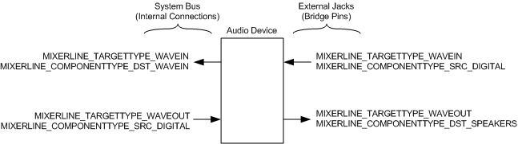

# Topology Pins

## 

The [WDMAud system driver](user-mode-wdm-audio-components.md#wdmaud_system_driver) translates topology pins on KS filters into the source and destination mixer lines that the mixer API exposes to applications. Input (sink) pins become source mixer lines, and output (source) pins become destination mixer lines.

As described in [Pin Factories](pin-factories.md), a miniport driver provides an array of pin descriptors, each of which is a structure of type [**PCPIN\_DESCRIPTOR**](https://msdn.microsoft.com/library/windows/hardware/ff537721) that describes a pin factory belonging to a filter. Each pin descriptor includes the following information:

-   **Dataflow direction specifier**

    Indicates whether the data stream enters (KSPIN\_DATAFLOW\_IN) or exits (KSPIN\_DATAFLOW\_OUT) the filter through the pin.

-   **KS pin category GUID**

    Indicates the pin category to which the pin belongs. For example, on an audio playback device, one pin might accept a wave-formatted digital audio stream, and another pin might generate an analog audio signal to drive a speaker. The miniport driver identifies these two types of pins as belonging to distinct pin categories.

-   **Communications type specifier**

    Indicates the type of IRP communications that the pin supports. A pin that supports IRP communications can be an IRP sink (KSPIN\_COMMUNICATION\_SINK), IRP source (KSPIN\_COMMUNICATION\_SOURCE), or both (KSPIN\_COMMUNICATION\_BOTH). A pin that does not support IRP communications can either lie inside a KS filter graph (KSPIN\_COMMUNICATION\_NONE) or be a [*bridge pin*](https://msdn.microsoft.com/library/windows/hardware/ff556272#wdkgloss_bridge_pin) at the endpoint of a graph (KSPIN\_COMMUNICATION\_BRIDGE).

For more information about bridge pins, see [Audio Filter Graphs](audio-filter-graphs.md).

WDMAud converts the information from the miniport driver's pin descriptor into a mixer-line descriptor, which is a structure of type MIXERLINE that includes the following information:

-   **Mixer-line component type**

    Indicates whether the mixer line is a source or a destination line, and also indicates the general function of the mixer line. For example, the component type for a mixer line that transports an analog signal that is generated from a wave output (rendering) stream to drive a set of headphones is MIXERLINE\_COMPONENTTYPE\_DST\_HEADPHONES.

-   **Mixer-line target type**

    Indicates the type of data stream that the mixer line transports. For example, the target type for a wave output (rendering) stream is MIXERLINE\_TARGETTYPE\_WAVEOUT, and the target type for a wave input (capture) stream is MIXERLINE\_TARGETTYPE\_WAVEIN.

For more information about the MIXERLINE structure, see the Microsoft Windows SDK documentation.

The following two tables show how WDMAud translates input (KSPIN\_DATAFLOW\_IN) pins to source mixer lines. The first table shows how the input pin **KS pin category GUID**s map to the associated MIXERLINE target types.

PCPIN\_DESCRIPTOR values
MIXERLINE values
KS pin category GUID
Bridge pin?
Target type
KSNODETYPE\_MICROPHONE

KSNODETYPE\_DESKTOP\_MICROPHONE

--

MIXERLINE\_TARGETTYPE\_WAVEIN

KSNODETYPE\_LEGACY\_AUDIO\_CONNECTOR

KSCATEGORY\_AUDIO

KSNODETYPE\_SPEAKER

--

MIXERLINE\_TARGETTYPE\_WAVEOUT

KSNODETYPE\_CD\_PLAYER

--

MIXERLINE\_TARGETTYPE\_UNDEFINED

KSNODETYPE\_SYNTHESIZER

--

MIXERLINE\_TARGETTYPE\_MIDIOUT

KSNODETYPE\_LINE\_CONNECTOR

--

MIXERLINE\_TARGETTYPE\_UNDEFINED

KSNODETYPE\_TELEPHONE

KSNODETYPE\_PHONE\_LINE

KSNODETYPE\_DOWN\_LINE\_PHONE

--

MIXERLINE\_TARGETTYPE\_UNDEFINED

KSNODETYPE\_ANALOG\_CONNECTOR

Yes

MIXERLINE\_TARGETTYPE\_WAVEIN

KSNODETYPE\_ANALOG\_CONNECTOR

No

MIXERLINE\_TARGETTYPE\_WAVEOUT

KSNODETYPE\_SPDIF\_INTERFACE

Yes

MIXERLINE\_TARGETTYPE\_WAVEIN

KSNODETYPE\_SPDIF\_INTERFACE

No

MIXERLINE\_TARGETTYPE\_WAVEOUT

 

The following table shows how the input pin **KS pin category GUID**s map to the associated MIXERLINE component types.

<table>
<colgroup>
<col width="50%" />
<col width="50%" />
</colgroup>
<thead>
<tr class="header">
<th align="left">PCPIN_DESCRIPTOR values</th>
<th align="left">MIXERLINE values</th>
</tr>
</thead>
<tbody>
<tr class="odd">
<td align="left">KS pin category GUID</td>
<td align="left">Component type</td>
</tr>
<tr class="even">
<td align="left">
KSNODETYPE_MICROPHONE

KSNODETYPE_DESKTOP_MICROPHONE
</td>
<td align="left">
MIXERLINE_COMPONENTTYPE_SRC_MICROPHONE
</td>
</tr>
<tr class="odd">
<td align="left">
KSNODETYPE_LEGACY_AUDIO_CONNECTOR

KSCATEGORY_AUDIO

KSNODETYPE_SPEAKER
</td>
<td align="left">
MIXERLINE_COMPONENTTYPE_SRC_WAVEOUT
</td>
</tr>
<tr class="even">
<td align="left">
KSNODETYPE_CD_PLAYER
</td>
<td align="left">
MIXERLINE_COMPONENTTYPE_SRC_COMPACTDISC
</td>
</tr>
<tr class="odd">
<td align="left">
KSNODETYPE_SYNTHESIZER
</td>
<td align="left">
MIXERLINE_COMPONENTTYPE_SRC_SYNTHESIZER
</td>
</tr>
<tr class="even">
<td align="left">
KSNODETYPE_LINE_CONNECTOR
</td>
<td align="left">
MIXERLINE_COMPONENTTYPE_SRC_LINE
</td>
</tr>
<tr class="odd">
<td align="left">
KSNODETYPE_TELEPHONE

KSNODETYPE_PHONE_LINE

KSNODETYPE_DOWN_LINE_PHONE
</td>
<td align="left">
MIXERLINE_COMPONENTTYPE_SRC_TELEPHONE
</td>
</tr>
<tr class="even">
<td align="left">
KSNODETYPE_ANALOG_CONNECTOR
</td>
<td align="left">
MIXERLINE_COMPONENTTYPE_SRC_ANALOG
</td>
</tr>
<tr class="odd">
<td align="left">
KSNODETYPE_ANALOG_CONNECTOR
</td>
<td align="left">
MIXERLINE_COMPONENTTYPE_SRC_ANALOG
</td>
</tr>
<tr class="even">
<td align="left">
KSNODETYPE_SPDIF_INTERFACE
</td>
<td align="left">
MIXERLINE_COMPONENTTYPE_SRC_DIGITAL
</td>
</tr>
<tr class="odd">
<td align="left">
KSNODETYPE_SPDIF_INTERFACE
</td>
<td align="left">
MIXERLINE_COMPONENTTYPE_SRC_DIGITAL
</td>
</tr>
</tbody>
</table>

 

In the preceding tables, the left column specifies the pin category GUID from the pin's PCPIN\_DESCRIPTOR structure, and the right columns specify the corresponding target type and component type for the MIXERLINE structure.

The entries in the column labeled "Bridge Pin?" indicate whether the pin is a bridge pin. A "Yes" means that the pin communications type is KSPIN\_COMMUNICATION\_BRIDGE. A "No" means that the pin communications type is a KSPIN\_COMMUNICATION\_*Xxx* value other than KSPIN\_COMMUNICATION\_BRIDGE. If WDMAud ignores the pin communications type when translating the pin parameters to mixer-line parameters, the "Bridge Pin?" entry is a dash (-).

For all pin categories that do not appear in the preceding tables, WDMAud translates the input pins to source mixer lines with target types of MIXERLINE\_TARGETTYPE\_UNDEFINED and component types of MIXERLINE\_COMPONENTTYPE\_SRC\_UNDEFINED.

The following tables show how WDMAud translates output (KSPIN\_DATAFLOW\_OUT) pins to destination mixer lines. The column headings have the same meanings as in the preceding table. The first table shows how the output pin **KS pin category GUID**s map to the associated MIXERLINE target types.

PCPIN\_DESCRIPTOR values
MIXERLINE values
KS pin category GUID
Bridge pin?
Target type
KSNODETYPE\_SPEAKER

KSNODETYPE\_DESKTOP\_SPEAKER

KSNODETYPE\_ROOM\_SPEAKER

KSNODETYPE\_COMMUNICATION\_SPEAKER

--

MIXERLINE\_TARGETTYPE\_WAVEOUT

KSCATEGORY\_AUDIO

PINNAME\_CAPTURE

--

MIXERLINE\_TARGETTYPE\_WAVEIN

KSNODETYPE\_HEADPHONES

KSNODETYPE\_HEAD\_MOUNTED\_DISPLAY\_AUDIO

--

MIXERLINE\_TARGETTYPE\_WAVEOUT

KSNODETYPE\_TELEPHONE

KSNODETYPE\_PHONE\_LINE

KSNODETYPE\_DOWN\_LINE\_PHONE

--

MIXERLINE\_TARGETTYPE\_UNDEFINED

KSNODETYPE\_ANALOG\_CONNECTOR

Yes

MIXERLINE\_TARGETTYPE\_WAVEOUT

KSNODETYPE\_ANALOG\_CONNECTOR

No

MIXERLINE\_TARGETTYPE\_WAVEIN

KSNODETYPE\_SPDIF\_INTERFACE

Yes

MIXERLINE\_TARGETTYPE\_WAVEOUT

KSNODETYPE\_SPDIF\_INTERFACE

No

MIXERLINE\_TARGETTYPE\_WAVEIN

 

The following table shows how the output pin **KS pin category GUID**s map to the associated MIXERLINE component types.

<table>
<colgroup>
<col width="50%" />
<col width="50%" />
</colgroup>
<thead>
<tr class="header">
<th align="left">PCPIN_DESCRIPTOR values</th>
<th align="left">MIXERLINE values</th>
</tr>
</thead>
<tbody>
<tr class="odd">
<td align="left">KS pin category GUID</td>
<td align="left">Component type</td>
</tr>
<tr class="even">
<td align="left">
KSNODETYPE_SPEAKER

KSNODETYPE_DESKTOP_SPEAKER

KSNODETYPE_ROOM_SPEAKER

KSNODETYPE_COMMUNICATION_SPEAKER
</td>
<td align="left">
MIXERLINE_COMPONENTTYPE_DST_SPEAKERS
</td>
</tr>
<tr class="odd">
<td align="left">
KSCATEGORY_AUDIO

PINNAME_CAPTURE
</td>
<td align="left">
MIXERLINE_COMPONENTTYPE_DST_WAVEIN
</td>
</tr>
<tr class="even">
<td align="left">
KSNODETYPE_HEADPHONES

KSNODETYPE_HEAD_MOUNTED_DISPLAY_AUDIO
</td>
<td align="left">
MIXERLINE_COMPONENTTYPE_DST_HEADPHONES
</td>
</tr>
<tr class="odd">
<td align="left">
KSNODETYPE_TELEPHONE

KSNODETYPE_PHONE_LINE

KSNODETYPE_DOWN_LINE_PHONE
</td>
<td align="left">
MIXERLINE_COMPONENTTYPE_DST_TELEPHONE
</td>
</tr>
<tr class="even">
<td align="left">
KSNODETYPE_ANALOG_CONNECTOR
</td>
<td align="left">
MIXERLINE_COMPONENTTYPE_DST_SPEAKERS
</td>
</tr>
<tr class="odd">
<td align="left">
KSNODETYPE_ANALOG_CONNECTOR
</td>
<td align="left">
MIXERLINE_COMPONENTTYPE_DST_WAVEIN
</td>
</tr>
<tr class="even">
<td align="left">
KSNODETYPE_SPDIF_INTERFACE
</td>
<td align="left">
MIXERLINE_COMPONENTTYPE_DST_SPEAKERS
</td>
</tr>
<tr class="odd">
<td align="left">
KSNODETYPE_SPDIF_INTERFACE
</td>
<td align="left">
MIXERLINE_COMPONENTTYPE_DST_WAVEIN
</td>
</tr>
</tbody>
</table>

 

For all pin categories that do not appear in the preceding tables, WDMAud translates the output pins to destination mixer lines with target types of MIXERLINE\_TARGETTYPE\_UNDEFINED and component types of MIXERLINE\_COMPONENTTYPE\_DST\_UNDEFINED.

In the preceding tables, most of the KS pin category GUIDs have KSNODETYPE\_*Xxx* names. These names are defined in header files Ksmedia.h and Dmusprop.h. (Two departures from this naming convention are GUIDs KSCATEGORY\_AUDIO and PINNAME\_CAPTURE, which are also defined in Ksmedia.h.) As described in [Topology Nodes](topology-nodes.md), KSNODETYPE\_*Xxx* GUIDs can also be used to designate KS node types. Most KSNODETYPE\_*Xxx* GUIDs specify either pin categories or node types, but not both. The exception is [**KSNODETYPE\_SYNTHESIZER**](https://msdn.microsoft.com/library/windows/hardware/ff537203), which can specify either a pin category or a node type, depending on the context in which is used. For a list of KSNODETYPE\_*Xxx* GUIDs representing pin categories, see [Pin Category Property](pin-category-property.md). For a list of KSNODETYPE\_*Xxx* GUIDs representing node types, see [Audio Topology Nodes](https://msdn.microsoft.com/library/windows/hardware/ff536219).

KSCATEGORY\_AUDIO is another dual-usage GUID. It can be used as either a **KS pin category GUID** or a **KS filter category GUID**, depending on the context. During device installation, an audio driver registers its device interface under the filter category KSCATEGORY\_AUDIO. For more information, see [Installing Device Interfaces for an Audio Adapter](installing-device-interfaces-for-an-audio-adapter.md).

For a pin category of KSNODETYPE\_ANALOG\_CONNECTOR or KSNODETYPE\_SPDIF\_INTERFACE, WDMAud needs to know whether the pin is a bridge pin to correctly translate the pin to its mixer-line equivalent. For example, an S/PDIF pin (with pin category KSNODETYPE\_SPDIF\_INTERFACE) translates to one of the four mixer-line types shown in the following figure. The translation depends on both the pin's data direction (in or out) and whether it is a bridge pin (yes or no), which together yield four possible types of mixer line (in+yes, in+no, out+yes, and out+no). The four mixer-line types shown in the figure represent the bottom pairs of entries from the preceding tables.

Note that two streams on the right side of the audio device in the figure are in S/PDIF format, and the two streams on the left are in wave format. The audio device performs the conversion between the two digital formats.

The SndVol32 application is a client of the mixer API. The mixer API converts each pin found in the topology to either a source or destination mixer line, but the line might not be shown in SndVol32, which recognizes only a subset of the mixer-line component types that header file Mmsystem.h defines for the mixer API. For more information about SndVol32, see [SysTray and SndVol32](systray-and-sndvol32.md).

 

 

