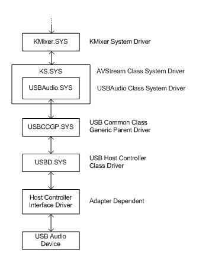

# USB Audio 2.0 Drivers

Starting with Windows 10, release 1703, a USB Audio 2.0 driver is shipped with Windows. It is designed to support the USB Audio 2.0 device class. The driver is a WaveRT audio port class miniport. For more information about the  USB Audio 2.0 device class, see [https://www.usb.org/developers/docs/devclass_docs/](https://www.usb.org/developers/docs/devclass_docs/). 

The driver is named: _usbaudio2.sys_ and the associated inf file is _usbaudio2.inf_.

The driver will identify in device manager as "USB Audio Class 2 Device". This name will be overwritten with a USB Product string, if it is available.

The driver is automatically enabled when a compatible device is attached to the system. However, if a third-party driver exists on the system or Windows Update, that driver will be installed and override the class driver. 

 
## Architecture

USBAudio.Sys fits within the wider architecture of Windows USB Audio as shown. 



## Related USB specifications

The following USB specifications define USB Audio and are referenced in this topic.

-	USB-2 refers to the Universal Serial Bus Specification, Revision 2.0
-	ADC-2 refers to the USB Device Class Definition for Audio Devices, Release 2.0.
-	FMT-2 refers to the Audio Data Formats specification, Release 2.0.

The USB-IF is a special interest group that maintains the [Official USB Specification](https://www.usb.org/developers/docs/), test specifications and tools. 


## Audio formats
The driver supports the formats listed below. An alternate setting which specifies another format defined in FMT-2, or an unknown format, will be ignored.

Type I formats (FMT-2 2.3.1):
-	PCM Format with 8..32 bits per sample (FMT20 2.3.1.7.1)
-	PCM8 Format (FMT-2 2.3.1.7.2)
-	IEEE_FLOAT Format (FMT-2 2.3.1.7.3)

Type III formats (FMT-2 2.3.3 and A.2.3):
-	IEC61937_AC-3
-	IEC61937_MPEG-2_AAC_ADTS
-	IEC61937_DTS-I
-	IEC61937_DTS-II
-	IEC61937_DTS-III
-	TYPE_III_WMA


## Feature descriptions

This section describes the features of the of the USB Audio 2.0 driver. 

### Audio function topology

The driver supports all entity types defined in ADC-2 3.13.

Each Terminal Entity must have a valid clock connection in compatible USB Audio 2.0 hardware. The clock path may optionally include Clock Multiplier and Clock Selector units and must end in a Clock Source Entity.

The driver supports one single clock source only. If a device implements multiple clock source entities and a clock selector, then the driver will use the clock source that is selected by default and will not modify the clock selector’s position.

A Processing Unit (ADC-2 3.13.9) with more than one input pin is not supported.

An Extension Unit (ADC-2 3.13.10) with more than one input pin is not supported.

Cyclic paths in the topology are not allowed.


### Audio streaming

The driver supports the following endpoint synchronization types (USB-2 5.12.4.1):

 -	Asynchronous IN and OUT
 -	Synchronous IN and OUT
 -	Adaptive IN and OUT

For the asynchronous OUT case the driver supports explicit feedback only. A feedback endpoint must be implemented in the respective alternate setting of the AS interface. The driver does not support implicit feedback.

There is currently limited support for devices using a shared clock for multiple endpoints. 

For the Adaptive IN case the driver does not support a feedforward endpoint. If such an endpoint is present in the alternate setting, it will be ignored. The driver handles the Adaptive IN stream in the same way as an Asynchronous IN stream.

The size of isochronous packets created by the device must be within the limits specified in FMT-2.0 section 2.3.1.1. This means that the deviation of actual packet size from nominal size must not exceed +/- one audio slot (audio slot = channel count samples).


## Descriptors

An audio function must implement exactly one AudioControl  Interface Descriptor (ADC-2 4.7) and one or more AudioStreaming Interface Descriptors (ADC-2 4.9). A function with an audio control interface but no streaming interface is not supported.

The driver supports all descriptor types defined in ADC20, section 4. The following subsections provide comments on some specific descriptor types.

### Class-Specific AS interface descriptor 

For details on this specification, refer to ADC-2 4.9.2.

An AS interface descriptor must start with alternate setting zero with no endpoint (no bandwidth consumption) and further alternate settings must be specified in ascending order in compatible USB Audio 2.0 hardware.

An alternate setting with a format that is not supported by the driver will be ignored.

Each non-zero alternate setting must specify an isochronous data endpoint, and optionally a feedback endpoint. A non-zero alternate setting without any endpoint is not supported.

The bTerminalLink field must refer to a Terminal Entity in the topology and its value must be identical in all alternate settings of an AS interface.

The bFormatType field in the AS interface descriptor must be identical to bFormatType specified in the Format Type Descriptor (FMT-2 2.3.1.6).

For Type I formats, exactly one bit must be set to one in the bmFormats field of the AS interface descriptor. Otherwise, the format will be ignored by the driver.

To save bus bandwidth, one AS interface can implement multiple alternate settings with the same format (in terms of bNrChannels  and AS Format Type Descriptor) but different wMaxPacketSize values in the isochronous data endpoint descriptor. For a given sample rate, the driver selects the alternate setting with the smallest wMaxPacketSize that can fulfill the data rate requirements.

### Type I format type descriptor

For details on this specification, refer to FMT-2 2.3.1.6.

The following restrictions apply:

|                            |                        |                               |
|----------------------------|------------------------|-------------------------------|
| Type I PCM format: 		 | 1 <= bSubslotSize <= 4 |		8 <= bBitResolution <= 32 |
| Type I PCM8 format:		 | bSubslotSize == 1	  | 	bBitResolution == 8       |
| Type I IEEE_FLOAT format:	 | bSubslotSize == 4	  | 	bBitResolution == 32      | 
| Type III IEC61937 formats: | bSubslotSize == 2	  | 	bBitResolution == 16      |


### Class-Specific AS isochronous audio data endpoint descriptor 

For details on this specification, refer to ADC-2 4.10.1.2.

The MaxPacketsOnly flag in the bmAttributes field is not supported and will be ignored.

The fields bmControls, bLockDelayUnits and wLockDelay will be ignored.


## Class requests and interrupt data messages

The driver supports a subset of the control requests defined in ADC-2, section 5.2, and supports interrupt data messages (ADC-2 6.1) for some controls. The following table shows the subset that is implemented in the driver.

| Entity           | Control                    | GET CUR | SET CUR | GET RANGE | INTERRUPT |
|------------------|----------------------------|---------|---------|-----------|-----------|
| Clock Source     | Sampling Frequency Control | x       | x       | x         |           |
| Clock Selector   | Clock Selector Control     | x       |         |           |           |
| Clock Multiplier | Numerator Control          | x       |         |           |           |
|                  | Denominator Control        | x       |         |           |           |
| Terminal         | Connector Control          | x       |         |           | x         |
| Mixer Unit       | Mixer Control              | x       | x       | x         |           |
| Selector Unit    | Selector Control           | x       | x       |           |           |
| Feature Unit     | Mute Control               | x       | x       |           | x         |
|                  | Volume Control             | x       | x       | x         | x         |
|                  | Automatic Gain Control     | x       | x       |           |           |
| Effect Unit      | –                          |         |         |           |           |
| Processing Unit  | –                          |         |         |           |           |
| Extension Unit   | –                          |         |         |           |           |


Additional information on the controls and requests is available in the following subsections.

### Clock source entity 

For details on this specification, refer to ADC-2 5.2.5.1.

At a minimum, a Clock Source Entity must implement Sampling Frequency Control GET RANGE and GET CUR requests (ADC-2 5.2.5.1.1) in compatible USB Audio 2.0 hardware.

The Sampling Frequency Control GET RANGE request returns a list of subranges (ADC-2 5.2.1). Each subrange describes a discrete frequency, or a frequency range. A discrete sampling frequency must be expressed by setting MIN and MAX fields to the respective frequency and RES to zero. Individual subranges must not overlap. If a subrange overlaps a previous one, it will be ignored by the driver.

A Clock Source Entity which implements one single fixed frequency only does not need to implement Sampling Frequency Control SET CUR. It implements GET CUR which returns the fixed frequency, and it implements GET RANGE which reports one single discrete frequency.

### Clock selector entity 

For details on this specification, refer to ADC-2 5.2.5.2

The USB Audio 2.0 driver does not support clock selection. The driver uses the Clock Source Entity which is selected by default and never issues a Clock Selector Control SET CUR request. The Clock Selector Control GET CUR request (ADC-2 5.2.5.2.1) must be implemented in compatible USB Audio 2.0 hardware. 


### Feature unit 

For details on this specification, refer to ADC-2 5.2.5.7.

The driver supports one single volume range only. If the Volume Control GET RANGE request returns more than one range, then subsequent ranges will be ignored.

The volume interval expressed by the MIN and MAX fields should be an integer multiple of the step size specified in the RES field.

If a feature unit implements single channel controls as well as a master control for Mute or Volume, then the driver uses the single channel controls and ignores the master control.


## Additional Information for OEM and IHVs

OEMs and IHVs should test their existing and new devices against the supplied in-box driver.

There is not any specific partner customization that is associated with the in-box USB Audio 2.0 driver.

This INF file entry (provided in a update to Windows Release 1703), is used to indentify that the in-box driver is a generic device driver. 

```inf
GenericDriverInstalled,,,,1
```


The in-box driver registers for the following compatible IDs with usbaudio2.inf.

```inf
USB\Class_01&SubClass_00&Prot_20
USB\Class_01&SubClass_01&Prot_20
USB\Class_01&SubClass_02&Prot_20
USB\Class_01&SubClass_03&Prot_20
```

See the USB audio 2.0 specification for subclass types.

USB Audio 2.0 Devices with MIDI (subclass 0x03 above) will enumerate the MIDI function as a separate multi-function device with usbaudio.sys (USB Audio 1.0 driver) loaded. 

The USB Audio 1.0 class driver registers this compatible ID with wdma_usb.inf.
 
```inf
USB\Class_01
```
 
And has these exclusions:
 
```inf
USB\Class_01&SubClass_00&Prot_20
USB\Class_01&SubClass_01&Prot_20
USB\Class_01&SubClass_02&Prot_20
USB\Class_01&SubClass_03&Prot_20
```

An arbitrary number of channels (greater than eight) are not supported in shared mode due to a limitation of the Windows audio stack.


## IHV USB Audio 2.0 drivers and updates
For IHV provided third party driver USB Audio 2.0 drivers, those drivers will continue to be preferred for their devices over our in-box driver unless they update their driver to explicitly override this behavior and use the in-box driver. 

## Audio Jack Registry Descriptions

Starting in Windows 10 release 1703, IHVs that create USB Audio Class 2.0 devices having one or more jacks have the capability to describe these jacks to the in-box Audio Class 2.0 driver. The in-box driver uses the supplied jack information when handling the KSPROPERTY_JACK_DESCRIPTION for this device.

Jack information is stored in the registry in the device instance key (HW key).

The following describes the audio jack information settings in the registry:

```text
REG_DWORD  T<tid>_NrJacks                 # of the jack on this device
REG_DWORD  T<tid>_J<n>_ChannelMapping     Channel mask. The value is defined in ksmedia.h. e.g. SPEAKER_FRONT_RIGHT or KSAUDIO_SPEAKER_5POINT1_SURROUND
REG_DWORD  T<tid>_J<n>_ConnectorType      The enum value is define in EPcxConnectionType. 
REG_DWORD  T<tid>_J<n>_GeoLocation        The enum value is define in EPcxGeoLocation.
REG_DWORD  T<tid>_J<n>_GenLocation        The enum value is define in EPcxGenLocation.
REG_DWORD  T<tid>_J<n>_PortConnection     The enum value is define in EPxcPortConnection.
REG_DWORD  T<tid>_J<n>_Color              The color needs to be represent by RGB like this: 0x00RRGGBB (NOT a COLORREF).
```

\<tid\> = terminal ID (As defined in the descriptor)
  
\<n\>   = Jack number (1 ~ n). 

Convention for \<tid\> and \<n\> is:

- Base 10 (8, 9, 10 rather than 8, 9, a)
- No leading zeros
- n is 1-based (first jack is jack 1 rather than jack 0)

For example: 

T1_NrJacks, T1_J2_ChannelMapping, T1_J2_ConnectorType

For additional audio jack information, see [KSJACK_DESCRIPTION structure](https://docs.microsoft.com/windows-hardware/drivers/audio/ksjack-description).

These registry values can be set in various ways: 

- Using custom INFs which wrap the in-box INF for the purpose to set these values.

- Directly by the h/w device via a Microsoft OS Descriptors for USB devices (see example below). For more information about creating these descriptors, see [Microsoft OS Descriptors for USB Devices](https://docs.microsoft.com/windows-hardware/drivers/usbcon/microsoft-defined-usb-descriptors).

### Microsoft OS Descriptors for USB Example

The following Microsoft OS Descriptors for USB example contains the channel mapping and color for one jack. The example is for a non-composite device with single feature descriptor. 

The IHV vendor should extend it to contain any other information for the jack description. 


```text
UCHAR Example2_MSOS20DescriptorSetForUAC2 [0x76] = {
    //
    // Microsoft OS 2.0 Descriptor Set Header
    //
    0x0A, 0x00,             // wLength - 10 bytes
    0x00, 0x00,             // MSOS20_SET_HEADER_DESCRIPTOR
    0x00, 0x00, 0x0?, 0x06, // dwWindowsVersion – 0x060?0000 for future Windows version
    0x76, 0x00,             // wTotalLength – 118 bytes // update later

    //
    // Microsoft OS 2.0 Registry Value Feature Descriptor
    //
    0x42, 0x00,             // bLength - 66 bytes
    0x04, 0x00,             // wDescriptorType – 5 for Registry Property
    0x04, 0x00,             // wPropertyDataType - 4 for REG_DWORD
    0x34, 0x00,             // wPropertyNameLength – 52 bytes
    0x54, 0x00, 0x30, 0x00, // Property Name - “T01_J01_ChannelMapping”
    0x31, 0x00, 0x5f, 0x00,
    0x4a, 0x00, 0x30, 0x00,
    0x31, 0x00, 0x5f, 0x00, 
    0x43, 0x00, 0x68, 0x00,
    0x61, 0x00, 0x6e, 0x00,
    0x6e, 0x00, 0x65, 0x00,
    0x6c, 0x00, 0x4d, 0x00,
    0x61, 0x00, 0x70, 0x00,
    0x70, 0x00, 0x69, 0x00,
    0x6e, 0x00, 0x67, 0x00,
    0x00, 0x00
    0x04, 0x00,                       // wPropertyDataLength – 4 bytes
    0x02, 0x00, 0x00, 0x00  // PropertyData - SPEAKER_FRONT_RIGHT

    //
    // Microsoft OS 2.0 Registry Value Feature Descriptor
    //
    0x2A, 0x00,             // bLength - 42 bytes
    0x04, 0x00,             // wDescriptorType – 5 for Registry Property
    0x04, 0x00,             // wPropertyDataType - 4 for REG_DWORD
    0x1C, 0x00,             // wPropertyNameLength – 28 bytes
    0x54, 0x00, 0x30, 0x00, // Property Name - “T01_J01_Color”
    0x31, 0x00, 0x5f, 0x00,
    0x4a, 0x00, 0x30, 0x00,
    0x31, 0x00, 0x5f, 0x00,
    0x43, 0x00, 0x6f, 0x00,
    0x6c, 0x00, 0x6f, 0x00,
    0x72, 0x00, 0x00, 0x00,
    0x04, 0x00,             // wPropertyDataLength – 4 bytes
    0x00, 0x00, 0xff, 0x00  // PropertyData - 0xff0000 - RED }
```


## Troubleshooting
If the driver does not start, the system event log should be checked. The driver logs events which indicate the reason for the failure. Similarly, audio logs can be manually collected following the steps described in [this blog entry](https://blogs.msdn.microsoft.com/matthew_van_eerde/2017/01/09/collecting-audio-logs-the-old-fashioned-way/). If the failure may indicate a driver problem, please report it using the Feedback Hub described below, and include the logs.

For information on how to read logs for the USB Audio 2.0 class driver using supplemental TMF files, see [this blog entry](https://blogs.msdn.microsoft.com/matthew_van_eerde/2017/10/23/how-to-gather-and-read-logs-for-microsofts-usb-audio-2-0-class-driver/). For general information on working with TMF files, see [Displaying a Trace Log with a TMF File](https://docs.microsoft.com/windows-hardware/drivers/devtest/displaying-a-trace-log-with-a-tmf-file).

## Feedback Hub
If you run into a problem with this driver, please collect audio logs and then  follow steps outlined in [this blog entry](https://blogs.msdn.microsoft.com/matthew_van_eerde/2016/09/26/report-problems-with-logs-and-suggest-features-with-the-feedback-hub/) to bring it to our attention via the Feedback Hub.


## Driver development 

This USB Audio 2.0 class driver was developed by Thesycon and is supported by Microsoft.


### See also

[Windows Driver Model (WDM)](https://msdn.microsoft.com/library/windows/hardware/ff565698)

[Audio Drivers Overview](https://docs.microsoft.com/windows-hardware/drivers/audio/getting-started-with-wdm-audio-drivers)

[WaveRT Port Driver](https://docs.microsoft.com/windows-hardware/drivers/audio/introducing-the-wavert-port-driver)

[Low Latency Audio](https://docs.microsoft.com/windows-hardware/drivers/audio/low-latency-audio)


