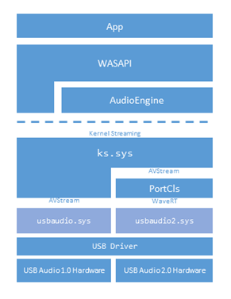

## Overview

Starting with Windows 10, release 1703, a USB 2.0 driver is shipped with Windows. This driver provides basic functionality including:

- The driver is designed to support the USB Audio 2.0 device class. For more information see [http://www.usb.org/developers/docs/devclass_docs/](http://www.usb.org/developers/docs/devclass_docs/)
- The driver is a WaveRT Audio Port Class
- The driver supports power management including USB selective suspend
- DRM and copy protected content is not supported 

The driver is named: _usbaudio2.sys_ and the associated inf file is _usbaudio2.inf_.

The driver will identify in device manager as "USB Audio Class 2 Device". This name will be overwritten with USB Product string, if it is available.

The driver is automatically enabled when a compatible device is attached to the system.

 
## Architecure

USBAudio.Sys fits within the wider architecture of Windows USB Audio as shown. 

## Audio Formats
The driver supports the formats listed below. An alternate setting which specifies another format defined in FMT20, or an unknown format, will be ignored.

Type I formats (FMT20 2.3.1):
-	PCM Format with 8..32 bits per sample (FMT20 2.3.1.7.1)
-	PCM8 Format (FMT20 2.3.1.7.2)
-	IEEE_FLOAT Format (FMT20 2.3.1.7.3)

Type III formats (FMT20 2.3.3 and A.2.3):
-	IEC61937_AC-3
-	IEC61937_MPEG-2_AAC_ADTS
-	IEC61937_DTS-I
-	IEC61937_DTS-II
-	IEC61937_DTS-III
-	TYPE_III_WMA

## Feature descriptions

This section describes the features of the of the USB 2.0 driver. The following USB specificiation are referenced.

-	USB-2 refers to the Universal Serial Bus Specification, Revision 2.0
-	ADC-2 refers to the USB Audio Device Class specification, Release 2.0.
-	FMT-2 refers to the Audio Data Formats specification, Release 2.0.

The USB-IF is a special interest group that maintains the [Official USB Specification](http://www.usb.org/developers/docs/), test specifications and tools. 

### Audio function topology - (ADC-2.0 3.13)

The driver supports all entity types defined in ADC-2 3.13.

Each Terminal Entity must have a valid clock connection. The clock path may optionally include Clock Multiplier and Clock Selector units and must end in a Clock Source Entity.

The driver supports one single clock source only. If a device implements multiple clock source entities and a clock selector then the driver will use the clock source that is selected by default and will not modify the clock selector’s position.

A Processing Unit (ADC-2 3.13.9) with more than one input pin is not supported.

An Extension Unit (ADC-2 3.13.10) with more than one input pin is not supported.

Cyclic paths in the topology are not allowed.

### Audio Streaming
The driver supports the following endpoint synchronization types (USB-2 5.12.4.1):

 -	Asynchronous IN and OUT
 -	Synchronous IN and OUT
 -	Adaptive IN and OUT

For the asynchronous OUT case the driver supports explicit feedback only. A feedback endpoint must be implemented in the respective alternate setting of the AS interface. The driver does not support implicit feedback.

For the Adaptive IN case the driver does not support a feedforward endpoint. If such an endpoint is present in the alternate setting, it will be ignored. The driver handles the Adaptive IN stream in the same way as an Asynchronous IN stream.

The size of isochronous packets created by the device must be within the limits specified in FMT-2.0 section 2.3.1.1. This means that the deviation of actual packet size from nominal size must not exceed +/- one audio slot (audio slot = channel count samples).

### Descriptors

An audio function must implement exactly one AudioControl  Interface Descriptor (ADC-2 4.7) and one or more AudioStreaming Interface Descriptors (ADC-2 4.9). A function with an audio control interface but no streaming interface is not supported.

The driver supports all descriptor types defined in ADC20, section 4. The following subsections provide comments on some specific descriptor types.

### Class-Specific AS Interface Descriptor (ADC-2 4.9.2)

An AS interface descriptor must start with alternate setting zero with no endpoint (no bandwidth consumption) and further alternate settings must be specified in ascending order.

An alternate setting with a format that is not supported by the driver will be ignored.

Each non-zero alternate setting must specify an isochronous data endpoint, and optionally a feedback endpoint. A non-zero alternate setting without any endpoint is not supported.

The bTerminalLink field must refer to a Terminal Entity in the topology and its value must be identical in all alternate settings of an AS interface.

The bFormatType field in the AS interface descriptor must be identical to bFormatType specified in the Format Type Descriptor (FMT-2 2.3.1.6).

For Type I formats, exactly one bit must be set to one in the bmFormats field of the AS interface descriptor. Otherwise, the format will be ignored by the driver.

To save bus bandwidth, one AS interface can implement multiple alternate settings with the same format (in terms of bNrChannels  and AS Format Type Descriptor) but different wMaxPacketSize values in the isochronous data endpoint descriptor. For a given sample rate, the driver selects the alternate setting with the smallest wMaxPacketSize that can fulfill the data rate requirements.

### Type I Format Type Descriptor (FMT-2 2.3.1.6)

The following restrictions apply:

Type I PCM format: 		1 <= bSubslotSize <= 4		8 <= bBitResolution <= 32
Type I PCM8 format:		bSubslotSize == 1		bBitResolution == 8
Type I IEEE_FLOAT format:	bSubslotSize == 4		bBitResolution == 32
Type III IEC61937 formats:	bSubslotSize == 2		bBitResolution == 16
Class-Specific AS Isochronous Audio Data Endpoint Descriptor (ADC20 4.10.1.2)
The MaxPacketsOnly flag in the bmAttributes field is not supported and will be ignored.
The fields bmControls, bLockDelayUnits and wLockDelay will be ignored.

## Class Requests and Interrupt Data Messages

The driver supports a subset of the control requests defined in ADC20, section 5.2, and supports interrupt data messages (ADC20 6.1) for some controls. The following table shows the subset that is implemented in the driver.

## Additional Information for OEM and IHVs

OEMs and IHVs should test their existing and new devices against the supplied in-box driver.

There is not and any specific partner customization that is associated with the in-box USB Audio 2.0 driver.

This INF file entry (provided in a update to Windows Release 1703), is used to indentify that the in-box driver is a generic device driver. 

    GenericDriverInstalled,,,,1

The in-box driver registers for the following compatible IDs

    Class_01 SubClass_00 Prot_20
    Class_01 SubClass_01 Prot_20
    Class_01 SubClass_02 Prot_20
    Class_01 SubClass_03 Prot_20

## IHV USB 2.0 Audio Drivers and Updates
For IHV provided third party driver USB 2.0 drivers, those drivers will continue to be preferred for their devices over our in-box driver unless they update their driver to explicitly override this behavior and use the in-box driver. 

## Trouble Shooting
If the driver does not start, the system event log should be checked. The driver logs events which indicate the reason for the failure.

## Driver Development 

This driver was developed by Thesycon and is supported by Microsoft.

### See Also

[Windows Driver Model (WDM)](https://msdn.microsoft.com/library/windows/hardware/ff565698)
[Audio Drivers Overview](https://docs.microsoft.com/windows-hardware/drivers/audio/getting-started-with-wdm-audio-drivers)
[WaveRT Port Driver](https://docs.microsoft.com/windows-hardware/drivers/audio/introducing-the-wavert-port-driver)
[low-latency-audio](https://docs.microsoft.com/windows-hardware/drivers/audio/low-latency-audio)

--------------------
[Send comments about this topic to Microsoft](mailto:wsddocfb@microsoft.com?subject=Documentation%20feedback%20[audio\audio]:%20USB%20Audio%20Class%20System%20Driver%20%28Usbaudio.sys%29%20%20RELEASE:%20%287/18/2016%29&body=%0A%0APRIVACY%20STATEMENT%0A%0AWe%20use%20your%20feedback%20to%20improve%20the%20documentation.%20We%20don't%20use%20your%20email%20address%20for%20any%20other%20purpose,%20and%20we'll%20remove%20your%20email%20address%20from%20our%20system%20after%20the%20issue%20that%20you're%20reporting%20is%20fixed.%20While%20we're%20working%20to%20fix%20this%20issue,%20we%20might%20send%20you%20an%20email%20message%20to%20ask%20for%20more%20info.%20Later,%20we%20might%20also%20send%20you%20an%20email%20message%20to%20let%20you%20know%20that%20we've%20addressed%20your%20feedback.%0A%0AFor%20more%20info%20about%20Microsoft's%20privacy%20policy,%20see%20http://privacy.microsoft.com/default.aspx. "Send comments about this topic to Microsoft")

