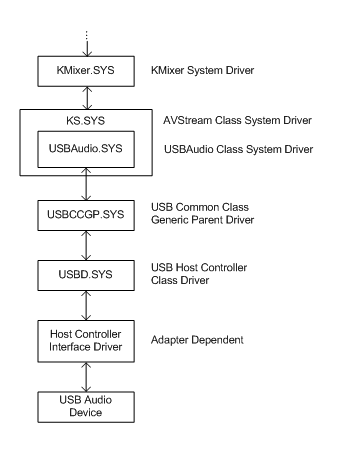

# USB Audio Class System Driver (Usbaudio.sys)

The USB Audio class system driver (Usbaudio.sys) is an AVStream minidriver that provides driver support for audio devices that comply with the Universal Serial Bus (USB) Device Class Definition for Audio Devices.

## 

The USB Device Class Definition for Audio Devices specification (release 1.0) is available at the [USB Implementers Forum](https://go.microsoft.com/fwlink/p/?linkid=8780) website. Usbaudio.sys supports a subset of the features that are described in the USB Audio specification. In addition to Usbaudio.sys, there are several other kernel-mode audio components in the Windows Driver Model (WDM). For more information, see [Kernel-Mode WDM Audio Components](kernel-mode-wdm-audio-components.md).

In Windows 98 Usbaudio.sys introduced support for USB devices such as speakers and microphones. Support for MIDI devices was added in Windows Me.

When an audio device identifies itself as USB Audio-compliant during Plug and Play device enumeration, the system automatically loads the USBAudio driver to drive the device. USBAudio drives the device directly, without the aid of a proprietary adapter driver. This means that a device that complies with the USB audio specifications requires no proprietary adapter driver.

Microsoft recommends that hardware vendors use the USBAudio driver for their USB Audio devices instead of writing proprietary adapter drivers.

In Windows 98, the USBAudio driver supports the following features:

-   All Type I formats (except 8-bit signed PCM)

-   AC-3 Type II format

-   Synchronization types synchronous and adaptive

-   Multichannel devices

However, USBAudio in Windows 98 does not support:

-   8-bit signed PCM format

-   MPEG Type II format

-   Type III formats

-   USB MIDI

-   [**WAVEFORMATEXTENSIBLE**](https://msdn.microsoft.com/library/windows/hardware/ff538802) wave format (USBAudio uses packed WAVE\_FORMAT\_PCM for 24-bit data instead.)

In Windows 98 Second Edition (SE), Windows Me, and Windows 2000 and later, USBAudio supports all the same features as Windows 98, with one exception: USBAudio supports WAVEFORMATEXTENSIBLE but does not support packed WAVE\_FORMAT\_PCM for 24-bit data.

In Windows Me, and Windows XP and later, USBAudio supports all the features that are supported in Windows 98 SE and Windows 2000. In addition, Windows Me and Windows XP support USB MIDI but do not support USB MIDI Elements.

The following figure shows the driver hierarchy for a USB audio device. All of the driver components shown in the figure are provided by Microsoft with the operating system.

For more information about the driver components in the figure, see the following sections:

[AVStream Overview](https://msdn.microsoft.com/library/windows/hardware/ff554240)

[System-Supplied USB Drivers](https://msdn.microsoft.com/library/windows/hardware/ff538853)

 

 

