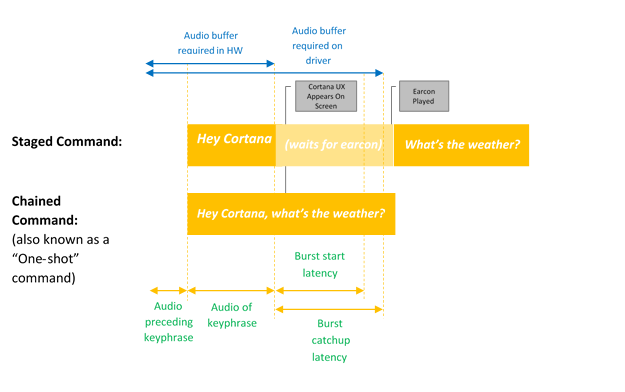
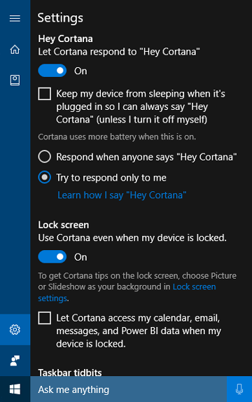
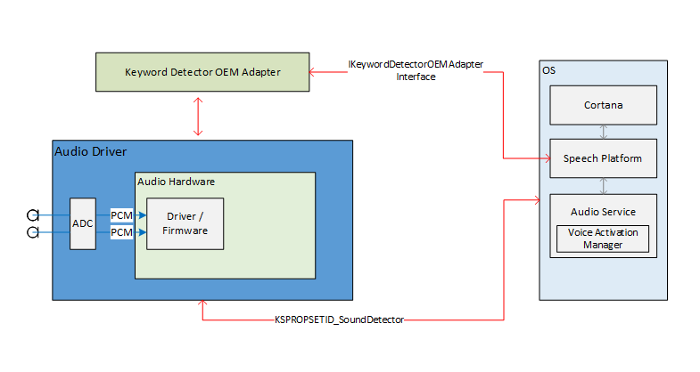

# Voice Activation


Cortana, the personal assistant technology introduced on Windows Phone, is supported on Windows 10 devices. The Windows speech platform is used to power all of the speech experiences in Windows 10 such as Cortana and Dictation. Voice activation is a feature that enables users to invoke a speech recognition engine from various device power states by saying a specific phrase - "Hey Cortana". To create hardware that supports voice activation technology, review the information in this topic.

**Note**  
Implementing voice activation is a significant project and is a task completed by SoC vendors. OEMs can contact their SoC vendor for information on their SoC's implementation of voice activation.


## <span id="cortana_end_user_experience">Cortana End User Experience


To understand the voice interaction experience available in Windows, review these topics.

|                                                                                                   |                                                                       |
|---------------------------------------------------------------------------------------------------|-----------------------------------------------------------------------|
| **Topic**                                                                                         | **Description**                                                       |
| [What is Cortana?](https://windows.microsoft.com/windows-10/getstarted-what-is-cortana)      | Provides and overview and usage direction for Cortana                 |
| [Make Cortana yours](https://windows.microsoft.com/windows-10/getstarted-make-cortana-yours) | Describes customization available through Cortana's Settings screens. |


## <span id="introduction_to__hey_cortana__voice_activation_and__learn_my_voice_"></span>Introduction to "Hey Cortana" Voice Activation and "Learn my voice"


**"Hey Cortana" Voice Activation**

The "Hey Cortana" Voice Activation (VA) feature allows users to quickly engage the Cortana experience outside of his or her active context (i.e., what is currently on screen) by using his or her voice. Users often want to be able to instantly access an experience without having to physically interact touch a device. For phone users this may be due to driving in the car and having their attention and hands engaged with operating the vehicle. For an Xbox user this may be due not wanting to find and connect a controller. For PC users, this may be due to rapid access to an experience without having to perform multiple mouse, touch and/or keyboard actions, e.g. a computer in the kitchen.

Voice activation provides always listening speech input via predefined key phrase(s) or "activation phrases". Key phrases may be uttered by themselves ("Hey Cortana") as a staged command, or followed by a speech action, for example, "Hey Cortana, where is my next meeting?", a chained command.

The term *Keyword Detection*, describes the detection of the keyword by either hardware or software.

*Keyword only* activation occurs when only the Cortana keyword is said, Cortana starts and plays the EarCon sound to indicate that it has entered listening mode.

A *chained command* describes the ability of issuing a command immediately following the keyword (like “Hey Cortana, call John”) and have Cortana start (if not already started) and follow the command (starting a phone call with John).

This diagram illustrates chained and keyword only activation.



Microsoft provides an OS default keyword spotter (software keyword spotter) that is used to ensure quality of hardware keyword detections and to provide the Hey Cortana experience in cases where hardware keyword detection is absent or unavailable. 

**The "Learn my voice" feature**

The "Learn my voice" feature allows the user to train Cortana to recognize their unique voice. This is accomplished by the user clicking on *Learn how I say "Hey Cortana"* in the Cortana settings screen. The user then repeats six carefully chosen phrases that provide a sufficient variety of phonetic patterns to identify the unique attributes of the users voice.



When voice activation is paired with "Learn my voice", the two algorithms will work together to reduce false activations. This is especially valuable for the meeting room scenario, where one person says "Hey Cortana" in a room full of devices.

Voice activation is powered by a keyword spotter (KWS) which reacts if the key phrase is detected. If the KWS is to wake the device from a low powered state, the solution is known as Wake on Voice (WoV). For more information, see [Wake on Voice](#wake_on_voice).


## <span id="glossary_of_terms"></span><span id="Glossary_Of_Terms"></span>Glossary of Terms

This glossary summarizes terms related to voice activation.

|                      |                                                                                                                                                           |
| -------------------- | --------------------------------------------------------------------------------------------------------------------------------------------------------- |
| Staged Command        | Example: Hey Cortana <pause, wait for earcon> What’s the weather? This is sometimes referred to as “Two-shot command” or “Keyword-only” |
|Chained Command        | Example: Hey Cortana what’s the weather? This is sometimes referred to as a “One-shot command” |
| Voice Activation      | The scenario of providing keyword detection of a predefined activation keyphrase. For example, "Hey Cortana" is the Microsoft Voice Activation scenario. |
|WoV                    | Wake-on-Voice – Technology that enables Voice Activation from a screen off, lower power state, to a screen on full power state. |
|WoV from Modern Standby| Wake-on-Voice from a Modern Standby (S0ix) screen off state to a screen on full power (S0) state. |
|Modern Standby |Windows Low Power Idle infrastructure - successor to Connected Standby (CS) in Windows 10. The first state of modern standby is when the screen is off. The deepest sleep state is when in DRIPS/Resiliency. For more information, see [Modern Standby](https://msdn.microsoft.com/library/windows/hardware/mt282515(v=vs.85).aspx)   |
|KWS                    |Keyword spotter – the algorithm that provides the detection of “Hey Cortana” |
| SW KWS                |Software keyword spotter – an implementation of KWS that runs on the host (CPU). For "Hey Cortana", SW KWS is included as part of Windows. |
| HW KWS                | Hardware-offloaded keyword spotter – an implementation of KWS that runs offloaded on hardware. |
|Burst Buffer           | A circular buffer used to store PCM data that can be ‘bursted up’ in the event of a KWS detection, so that all audio that triggered a KWS detection is included. |
|Keyword Detector OEM Adapter |A driver-level shim that enables the WoV-enabled HW to communicate with Windows and the Cortana stack. |
|Model | The acoustic model data file used by the KWS algorithm. The data file is static. Models are localized, one per locale.|

## <span id="Implementing_Voice_Activation"></span><span id="implementing_voice_activation"></span><span id="IMPLEMENTING_VOICE_ACTIVATION"></span>Integrating a Hardware Keyword Spotter

To implement a hardware keyword spotter (HW KWS) SoC vendors must complete the following tasks.

-   Create a custom keyword detector based on the SYSVAD sample described later in this topic. You will implement these methods in a COM DLL, described in [Keyword Detector OEM Adapter Interface](#keyword_detector).
-   Implement WAVE RT enhancements described in [WAVERT Enhancements](#wavert_enhancements).
-   Provide INF file entries to describe any custom APOs used for keyword detection.
    -   [PKEY\_FX\_KeywordDetector\_StreamEffectClsid](https://msdn.microsoft.com/library/windows/hardware/mt244268)
    -   [PKEY\_FX\_KeywordDetector\_ModeEffectClsid](https://msdn.microsoft.com/library/windows/hardware/mt244267)
    -   [PKEY\_FX\_KeywordDetector\_EndpointEffectClsid](https://msdn.microsoft.com/library/windows/hardware/mt244266)
    -   [PKEY\_SFX\_KeywordDetector\_ProcessingModes\_Supported\_For\_Streaming](https://msdn.microsoft.com/library/windows/hardware/mt244270)
    -   [PKEY\_MFX\_KeywordDetector\_ProcessingModes\_Supported\_For\_Streaming](https://msdn.microsoft.com/library/windows/hardware/mt244269)
    -   [PKEY\_EFX\_KeywordDetector\_ProcessingModes\_Supported\_For\_Streaming](https://msdn.microsoft.com/library/windows/hardware/mt244264)
-   Review the hardware recommendations in [Cortana Device Recommendation](https://msdn.microsoft.com/library/windows/hardware/dn957008). This topic provides guidance and recommendations for the design and development of audio input devices intended for use with Microsoft’s Speech Platform.
-   Review the hardware recommendation [Cortana Device Test Setup](https://msdn.microsoft.com/library/windows/hardware/dn957009). This topic provides test guidance of audio input devices intended for use with Microsoft’s Speech Platform.
-   Support both staged and chained commands.
-   Support “Hey Cortana” for each of the supported Cortana locales. 
-   The APOs (Audio Processing Objects) must provide the following effects: 
    -   AEC
    -   AGC
    -   NS
-   Effects for Speech processing mode must be reported by the MFX APO.
-   The APO may perform format conversion as MFX.   
-   The APO must output the following format: 
    -   16 kHz, mono, FLOAT.
-   Optionally design any custom APOs to enhance the audio capture process. For more information, see [Windows Audio Processing Objects](windows-audio-processing-objects.md).

Hardware-offloaded keyword spotter (HW KWS) WoV Requirements
- HW KWS WoV is supported during S0 Working state and S0 sleep state also known as Modern Standby.  
- HW KWS WoV is not supported from S3.  

AEC Requirements for HW KWS

- For Windows Version 1709
    - To support HW KWS WoV for S0 sleep state (Modern Standby) AEC is not required.  
    - HW KWS WoV for S0 working state is not supported in Windows Version 1709.

- For Windows Version 1803 
    - HW KWS WoV for S0 working state is supported.
    - To enable HW KWS WoV for S0 working state, the APO must support AEC.


## <span id="sample_code_overview"></span>Sample Code Overview


There is sample code for an audio driver that implements voice activation on GitHub as part of the SYSVAD virtual audio adapter sample. It is recommended to use this code as a starting point. The code is available at this location.

<https://github.com/Microsoft/Windows-driver-samples/blob/master/audio/sysvad/>

For more information about the SYSVAD sample audio driver, see [Sample Audio Drivers](sample-audio-drivers.md).

## <span id="keyword_recognition_system_information"></span>Keyword Recognition System Information


**Voice Activation Audio Stack Support**

The audio stack external interfaces for enabling Voice Activation serves as the communication pipeline for the speech platform and the audio drivers. The external interfaces are divided into three parts.

-   *Keyword detector Device Driver Interface (DDI)*. The Keyword detector Device Driver Interface is responsible for configuring and arming the HW Keyword Spotter (KWS).  It is also used by the driver to notify the system of a detection event.
-   *Keyword Detector OEM Adapter DLL*. This DLL implements a COM interface to adapt the driver specific opaque data for use by the OS to assist with keyword detection.
-   *WaveRT streaming enhancements*. The enhancements enable the audio driver to burst stream the buffered audio data from the keyword detection.

**Audio Endpoint Properties**

Audio endpoint graph building occurs normally. The graph is prepared to handle faster than real time capture. Timestamps on captured buffers remain true. Specifically, the timestamps will correctly reflect data that was captured in the past and buffered, and is now “bursting”.

**Theory of Operation**

The driver exposes a KS filter for its capture device as usual. This filter supports several KS properties and a KS event to configure, enable and signal a detection event. The filter also includes an additional pin factory identified as a keyword spotter (KWS) pin. This pin is used to stream audio from the keyword spotter.

The properties are:

-   Supported keyword types - [**KSPROPERTY\_SOUNDDETECTOR\_PATTERNS**](https://msdn.microsoft.com/library/windows/hardware/dn932151). This property is set by the operating system to configure the keywords to be detected.
-   List of keyword patterns GUIDs - [**KSPROPERTY\_SOUNDDETECTOR\_SUPPORTEDPATTERNS**](https://msdn.microsoft.com/library/windows/hardware/dn932152). This property is used to get a list of GUIDs that identify the types of supported patterns.
-   Armed - [**KSPROPERTY\_SOUNDDETECTOR\_ARMED**](https://msdn.microsoft.com/library/windows/hardware/dn932149). This read/write property is a simply Boolean status indicating whether the detector is armed. The OS sets this to engage the keyword detector. The OS can clear this to disengage. The driver automatically clears this when keyword patterns are set and also after a keyword is detected. (The OS must rearm.)
-   Match result - [**KSPROPERTY\_SOUNDDETECTOR\_MATCHRESULT**](https://msdn.microsoft.com/library/windows/hardware/dn932150). This read property holds the result data after detection has occurred.

The event that is fired when a keyword is detected is a [**KSEVENT\_SOUNDDETECTOR\_MATCHDETECTED**](https://msdn.microsoft.com/library/windows/hardware/dn932148) event.

**Sequence of Operation**

*System Startup*

1. The OS reads the supported keyword types to verify it has keywords in that format.
2. The OS registers for the detector status change event.
3. The OS sets the keyword patterns.
4. The OS arms the detector.

*On Receiving the KS Event*

1. The driver disarms the detector.
2. The OS reads the keyword detector status, parses the returned data, and determines which pattern was detected.
3. The OS rearms the detector.

**Internal Driver and Hardware Operation**

While the detector is armed, the hardware can be continuously capturing and buffering audio data in a small FIFO buffer. (The size of this FIFO buffer is determined by requirements outside of this document, but might typically be hundreds of milliseconds to several seconds.) The detection algorithm operates on the data streaming through this buffer. The design of the driver and hardware are such that while armed there is no interaction between the driver and hardware and no interrupts to the “application” processors until a keyword is detected. This allows the system to reach a lower power state if there is no other activity.

When the hardware detects a keyword, it generates an interrupt. While waiting for the driver to service the interrupt, the hardware continues to capture audio into the buffer, ensuring no data after the keyword is lost, within buffering limits.

**Keyword Timestamps**

After detecting a keyword, all voice activation solutions must buffer all of the spoken keyword, including 250ms before the start of the keyword. The audio driver must provide timestamps identifying the start and end of the key phrase in the stream.

In order to support the keyword start/end timestamps, DSP software may need to internally timestamp events based on a DSP clock. Once a keyword is detected, the DSP software interacts with the driver to prepare a KS event. The driver and DSP software will need to map the DSP timestamps to a Windows performance counter value. The method of doing this is specific to the hardware design. One possible solution is for the driver to read current performance counter, query the current DSP timestamp, read current performance counter again, and then estimate a correlation between performance counter and DSP time. Then given the correlation, the driver can map the keyword DSP timestamps to Windows performance counter timestamps.


## <span id="keyword_detector"></span>Keyword Detector OEM Adapter Interface

The OEM supplies a COM object implementation that acts as an intermediary between the OS and the driver, helping to compute or parse the opaque data that is written and read to the audio driver through [**KSPROPERTY\_SOUNDDETECTOR\_PATTERNS**](https://msdn.microsoft.com/library/windows/hardware/dn932151) and [**KSPROPERTY\_SOUNDDETECTOR\_MATCHRESULT**](https://msdn.microsoft.com/library/windows/hardware/dn932150).

The CLSID of the COM object is a detector pattern type GUID returned by the [**KSPROPERTY\_SOUNDDETECTOR\_SUPPORTEDPATTERNS**](https://msdn.microsoft.com/library/windows/hardware/dn932152). The OS calls CoCreateInstance passing the pattern type GUID to instantiate the appropriate COM object that is compatible with keyword pattern type and calls methods on the object’s IKeywordDetectorOemAdapter interface.

**COM Threading Model requirements**

The OEM’s implementation may choose any of the COM threading models.

**IKeywordDetectorOemAdapter**

The interface design attempts to keep the object implementation stateless. In other words, the implementation should require no state to be stored between method calls. In fact, internal C++ classes likely do not need any member variables beyond those required to implement a COM object in general.

**Methods**

Implement the following methods.

-   [**IKeywordDetectorOemAdapter::BuildArmingPatternData**](https://msdn.microsoft.com/library/windows/hardware/dn957505)
-   [**IKeywordDetectorOemAdapter::ComputeAndAddUserModelData**](https://msdn.microsoft.com/library/windows/hardware/dn957506)
-   [**IKeywordDetectorOemAdapter::GetCapabilities**](https://msdn.microsoft.com/library/windows/hardware/dn957507)
-   [**IKeywordDetectorOemAdapter::ParseDetectionResultData**](https://msdn.microsoft.com/library/windows/hardware/dn957508)
-   [**IKeywordDetectorOemAdapter::VerifyUserKeyword**](https://msdn.microsoft.com/library/windows/hardware/dn957509)

**KEYWORDID**

The [**KEYWORDID**](https://msdn.microsoft.com/library/windows/hardware/dn957510) enumeration identifies the phrase text/function of a keyword and is also used in the Windows Biometric Service adapters. For more information, see [Biometric Framework Overview - Core Platform Components](https://msdn.microsoft.com/library/windows/desktop/dd560897.aspx)

```cpp
typedef enum  { 
  KwInvalid              = 0,
  KwHeyCortana           = 1,
  KwSelect               = 2
} KEYWORDID;
```

**KEYWORDSELECTOR**

The [**KEYWORDSELECTOR**](https://msdn.microsoft.com/library/windows/hardware/dn957511) struct is a set of IDs that uniquely select a particular keyword and language.

```cpp
typedef struct
{
    KEYWORDID KeywordId;
    LANGID LangId;
} KEYWORDSELECTOR;
```

**Handling Model Data**

*Static user independent model* - The OEM DLL would typically include some static user independent model data either built into the DLL or in a separate data file included with the DLL. The set of supported keyword IDs returned by the GetCapabilities routine would depend on this data. For example, if the list of supported keyword IDs returned by GetCapabilities includes KwHeyCortana, the static user independent model data would include data for “Hey Cortana” (or its translation) for all the supported languages.

*Dynamic user dependent model* - IStream provides a random access storage model. The OS passes an IStream interface pointer to many of the methods on the IKeywordDetectorOemAdapter interface. The OS backs the IStream implementation with appropriate storage for up to 1MB of data.

The content and structure of the data within this storage is defined by the OEM. The intended purpose is for persistent storage of user dependent model data computed or retrieved by the OEM DLL.

The OS may call the interface methods with an empty IStream, particularly if the user has never trained a keyword. The OS creates a separate IStream storage for each user. In other words, a given IStream stores model data for one and only one user.

The OEM DLL developer decides how to manage the user independent and user dependent data. However, it shall never store user data anywhere outside the IStream. One possible OEM DLL design would internally switch between accessing the IStream and the static user independent data depending on the parameters of the current method. An alternate design might check the IStream at the start of each method call and add the static user independent data to the IStream if not already present, allowing the rest of the method to access only the IStream for all model data.

## <span id="Training_and_Operation_Audio_Processing"></span><span id="training_and_operation_audio_processing"></span><span id="TRAINING_AND_OPERATION_AUDIO_PROCESSING"></span>Training and Operation Audio Processing


As described previously, the training UI flow results in full phonetically rich sentences being available in the audio stream. Each sentence is individually passed to [**IKeywordDetectorOemAdapter::VerifyUserKeyword**](https://msdn.microsoft.com/library/windows/hardware/dn957509) to verify it contains the expected keyword and has acceptable quality. After all sentences are gathered and verified by the UI, they are all passed in one call to [**IKeywordDetectorOemAdapter::ComputeAndAddUserModelData**](https://msdn.microsoft.com/library/windows/hardware/dn957506).

Audio is processed in a unique way for voice activation training. The following table summarizes the differences between voice activation training and the regular voice recognition usage.

<table>
<colgroup>
<col width="33%" />
<col width="33%" />
<col width="33%" />
</colgroup>
<tbody>
<tr class="odd">
<td align="left"></td>
<td align="left"><strong>Voice Training</strong></td>
<td align="left"><strong>Voice Recognition</strong></td>
</tr>
<tr class="even">
<td align="left"><strong>Mode</strong></td>
<td align="left">Raw</td>
<td align="left">Raw or Speech</td>
</tr>
<tr class="odd">
<td align="left"><strong>Pin</strong></td>
<td align="left">Normal</td>
<td align="left">KWS</td>
</tr>
<tr class="even">
<td align="left"><strong>Audio Format</strong></td>
<td align="left">32-bit float (Type = Audio, Subtype = IEEE_FLOAT, Sampling Rate = 16 kHz, bits = 32)</td>
<td align="left">Managed by OS audio stack</td>
</tr>
<tr class="odd">
<td align="left"><strong>Mic</strong></td>
<td align="left">Mic 0</td>
<td align="left">All mics in array, or mono</td>
</tr>
</tbody>
</table>


## <span id="Keyword_Recognition_System_Overview"></span><span id="keyword_recognition_system_overview"></span><span id="KEYWORD_RECOGNITION_SYSTEM_OVERVIEW"></span>Keyword Recognition System Overview


This diagram provides an overview of the keyword recognition system.



## <span id="Keyword_Recognition__Sequence_Diagrams"></span><span id="keyword_recognition__sequence_diagrams"></span><span id="KEYWORD_RECOGNITION__SEQUENCE_DIAGRAMS"></span>Keyword Recognition Sequence Diagrams


In these diagrams, the speech runtime module is shown as the “speech platform”. As mentioned previously, the Windows speech platform is used to power all of the speech experiences in Windows 10 such as Cortana and dictation.

During startup, capabilities are gathered using [**IKeywordDetectorOemAdapter::GetCapabilities**](https://msdn.microsoft.com/library/windows/hardware/dn957507).


Later when the user selects to "Learn my voice", the training flow is invoked.


This diagram describes the process of arming for keyword detection.


## <span id="WAVERT_Enhancements"></span><span id="wavert_enhancements"></span><span id="WAVERT_ENHANCEMENTS"></span>WAVERT Enhancements


Miniport interfaces are defined to be implemented by WaveRT miniport drivers. These interfaces provide methods to either simplify the audio driver, improve OS audio pipeline performance and reliability, or support new scenarios. A new PnP device interface property is defined allowing the driver to provide a static expressions of its buffer size constraints to the OS.

**Buffer Sizes**

A driver operates under various constraints when moving audio data between the OS, the driver, and the hardware. These constraints may be due to the physical hardware transport that moves data between memory and hardware, and/or due to the signal processing modules within the hardware or associated DSP.

HW-KWS solutions must support audio capture sizes of at least 100ms and up to 200ms.

The driver expresses the buffer size constraints by setting the DEVPKEY\_KsAudio\_PacketSize\_Constraints device property on the KSCATEGORY\_AUDIO PnP device interface of the KS filter that has the KS streaming pin(s). This property should remain valid and stable while the KS filter interface is enabled. The OS can read this value at any time without having to open a handle to the driver and call on the driver.

**DEVPKEY\_KsAudio\_PacketSize\_Constraints**

The DEVPKEY\_KsAudio\_PacketSize\_Constraints property value contains a [**KSAUDIO\_PACKETSIZE\_CONSTRAINTS**](https://msdn.microsoft.com/library/windows/hardware/dn965561) structure describing the physical hardware constraints (i.e. due to the mechanics of transferring data from the WaveRT buffer to the audio hardware). The structure includes an array of 0 or more [**KSAUDIO\_PACKETSIZE\_PROCESSINGMODE\_CONSTRAINT**](https://msdn.microsoft.com/library/windows/hardware/dn965562) structures describing constraints specific to any signal processing modes. The driver sets this property before calling [**PcRegisterSubdevice**](https://msdn.microsoft.com/library/windows/hardware/ff537731) or otherwise enabling its KS filter interface for its streaming pins.

**IMiniportWaveRTInputStream**

A driver implements this interface for better coordination of audio dataflow from the driver to OS. If this interface is available on a capture stream, the OS uses methods on this interface to access data in the WaveRT buffer. For more information see, [**IMiniportWaveRTInputStream::GetReadPacket**](https://msdn.microsoft.com/library/windows/hardware/dn946533)

**IMiniportWaveRTOutputStream**

A WaveRT miniport optionally implements this interface to be advised of write progress from the OS and to return precise stream position. For more information see [**IMiniportWaveRTOutputStream::SetWritePacket**](https://msdn.microsoft.com/library/windows/hardware/dn946537), [**IMiniportWaveRTOutputStream::GetOutputStreamPresentationPosition**](https://msdn.microsoft.com/library/windows/hardware/dn946535) and [**IMiniportWaveRTOutputStream::GetPacketCount**](https://msdn.microsoft.com/library/windows/hardware/dn946536).

**Performance counter timestamps**

Several of the driver routines return Windows performance counter timestamps reflecting the time at which samples are captured or presented by the device.

In devices that have complex DSP pipelines and signal processing, calculating an accurate timestamp may be challenging and should be done thoughtfully. The timestamps should not simply reflect the time at which samples were transferred to or from the OS to the DSP.

-   Within the DSP, track sample timestamps using some internal DSP wall clock.
-   Between the driver and DSP, calculate a correlation between the Windows performance counter and the DSP wall clock. Procedures for this can range from very simple (but less precise) to fairly complex or novel (but more precise).
-   Factor in any constant delays due to signal processing algorithms or pipeline or hardware transports, unless these delays are otherwise accounted for.

**Burst Read Operation**

This section describes the OS and driver interaction for burst reads. Burst read can happen outside of the voice activation scenario as long as the driver supports the packet based streaming WaveRT model, including the [**IMiniportWaveRTInputStream::GetReadPacket**](https://msdn.microsoft.com/library/windows/hardware/dn946533) function.

Two burst example read scenarios are discussed. In one scenario, if the miniport supports a pin having pin category [**KSNODETYPE\_AUDIO\_KEYWORDDETECTOR**](https://msdn.microsoft.com/library/windows/hardware/dn965563) then the driver will begin capturing and internally buffering data when a keyword is detected. In another scenario, the driver can optionally internally buffer data outside of the WaveRT buffer if the OS is not reading data quickly enough by calling [**IMiniportWaveRTInputStream::GetReadPacket**](https://msdn.microsoft.com/library/windows/hardware/dn946533).

To burst data that has been captured prior to transition to KSSTATE\_RUN, the driver must retain accurate sample timestamp information along with the buffered capture data. The timestamps identify the sampling instant of the captured samples.

1. After the stream transitions to KSSTATE\_RUN, the driver immediately sets the buffer notification event because it already has data available.
2. On this event, the OS calls GetReadPacket() to get information about the available data.

    a. The driver returns the packet number of the valid captured data (0 for the first packet after the transition from KSSTATE\_STOP to KSSTATE\_RUN), from which the OS can derive the packet position within the WaveRT buffer as well as the packet position relative to start of stream.

    b. The driver also returns the performance counter value that corresponds to the sampling instant of the first sample in the packet. Note that this performance counter value might be relatively old, depending on how much capture data has been buffered within the hardware or driver (outside of the WaveRT buffer).

    c. If there is more unread buffered data available the driver either:
       i. Immediately transfers that data into the available space of WaveRT buffer (i.e. space not used by the packet returned from GetReadPacket), returns true for MoreData, and sets the buffer notification event before returning from this routine. Or,
       ii. Programs hardware to burst the next packet into the available space of the WaveRT buffer, returns false for MoreData, and later sets the buffer event when the transfer completes.
3. The OS reads data from the WaveRT buffer using the information returned by GetReadPacket().
4. The OS waits for the next buffer notification event. The wait might terminate immediately if the driver set the buffer notification in step (2c).
5. If the driver did not immediately set the event in step (2c), the driver sets the event after it transfers more captured data into the WaveRT buffer and makes it available for the OS to read
6. Go to (2).
For [**KSNODETYPE\_AUDIO\_KEYWORDDETECTOR**](https://msdn.microsoft.com/library/windows/hardware/dn965563) keyword detector pins, drivers should allocate enough internal burst buffering for at least 5000ms of audio data. If the OS fails to create a stream on the pin before the buffer overflows then the driver may end the internal buffering activity and free associated resources.


## <span id="Wake_on_Voice"></span><span id="wake_on_voice"></span><span id="WAKE_ON_VOICE"></span>Wake on Voice

Wake On Voice (WoV) enables the user to activate and query a speech recognition engine from a screen off, lower power state, to a screen on, full power state by saying a certain keyword, such as "Hey Cortana".

This feature allows for the device to be always listening for the user’s voice while the device is in a low power state, including when the screen is off and the device is idle. It does this by using a listening mode, which is lower power when compared to the much higher power usage seen during normal microphone recording. The low power speech recognition allows a user to simply say a pre-defined key phrase like "Hey Cortana", followed by a chained speech phrase like "when’s my next appointment" to invoke speech in a hands-free manner. This will work regardless of whether the device is in use or idle with the screen off.

The audio stack is responsible for communicating the wake data (speaker ID, keyword trigger, confidence level) as well as notifying interested clients that the keyword has been detected.


