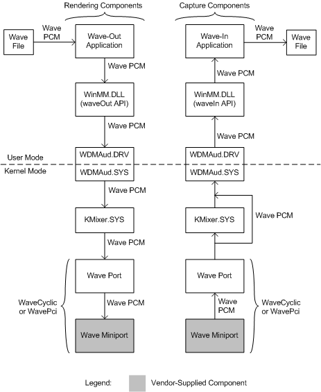
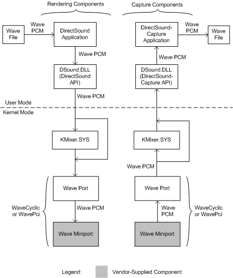

# Wave and DirectSound Components

## 

Application programs rely on a combination of user-mode and kernel-mode components to capture (input) and render (output) wave streams. A wave stream is a digital-audio stream whose data format is described by a [**WAVEFORMATEX**](https://msdn.microsoft.com/library/windows/hardware/ff538799) or [**WAVEFORMATEXTENSIBLE**](https://msdn.microsoft.com/library/windows/hardware/ff538802) structure.

An application can use either of the following software interfaces for wave rendering and capture:

-   Microsoft Windows Multimedia waveOut*Xxx* and waveIn*Xxx* functions

-   DirectSound and DirectSoundCapture APIs

The behavior of the waveOut*Xxx* and waveIn*Xxx* functions is based on the capabilities of legacy wave drivers and devices. Beginning with Windows 98, the [WDMAud system driver](user-mode-wdm-audio-components.md#wdmaud_system_driver) translates calls to these functions into commands to WDM audio drivers. However, by emulating the behavior of older software and hardware, the waveOut*Xxx* functions sacrifice the 3-D sound effects and hardware acceleration that are now available through the DirectSound API. For more information about DirectSound and the Windows Multimedia wave functions, see the Microsoft Windows SDK documentation.

DirectSound and the Windows Multimedia wave functions are clients of the [SysAudio system driver](kernel-mode-wdm-audio-components.md#sysaudio_system_driver), which builds the audio filter graphs that process the wave and DirectSound streams. Graph building is transparent to the applications that use these software interfaces.

### Wave Components

The following figure shows the user-mode and kernel-mode components that a wave application uses to render or capture a digital audio stream consisting of wave PCM data.

The rendering components appear on the left side of the preceding figure, and the capture components appear on the right. The boxes representing the wave miniport driver are darkened to indicate that these are vendor-supplied components. The other components in the figure are system-supplied.

At the top left of the figure, the wave-rendering (or "wave-out") application interfaces to the WDM audio drivers through the waveOut*Xxx* functions, which are implemented in the user-mode [WinMM system component](user-mode-wdm-audio-components.md#winmm_system_component), Winmm.dll. The application reads blocks of wave audio samples from a file and calls the [**waveOutWrite**](https://msdn.microsoft.com/library/windows/desktop/dd743876) function to render them.

WDMAud, which consists of both user-mode and kernel-mode components (Wdmaud.drv and Wdmaud.sys), buffers the wave data from the [**waveOutWrite**](https://msdn.microsoft.com/library/windows/desktop/dd743876) call and outputs the wave stream to the [KMixer system driver](kernel-mode-wdm-audio-components.md#kmixer_system_driver), which appears below WDMAud in the figure.

KMixer is a system component that receives wave PCM streams from one or more sources and mixes them together to form a single output stream, which is also in wave PCM format.

KMixer outputs a wave stream to a WaveCyclic or WavePci device, whose port and miniport drivers appear below KMixer on the left side of the preceding figure. The miniport driver binds itself to the port driver to form the wave filter that represents the underlying audio rendering device. A typical rendering device outputs an analog signal that drives a set of speakers or an external audio unit. A rendering device might also output digital audio through an S/PDIF connector. For more information about WaveCyclic and WavePci, see [Wave Filters](wave-filters.md).

Alternatively, KMixer can pass its output stream to a USB audio device, which is controlled by the [USBAudio class system driver](kernel-mode-wdm-audio-components.md#usbaudio_class_system_driver) (not shown in figure), instead of a WaveCyclic or WavePci device.

An adapter driver creates an instance of a WaveCyclic or WavePci port driver by calling [**PcNewPort**](https://msdn.microsoft.com/library/windows/hardware/ff537715) with a GUID value of **CLSID\_PortWaveCyclic** or **CLSID\_PortWavePci**, respectively.

The right side of the preceding figure shows the components that are needed to support an application that captures wave data to a file. The wave-capture (or "wave-in") application communicates with the WDM audio drivers through the waveIn*Xxx* functions, which are implemented in the WinMM system component.

At the lower right corner of the figure, the wave-capture device is controlled by wave miniport and port drivers. The port and miniport drivers, which can be of type WaveCyclic or WavePci, bind together to form a wave filter that represents the capture device. This device typically captures an analog signal from a microphone or other audio source and converts it to a wave PCM stream. The device might also input a digital audio stream through an S/PDIF connector.

The wave port driver outputs its wave stream either to KMixer or to WDMAud directly. The stream must pass through KMixer if it needs to be sample-rate converted before WDMAud receives it. A system that performs simultaneous rendering and capture of audio streams might require two instances of KMixer, as shown in the figure. Note that SysAudio automatically creates these instances as they are needed.

Alternatively, the source of the captured wave stream can be a USB audio device instead of a WaveCyclic or WavePci device. In this case, the USBAudio driver (not shown in figure) passes the stream to KMixer.

Regardless of whether the wave stream is captured by a USB device or by a WaveCyclic or WavePci device, KMixer performs sample-rate conversion on the stream, if needed, but does no mixing with other streams. KMixer outputs the resulting stream to Wdmaud.sys, the kernel-mode half of the WDMAud system driver. The user-mode half, Wdmaud.drv, outputs the wave stream to the application program through the waveIn*Xxx* functions, which are implemented in Winmm.dll. Finally, at the top of the figure, the wave-capture application writes the wave data to a file.

At the time that the wave-capture application calls the [**waveInOpen**](https://msdn.microsoft.com/library/windows/desktop/dd743847) function to open the capture stream, it passes in a pointer to its callback routine. When a wave-capture event occurs, the operating system calls the callback routine with a buffer containing the next block of wave samples from the capture device. In response to the callback, the application writes the next block of wave data to the file.

### DirectSound Components

The following figure shows the user-mode and kernel-mode components that are used by a DirectSound application program to render or capture wave data.

The rendering components are shown in the left half of the preceding figure, and the capture components appear on the right. The wave miniport drivers are shown as darkened boxes to indicate that they are vendor-supplied components. The other components in the figure are system-supplied.

At the top left of the figure, a DirectSound application loads wave data from a file to a sound buffer that the user-mode [DirectSound system component](user-mode-wdm-audio-components.md#directsound_system_component) (Dsound.dll) manages. This component sends a wave stream to a WaveCyclic or WavePci device, whose port and miniport drivers appear at the lower left in the figure. If a hardware mixer pin is available on the device, the stream passes directly to the wave port driver, bypassing KMixer. Otherwise, the stream first passes through KMixer, which mixes it with any other simultaneously playing streams. KMixer outputs the mixed stream to the port driver.

As before, the miniport driver binds itself to the port driver to form the wave filter that represents the underlying audio rendering device. This device might play the stream through a set of speakers, for example.

Alternatively, the wave stream can be rendered by a USB audio device instead of a WaveCyclic or WavePci device. In this case, the stream cannot bypass KMixer; the USBAudio class system driver (not shown in figure) always passes the stream to KMixer.

The right side of the preceding figure shows the components that support a DirectSoundCapture application. The application records wave data that is receives from a WaveCyclic or WavePci capture device. This device converts an analog signal from a microphone, for example, to a wave stream. The device's wave port and miniport drivers appear at the lower-right corner of the figure. As shown in the figure, the port driver receives as input the stream from the miniport driver and outputs it either directly to the user-mode DirectSound component, Dsound.dll, or indirectly through KMixer. This depends on whether a hardware capture pin is available from the capture device.

Alternatively, the source of the captured wave stream can be a USB audio device. In this case, the stream cannot bypass KMixer; the USBAudio driver (not shown in figure) always passes the stream to KMixer.

If KMixer is inserted into the path of the capture stream, it performs sample-rate conversion on the stream, if needed, but does no mixing with other streams.

At the top-right corner of the preceding figure, the application reads the wave data from the DirectSoundCapture buffer and writes it to the file.

 

 

