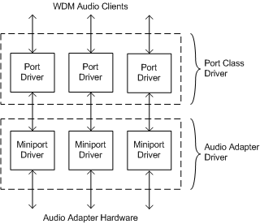

# WDM Audio Terminology

## 

This section describes the differences in terminology between the Microsoft Windows Driver Model (WDM) audio driver architecture and the generic Windows layered driver architecture. The generic driver architecture is exemplified by SCSI port/miniport drivers (see [Storage Driver Architecture](https://msdn.microsoft.com/library/windows/hardware/ff566978)).

The terms defined by the generic and WDM audio driver architectures are similar, but they do have some important differences, as described below.

### Miniport Driver (Generic)

The miniport driver (generic) is the hardware-specific driver for an adapter that resides on a system bus (for example, PCI or ISA). This driver has a single entry point, [*DriverEntry*](https://msdn.microsoft.com/library/windows/hardware/ff544113), and registers a table of functions with a port driver. This table of functions serves as the miniport driver's upper-edge interface.

The miniport driver sits below the port driver in the driver stack. That is, all calls to the miniport driver are made from the port driver and all calls out of the miniport driver are to the port driver's lower-edge interface.

The following figure illustrates the meaning of the terms *stack*, *upper-edge interface*, and *lower-edge interface* as they are used in this context. The block representing the port driver is stacked on top of the block representing the miniport driver. Hence, the miniport driver sits below the port driver in the "stack".

The port and miniport drivers communicate through the software interfaces that they expose to each other. In the preceding figure, these interfaces are associated with the lower-edge of the block representing the port driver and the upper-edge of the block representing the miniport driver. This representation is the source of the terms "lower-edge interface" and "upper-edge interface".

### Port Driver (Generic)

The port driver (generic) surrounds a miniport driver.

The port driver:

-   Implements WDM streaming filters.

-   Provides a common interface to the rest of the operating system.

-   Handles I/O requests from the system and recasts these requests as calls into the miniport driver's function table.

-   Provides the miniport driver with a library of support functions (the port driver's lower-edge interface).

The port driver hides many of the details of the operating system from the miniport driver, and the miniport driver hides the specifics of the underlying hardware from the port driver. The implementation of the port driver might undergo changes for different operating system releases, but the port driver's interface to the miniport driver remains more-or-less unchanged, enabling the miniport driver to be largely platform-independent.

### Minidriver (Generic)

The minidriver (generic) represents a hardware component on a bus. The minidriver uses the bus driver to communicate to the physical device over the bus, and it binds together the bus driver and one or more class drivers.

*Class drivers* help the minidriver present the physical device to clients as a type of logical device. In WDM environments, a minidriver typically receives requests in IRP form from class drivers, and sends requests in IRP form to a bus driver.

A minidriver might also have to communicate with several class drivers. An example of a minidriver that binds to multiple class drivers is a minidriver for a CD-ROM drive on an IEEE 1394 bus. It might bind to a file-system driver so that the drive can be accessed from the file system. However, it also binds to a [Redbook system driver](kernel-mode-wdm-audio-components.md#redbook_system_driver) so that audio can be streamed from CDs.

### Bus Driver (Generic)

The bus driver (generic) gives minidrivers access to a physical bus. The Microsoft Windows [*hardware abstraction layer (HAL)*](https://msdn.microsoft.com/library/windows/hardware/ff556288#wdkgloss_hardware_abstraction_layer__hal_) is sometimes referred to as the *system bus driver* because it provides access to the system bus. For more information, see [Bus Drivers](https://msdn.microsoft.com/library/windows/hardware/ff540704).

### Class Driver (Generic)

The class driver (generic) implements behavior that is common across a class of similar devices.

The class driver:

-   Eliminates duplication of functionality in hardware-specific drivers.

-   Is not bus-specific.

-   Is not aware of resource issues (for example, DMA and interrupts).

### Miniport Driver (WDM Audio)

The miniport driver (WDM audio) implements a function-specific interface for a function on an audio adapter card that resides on a system bus. A miniport driver is a component of an adapter driver. It is not recognized as a driver by the operating system. In this regard, an audio miniport driver differs from a generic miniport driver.

Unlike generic miniport drivers, audio miniport drivers do not implement [*DriverEntry*](https://msdn.microsoft.com/library/windows/hardware/ff544113), are not registered, and do not rely entirely on their respective port drivers for support. Multiple audio miniport drivers that address multiple functions can be linked into a single adapter driver (and associated with a single device object).

### Adapter Driver (WDM Audio)

The adapter driver (WDM audio) serves as a container for all miniport drivers associated with a given adapter. This adapter driver is recognized as a driver by the operating system and is contained in its own .sys file.

The audio adapter driver consists of a set of miniport drivers and additional code that addresses initialization issues. For example, an adapter driver implements a [*DriverEntry*](https://msdn.microsoft.com/library/windows/hardware/ff544113) entry point.

### Port Driver (WDM Audio)

The port driver (WDM audio) implements a KS filter on behalf of a miniport driver and operates in the context of a port class driver. The port driver exposes the miniport driver's function-specific code as a KS filter to the system and is responsible for implementing adapter-independent functionality.

Unlike the generic port driver, the audio port driver shares the device object and is, therefore, instantiated differently. An audio port driver is also more closely resembles a generic class driver than it does a generic port driver in that it implements behavior that is expected of a class of devices (it is not bus-independent).

### Port Class Driver (WDM Audio)

The port class driver (WDM audio) serves as a container for a collection of port drivers, each of which provides support for a different type of audio hardware function. The following figure shows the relationships between the audio port class and adapter drivers.

An adapter driver manages an adapter card that might contain several different hardware functions. As shown in the preceding figure, the adapter driver contains a miniport driver to manage each type of hardware function. Similarly, the port class driver is designed to provide support to adapter cards with multiple hardware functions. The port class driver provides a port driver for each of the well defined function types that it supports. The adapter driver binds its miniport driver for a particular function to the corresponding port driver for that function type. The port driver for each function handles communication with the WDM audio clients that use the function. The miniport driver contains all of the hardware-specific code for managing that function.

The port class driver (WDM audio) primarily functions as a container for multiple subdevices that are associated with a single device object. Bus drivers create a single [*physical device object (PDO)*](https://msdn.microsoft.com/library/windows/hardware/ff556325#wdkgloss_physical_device_object__pdo_) for each Plug and Play (PnP) node they enumerate.

In the case of an audio adapter, a single PnP node frequently contains multiple audio functions. To expose the various functions associated with a node as distinct devices typically requires writing a bus driver for the adapter. The bus driver enumerates the hardware functions and creates corresponding PDOs. In this scenario, one or more function-specific drivers need to bind to the PDOs and negotiate with the bus driver for access to shared resources on the adapter.

The port class driver uses the kernel streaming driver's ability to expose various aspects of a single device object in order that the operating system recognizes the device as a set of distinct subdevices.

A reference string is appended to the device name to specify the desired subdevice. The kernel streaming driver dispatches creation IRPs based on this reference string. After a file object is created, the kernel streaming driver provides dispatching of IRPs that are targeted at the file object that represents the subdevice. In addition, the port class driver implements a COM-based model for packaging subdevices.

An adapter driver instantiates a port driver and a miniport driver and binds them together by passing a pointer to the miniport driver as a parameter to the port driver's initialization function (see the code example in [Subdevice Creation](subdevice-creation.md)). The resulting port/miniport driver stack constitutes a KS filter that represents one of the subdevice types that the port class driver supports.

The port class driver's [**PcRegisterSubdevice**](https://msdn.microsoft.com/library/windows/hardware/ff537731) function registers the subdevice, which is perceived as a device by the rest of the system. The port driver receives creation IRPs targeted at the device object, but for only those IRPs that are specified by the reference string under which the subdevice is registered. The port driver also receives the IRPs targeted at the file objects that are associated with the subdevice. The port driver is responsible for the subdevice's behavior as a KS filter and for communicating appropriately with the miniport driver.

For more information about designing drivers for multifunction audio cards, see [Multifunction Audio Devices](multifunction-audio-devices.md).

 

 

