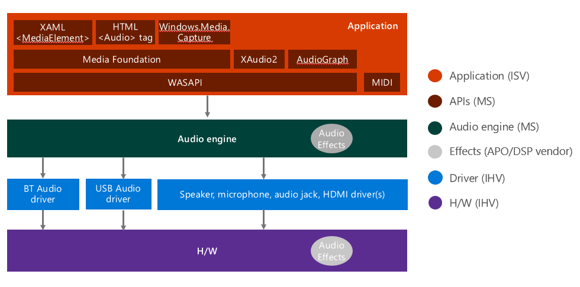

# Windows Audio Architecture

This topic provided a high level summary of the Windows 10 audio architecture.

## Windows 10 Audio Stack Diagram

This diagram provides a summary of the major elements of the Windows 10 audio stack.

## APIs

**Top level APIs**

The top level APIs are used for application development. These APIs are in currently in use and supported.

-   XAML [MediaElement class](/uwp/api/Windows.UI.Xaml.Controls.MediaElement)(C#, VB, C++)
-   HTML [Audio object](https://developer.mozilla.org/en-US/docs/Web/HTML/Element/audio) and [Video object](https://developer.mozilla.org/en-US/docs/Web/API/HTMLVideoElement)&lt;tags&gt; (used by websites and Windows Web Apps)
-   [Windows.Media.Capture namespace](/uwp/api/Windows.Media.Capture) (C#, VB, C++)
-   [Microsoft Media Foundation](/windows/desktop/medfound/microsoft-media-foundation-sdk) (C++)

These older APIs are deprecated.

-   [DirectShow](/windows/desktop/DirectShow/directshow)
-   [DirectSound](/previous-versions/windows/desktop/ee416960(v=vs.85))
-   [PlaySound](/previous-versions/dd743680(v=vs.85))
-   [Windows.Media.MediaControl](/uwp/api/Windows.Media.MediaControl)

**Low level APIs**

These lower level APIs are recommended for audio streaming.

-   [WASAPI](/windows/desktop/CoreAudio/wasapi) (High performance, but more complicated)
-   [IXAudio2](/windows/win32/api/xaudio2/nn-xaudio2-ixaudio2) (Typically used for games)
-   [MIDI](/windows/desktop/Multimedia/about-midi)

This lower level API is recommended for enumeration.

-   [Windows.Devices.Enumeration](/uwp/api/Windows.Devices.Enumeration)

These APIs are not recommended for Windows applications.

-   [About MMDevice API](/windows/desktop/CoreAudio/mmdevice-api) (replaced by Windows.Devices.Enumeration)
-   [DeviceTopology API](/windows/desktop/CoreAudio/devicetopology-api)
-   [EndpointVolume API](/windows/desktop/CoreAudio/endpointvolume-api)

## Audio Engine

The audio engine consists of two related components, the Audio Device Graph (audiodg.exe), which loads the Audio Engine (audioeng.dll).

The audio engine:

-   Mixes and processes audio streams. For more information about how the audio engine uses buffers to transfer audio, see [Understanding the WaveRT Port Driver](understanding-the-wavert-port-driver.md).
-   Loads Audio Processing Objects (APOs), which are H/W-specific plugins that process the audio signal. For more information about APOs, see [Windows Audio Processing Objects](windows-audio-processing-objects.md).

## Audio Service (audiosrv.dll)

The audio service:

-   Is used to setup and control audio streams.
-   Implements Windows policies for background audio playback, ducking, etc.

## Audio Endpoint Builder (audioendpointbuilder.exe)

The Audio Endpoint Builder (audioendpointbuilder.exe):

-   Is used to discover new audio devices and create software audio endpoints. For more information about the algorithm that is used, see [Audio Endpoint Builder Algorithm](audio-endpoint-builder-algorithm.md).

## Audio Drivers

Audio drivers:

-   Follow the port-miniport model. For more information, see [WDM Audio Terminology](wdm-audio-terminology.md) and [Developing a WaveRT Miniport Driver](developing-a-wavert-miniport-driver.md).
-   Allow the audio stack to render and capture audio from several audio devices, including: integrated speakers and microphones, headsets/headphones, USB devices, Bluetooth devices, HDMI, etc.
-   The port-minport model corresponds to the Advanced Linux Sound Architecture  ALSA
-   For information on sample driver code, see [Sample Audio Drivers](sample-audio-drivers.md).

## Hardware

The audio hardware that is present on any give device varies but can include:

-   Audio Codec
-   DSP (optional)
-   Integrated speakers, microphone, etc
-   External devices: USB audio devices, Bluetooth audio devices, HDMI audio, etc.
-   Signal processing can also be implemented in the H/W (e.g. the codec or the DSP), instead of or in addition to the APOs.
