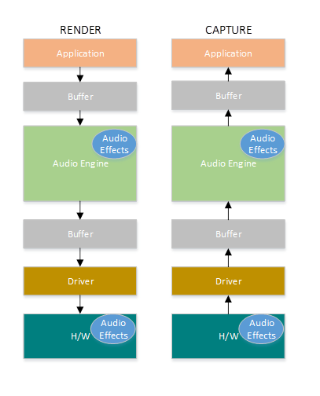

# Windows 10: What's New for Audio Drivers

This topic provides a high level summary of what's new in audio for Windows 10.

## Feature Summary

Here are the new audio features in Windows 10.

-   [Implementing Audio Module Communication](implementing-audio-module-communication.md)

-   [Low Latency Audio Improvements](#lowlatency)

-   [Signal Processing Modes and Audio Categories](#signalprocessing)

-   [Hardware Offloaded APO Effects](#hardwareoffloaded)

-   [Cortana Voice Activation](#cortanavoice)

-   [Windows Universal Drivers for Audio](#windowsuniversal)

-   [Resource Management for Audio Drivers](#resourcemanagement)

-   [PNP Rebalance for Audio Drivers](#pnprebalance)

## Low Latency Audio Improvements

Audio latency is the delay between that time that sound is created and when it is heard. Having low audio latency is very important for several key scenarios, such as the following.

-   Pro Audio
-   Music Creation and Mixing
-   Communications such as Skype
-   Virtual and Augmented Reality
-   Games

The total latency of a device is the sum of the latencies of the following components:

-   Operating System
-   Audio Processing Objects
-   Audio Driver
-   Audio Hardware

In Windows 10 work was done to reduce the latency in the OS. Without any driver changes, applications in Windows 10 will experience 4.5-16ms lower latency. In addition, if the driver has been updated to take advantage of the new low latency DDIs that use small buffers to process audio data, then the latency will be reduced even more. If a driver supports 3ms audio buffers, then the roundtrip latency is ~10ms.

The audio stack supports multiple packet sizes and dynamic packet resizing, in order to optimize the tradeoff between latency and power based on the user’s scenario. In addition, streams will be prioritized, in order to ensure that high priority streams (e.g. phone calls) have dedicated resources.

In order for audio drivers to support low latency, Windows 10 provides the following 3 new features:

1. \[Mandatory\] Declare the minimum buffer size that is supported in each mode.
2. \[Optional, but recommended\] Improve the coordination for the data flow between the driver and the OS.
3. \[Optional, but recommended\] Register the driver resources (interrupts, threads), so that they can be protected by the OS in low latency scenarios.
For more information, see [Low Latency Audio](low-latency-audio.md).

## Signal Processing Modes and Audio Categories

**Signal Processing Modes**

Drivers declare the supported audio signal processing modes for each device.

Audio categories (selected by applications) are mapped to audio modes (defined by drivers). Windows defines seven audio signal processing modes. OEMs and IHVs can determine which modes they want to implement. The modes are summarized in the table shown below.

<table>
<colgroup>
<col width="33%" />
<col width="33%" />
<col width="33%" />
</colgroup>
<tbody>
<tr class="odd">
<td align="left"><strong>Mode</strong></td>
<td align="left"><strong>Render/Capture</strong></td>
<td align="left"><strong>Description</strong></td>
</tr>
<tr class="even">
<td align="left">Raw</td>
<td align="left">Both</td>
<td align="left">
Raw mode specifies that there should not be any signal processing applied to the stream.

An application can request a raw stream that is completely untouched and perform its own signal processing.
</td>
</tr>
<tr class="odd">
<td align="left">Default</td>
<td align="left">Both</td>
<td align="left">
This mode defines the default audio processing.
</td>
</tr>
<tr class="even">
<td align="left">Movies *</td>
<td align="left">Render</td>
<td align="left">Movie audio playback</td>
</tr>
<tr class="odd">
<td align="left">Media *</td>
<td align="left">Both</td>
<td align="left">Music audio playback (default for most media streams)</td>
</tr>
<tr class="even">
<td align="left">Speech *</td>
<td align="left">Capture</td>
<td align="left">Human voice capture (e.g. input to Cortana)</td>
</tr>
<tr class="odd">
<td align="left">Communications *</td>
<td align="left">Both</td>
<td align="left">VOIP render and capture (e.g. Skype, Lync)</td>
</tr>
<tr class="even">
<td align="left">Notification *</td>
<td align="left">Render</td>
<td align="left">Ringtones, alarms, alerts, etc.</td>
</tr>
</tbody>
</table>

 

Audio device drivers need to support at least the Raw or Default mode. Supporting additional modes is optional.

Dedicated modes for speech, movie, music and communications. Audio drivers will be able to define different type of audio formats and processing, based on the stream type.

**Audio Categories**

The following table shows the audio categories in Windows 10.

In order to inform the system about the usage of an audio stream, applications have the option to tag the stream with a specific audio stream category. In Windows 10 there are nine audio stream categories.

|                |                                                                                                       |
|----------------|-------------------------------------------------------------------------------------------------------|
| **Category**   | **Description**                                                                                       |
| Movie\*        | Movies, video with dialog (Replaces ForegroundOnlyMedia)                                              |
| Media\*        | Default category for media playback (Replaces BackgroundCapableMedia)                                 |
| Game Chat\*    | In-game communication between users (New category in Windows 10)                                      |
| Speech\*       | Speech input (e.g. personal assistant) and output (e.g. navigation apps) (New category in Windows 10) |
| Communications | VOIP, real-time chat                                                                                  |
| Alerts         | Alarm, ring tone, notifications                                                                       |
| Sound Effects  | Beeps, dings, etc                                                                                     |
| Game Media     | In game music                                                                                         |
| Game Effects   | Balls bouncing, car engine sounds, bullets, etc.                                                      |
| Other          | Uncategorized streams                                                                                 |

 

\* New in Windows 10.

For more information see [Audio Signal Processing Modes](audio-signal-processing-modes.md) and [Audio Processing Object Architecture](audio-processing-object-architecture.md).

## Hardware Offloaded APO Effects

Windows 10 supports hardware offloaded APO effects. APOs can be loaded on top of the offload pin. This allows for the audio processing to be done in both software and hardware. In addition, the processing can change dynamically. Some or all of the processing can be moved from the software APO to the DSP when there are enough hardware resources and then moved back to the software APO when the load in the DSP increases.

For more information, see [Implementing Hardware Offloaded APO Effects](implementing-hardware-offloaded-apo-effects.md).

## Cortana Voice Activation - Wake on Voice

Cortana, the personal assistant technology introduced on Windows Phone 8.1, is now supported on Windows 10 devices. Voice activation is a feature that enables users to invoke a speech recognition engine from various device power states by saying a specific phrase - "Hey Cortana". The "Hey Cortana" Voice Activation (VA) feature allows users to quickly engage an experience (e.g., Cortana) outside of his or her active context (i.e., what is currently on screen) by using his or her voice. The feature is targeted for scenarios when the screen is off, idle or when it is fully active. If the hardware supports buffering, users can then chain the key phrase and command phrase together. This improves the end to end wake on voice experience for the user. For more information, see [Voice Activation](voice-activation.md).

## Windows Universal Drivers for Audio

Windows 10 supports one driver model that works for PC and 2:1’s and Windows 10 for phones and small screen tablets. This means that IHVs can develop their driver in one platform and that driver works in all devices (desktops, laptops, tablets, phones). The result is reduced development time and cost.

In order to develop Universal Audio Drivers, use the following tools:

1. Visual Studio 2015: New driver settings allow the “Target Platform” to be set to “Universal” to create a multi-platform driver.
2. APIValidator: This is a WDK tool that checks whether driver is universal and highlights calls that need to be updated.
3. Audio samples in GitHub: The sysvad and SwapAPO have been converted to be Universal Drivers.
For more information and pointers to GitHub sample code, see [Universal Windows Drivers for Audio](audio-universal-drivers.md).

## Resource Management for Audio Drivers

One challenge with creating a good audio experience on a low cost mobile device, is that some devices have various concurrency constraints. For example, it is possible that the device can only play up to 6 audio streams concurrently and supports only 2 offload streams. When there is an active phone call on a mobile device, it is possible that the device supports only 2 audio streams. When the device is capturing audio, the device can only play up to 4 audio streams.

Windows 10 includes a mechanism to express concurrency constraints to insure that high-priority audio streams and cellular phone calls will be able to play. If the system does not have enough resources, then low priority streams are terminated. This mechanism is only available in phones and tablets not on desktops or laptops.

For more information, see [Audio Hardware Resource Management](audio-hardware-resource-management.md).

## PNP Rebalance for Audio Drivers

PNP rebalancing is used in certain PCI scenarios where memory resources need to be reallocated. In that case, some drivers are unloaded, and then reloaded at different memory locations, in order to create free contiguous memory space. Rebalance can be triggered in two main scenarios:

1. PCI hotplug: A user plugs in a device and the PCI bus does not have enough resources to load the driver for the new device. Some examples of devices that fall into this category include Thunderbolt, USB-C and NVME Storage. In this scenario, memory resources need to be rearranged and consolidated (rebalanced) to support the additional devices being added.
2. PCI resizeable BARs: After a driver for a device is successfully loaded in memory, it requests additional resources. Some examples of devices include high-end graphics cards and storage devices.
For more information, see [Implement PnP Rebalance for PortCls Audio Drivers](implement-pnp-rebalance-for-portcls-audio-drivers.md).

 

 

