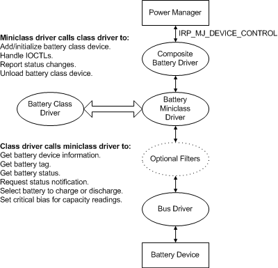

# Interaction of Battery Class and Miniclass Drivers

## 

Together, the battery class driver and the miniclass driver manage the computer's use of a battery. The following figure shows how these two drivers interact.

The miniclass driver is the primary function driver for the devices it controls. It receives IRPs from the power manager through the composite battery driver and calls support routines in the battery class driver to register its devices, to report status, and to handle certain system-defined battery IOCTLs.

The class driver receives information and status from all the miniclass drivers and reports it to the power manager through the composite battery driver. In response to battery IOCTLs, the class driver calls [battery miniclass driver routines](https://msdn.microsoft.com/library/windows/hardware/ff536286) (BatteryMini*Xxx* routines) in the miniclass drivers to perform specific device control operations. Additionally, applications such as the power meter can send [**IRP\_MJ\_DEVICE\_CONTROL**](https://msdn.microsoft.com/library/windows/hardware/ff550744) requests to a miniclass driver to get information about a specific battery.

The class driver is designed to handle the superset of possible battery information and conditions, including temperature, changes in capacity, and so forth; individual batteries vary in their ability to detect and report all these conditions. Each miniclass driver should be designed to manage its specific battery type and must respond appropriately to the class driver when asked for any information that the battery does not support.

 

 

