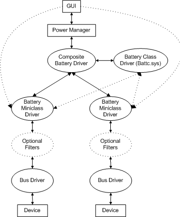

# Overview of System Battery Management

## 

Battery management involves the following system components:

-   The battery GUI, which presents status information to users and allows them to set battery options

-   The power manager

-   The composite battery driver, a kernel-mode driver supplied by Microsoft

-   The battery class driver, a kernel-mode driver supplied by Microsoft

-   Battery miniclass drivers for individual battery devices

-   Devices, including batteries and some Uninterruptible Power Supplies (UPS)

Devices controlled by battery miniclass drivers include batteries and some UPS devices. Batteries can be primary (nonrechargeable) or secondary (rechargeable) cells. A UPS is, in essence, a system battery with a much larger capacity and a different alert threshold than a laptop battery.

**Note**   For UPS units connected to COM ports, [writing a UPS minidriver](writing-ups-minidrivers.md) is preferable to writing a battery miniclass driver for operating systems prior to Windows Vista.

 

As shown in the preceding figure, the role of each component in battery operations is as follows:

-   A bus driver and one or more optional filter drivers, such as an ACPI filter, might be layered between the device and its miniclass driver.

-   A *battery miniclass driver* is the function driver for a specific type of battery or UPS device. A system can have as many battery miniclass drivers as it has different types of batteries.

-   The *composite battery driver* keeps track of the status of all the batteries in the system and acts as an intermediary between the power manager and the battery class/miniclass drivers. The composite battery driver receives IRPs from the power manager and notifies the power manager when the battery status changes (for example, when system battery power becomes critically low). The composite battery driver interacts with the battery class driver in much the same way that a battery miniclass driver does, but it is transparent to other miniclass drivers. The system has one composite battery driver, supplied by Microsoft.

-   The *battery class driver* supports all the battery miniclass drivers and the composite battery driver. The system has one battery class driver, supplied by Microsoft.

-   The *power manager* sends power and Plug and Play (PnP) IRPs to battery device stacks through the composite battery driver. The power manager does not interact directly with the battery class or miniclass drivers; all IRPs are sent through the composite battery driver.

-   The *battery GUI* gets system battery status from the composite battery driver through the power manager and presents the information to the user. The GUI also sends IRPs to the battery miniclass drivers for device-specific information. The system has one battery GUI, supplied by the hardware vendor.

 

 

