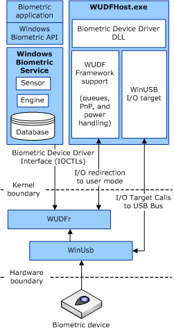

# Getting Started with Biometric Drivers

The Windows Biometric Framework (WBF) is a generic biometric architecture in Windows 7 and later versions of Windows.

WBF includes an IOCTL-based driver interface known as the Windows Biometric Driver Interface (WBDI) as well as a Windows service called the Windows Biometric Service (WBS). WBS is also referred to as the WinBio service. WBDI drivers respond to requests from the WinBio service. WBF also includes Windows log-in support.

This documentation describes the WBDI. WBS is documented separately in the Windows SDK.

### Choosing a Driver Model

The first choice you must make when you develop a driver to work with the Windows Biometric Driver Interface (WBDI) is which driver model to use.

Microsoft recommends that IHVs develop biometric device drivers by using the Windows User-mode Driver Framework (WUDF, also referred to as [UMDF](https://msdn.microsoft.com/library/windows/hardware/ff554928)) and the WinUSB I/O target.

The following diagram shows how a UMDF-based Windows Biometric Driver Interface (WBDI) driver fits into the Windows Biometric Framework (WBF) biometric support in Windows 7. All biometric operations are driven by client applications to the Windows Biometric Service (WBS). The WBS sends requests to biometric device drivers that expose the WBDI interface.

In the previous diagram, the vendor supplies the biometric device driver DLL.

If you do not want to use UMDF to develop your driver, you can also choose to implement the WBDI by using a KMDF or WDM driver, but this is not the preferred driver development environment.

The following list shows the different ways that you can develop a driver for WBDI, with the most preferred method on top and the least preferred at the bottom:

1.  UMDF with a WinUsb I/O target

2.  UMDF with a custom KMDF filter on WinUsb or custom KMDF I/O target

3.  KMDF

4.  WDM (only when absolutely necessary)

This documentation describes how to use UMDF to write a WBDI-based user-mode USB biometric driver.

 

 

