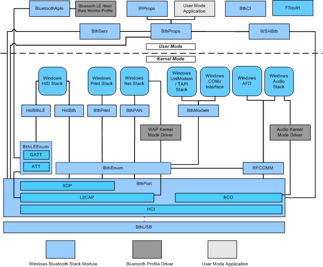

# Bluetooth Driver Stack

The Bluetooth driver stack comprises the core portion of the support provided by Microsoft for the Bluetooth protocol. With this stack, Bluetooth-enabled devices can locate each other and establish connections. Across such connections, the devices can exchange data and interact with one another through various applications.

The following image shows the modules within the Bluetooth driver stack, along with possible custom user-mode and kernel-mode drivers not included in Windows Vista and later. These custom drivers are known as profile drivers.

-   **User-mode**
    -   **User-mode application**- A user-mode application that accesses the Bluetooth driver stack through published APIs. For more information, see [About Bluetooth](http://go.microsoft.com/fwlink/p/?linkid=50712) in the Windows SDK documentation.

        **Note**  User-mode applications should link against *BthProps.lib*, instead of *IrProps.lib*, in order to use APIs, such as [**BluetoothSetLocalServiceInfo**](https://msdn.microsoft.com/library/windows/hardware/ff536580).

         

-   **Examples of profile drivers**
    -   **WAP Kernel Mode Driver**- The Wireless Application Protocol (WAP) component is an example of a profile driver that communicates between the Windows networking stack and BthPort, accessing the L2CAP interface and, optionally, the SDP interface contained in L2CAP. Other possible profiles include the Advanced Audio Distribution profile (A2DP), A/V Remote Control profile (AVRCP), Generic A/V Distribution profile (GAVDP), and Common ISDN Access (CIP) profile.
    -   **Audio Kernel Mode Driver**- An example of a profile driver that communicates between the Windows audio stack and BthPort, accessing the SCO interfaces contained in the latter. Possible profiles include the Hands Free profile (HFP), Headset profile (HSP), Cordless Telephony profile (CTP), and Intercom profile (ICP).
        **Note**  This profile driver is included with Windows beginning with Windows 8.

         

    -   **Bluetooth LE Heart Rate Monitor Profile**- An example of a Bluetooth LE profile driver that communicates with the Bluetooth Low Energy (LE) API.
-   **Bluetooth driver stack components**
    -   **IrProps**- A component that is used for backward compatibility for profile drivers that are created for the first version of the Bluetooth driver stack.

        **Note**  **IrProps** is provided only for backward compatibility. Use the **BthProps** component for new development.

         

    -   **BthProps**- A component that contains the implementation of the Bluetooth user interface along with implementation of the Bluetooth APIs that user-mode applications access. This component sends inquiries to BthServ through remote procedure calls (RPC). Additionally, BthProps performs pin exchanges with BthPort through private IOCTLs. Note that BthProps runs on any system with a Bluetooth-enabled radio.
    -   **BthServ**- A service that is responsible for caching and forwarding inquiry data to Bthport.
    -   **BthCi**- The Bluetooth class installer.
    -   **WshBth**- The Bluetooth Windows socket helper component. WshBth is called by the Windows sockets layer to perform socket operations. WshBth primarily calls into RfComm through the TDI interface. WshBth also calls into BthServ to perform remote device inquiries and into BthPort to perform local radio inquiries.
    -   **FSquirt**- A nonextensible Object Exchange (OBEX) component that allows users to send and receive files across an open Bluetooth connection. OBEX communicates with remote devices through RFCOMM that uses the WshBth component.
    -   **BthPrint**- A component that implements the Hardcopy Cable Replacement Profile (HCRP). This component allows the print system to send data to and receive data from Bluetooth-enabled printers. BthPrint communicates with the SDP interface in BthPort to query remote printers and the L2CAP interface in BthPort to send and receive data.
    -   **HidBth**- The component that implements the Human Interface Device (HID) profile. HidBth also communicates with the L2CAP and SDP interfaces in BthPort. HidBth connects to the HID stack much like USB HID module does.
    -   **BthPan**- The component that implements the Personal Area Network (PAN) profile, providing TCP connections across an open Bluetooth connection. In Windows Vista and Windows XP, BthPan only supports outgoing connections. BthPan is also a client of the BthPort component and uses both the L2CAP and SDP interfaces.
    -   **RfComm**- The component that implements the Bluetooth serial cable emulation protocol. RfComm also uses the L2CAP and SDP interfaces found in BthPort. The upper edge of RfComm exposes the TDI interface, allowing this component to appear to be a networking transport. This is how WshBth connects to Bluetooth to send and receive data from user-mode APIs.

        User-mode applications can access RfComm using the Winsock interfaces described in the Windows SDK.

    -   **BthModem**- The component that implements virtual COM ports and dial-up networking (DUN). BthModem directs all I/O and control operations to RfComm through a TDI interface. The upper edge of BthModem communicates with *Serial.sys* to give the appearance of being a wireless COM port.
        **Note**  This component is not available in Windows RT.

         

    -   **BthEnum**- The Bluetooth bus driver. BthEnum communicates with the Plug and Play (PnP) manager to create and destroy device objects used to enable Bluetooth services. BthEnum creates a PDO for every service that a connected remote device supports. For example, when a user connects a Bluetooth-enabled mouse, Windows will discover that the mouse supports the Bluetooth HID service and creates a PDO for the HID service that causes the PnP manager to load HidBth.

        **Note**  BthEnum will not create PDOs for services that appear in the **UnsupportedServices** registry key as specified in *Bth.inf*.

         

    -   **BthLEEnum**- The Bluetooth Low Energy (LE) bus driver. BthLEEnum implements the ATT protocol and the GATT profile. It is also responsible for creating PDOs to represent the remote devices and their primary services.

    -   **BthPort**- A minidriver loaded by the BthUsb miniport. BthPort provides four components:
        -   The HCI component communicates to the local Bluetooth-enabled radio through the Host Controller Interface (HCI) defined in the Bluetooth specification. Because all Bluetooth-enabled radios implement the HCI specification, BthPort is able to communicate with any Bluetooth-enabled radio, regardless of the manufacturer or model.
        -   The SCO component implements the Synchronous Connection-Oriented (SCO) protocol. This protocol supports creating point-to-point connections to a remote device. SCO clients communicate with the SCO interface by [building and sending](building-and-sending-a-brb.md) Bluetooth request blocks (BRBs).
        -   L2CAP implements the Bluetooth logical link control and adaptation protocol. This protocol supports creating a lossless channel to a remote device. L2CAP clients communicate with the L2CAP interface by building and sending Bluetooth request blocks (BRBs).
        -   SDP implements the Bluetooth Service Discovery Protocol.
    -   **BthUsb.sys**- The miniport that abstracts the bus interface from **BthPort**.

 

 

