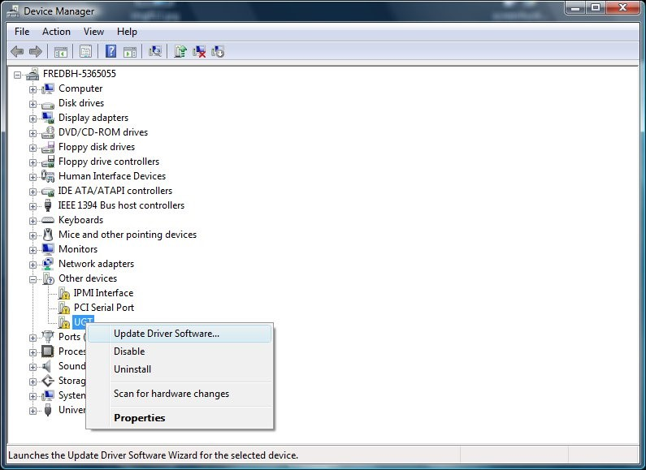
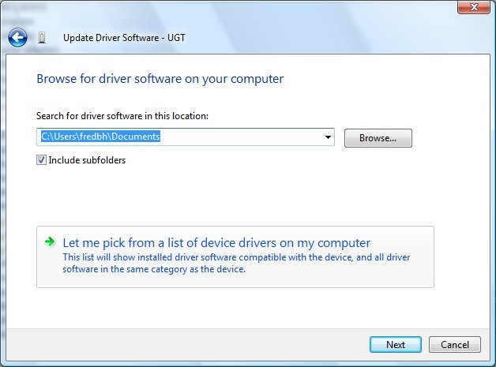
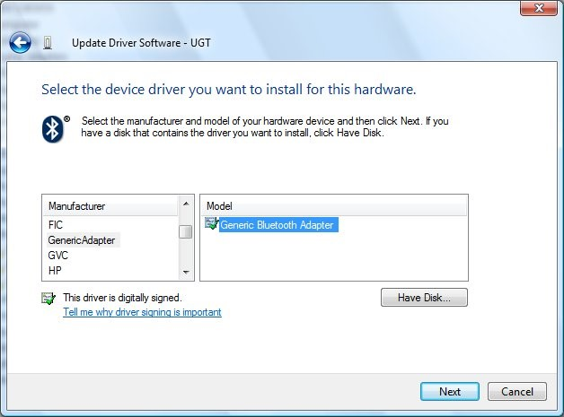
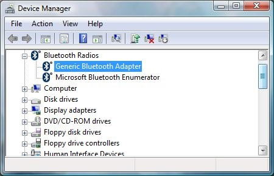

# Appendix A: How to Install an In-Box Bluetooth Driver on New Hardware in Windows Vista

This appendix describes the procedure for forcing the Bluetooth driver that is included with Windows Vista to install on a new Bluetooth radio. Windows XP SP2 uses a similar procedure, although some of the details are different.

## Step 1: Start Device Manager and Select the Bluetooth Radio

To start Device Manager:

1.  Click **Start**, navigate to **All Programs &gt; Accessories &gt; Command Prompt**, right-click **Command Prompt**, and then click **Run as administrator** to open a command window with elevated privileges.
2.  Type the following: **Devmgmt.msc**

Under **Other Devices**, find the entry for the Bluetooth radio on the Device Manager list of devices. In the following figure, the radio’s name is ”UGT”. On some portable computers, you might be required to first turn on the Bluetooth radio by using a key combination such as Fn+F5.

To verify that the selected device is a Bluetooth radio, right-click the device name and then click **Properties** to display the **Properties** dialog box. On the **Details** tab, verify that the device has the compatible ID for a Bluetooth radio:

USB\\Class\_e0&SubClass\_01&Prot\_01
### Step 2: Start the Update Driver Software Wizard

Right-click the Bluetooth radio node and then click **Update Driver Software**. To go to the page in the following figure, click **Browse my computer for driver software**. To manually select a driver, click **Let me pick from a list of device drivers on my computer**.

### Step 3: Select the Generic Bluetooth Driver

The Update Driver Software Wizard next displays a list of available drivers. Select **Bluetooth Radios** and then select a Bluetooth radio that matches your system, as shown in the following figure. If you are not sure which driver to use, you can use the generic driver for testing. To do this, select **Generic Adapter** as manufacturer and **Generic Bluetooth Adapter** as the model.

After you select a driver, the wizard asks you to confirm that you want to install the specified driver on the new Bluetooth radio. If you try to install a Bluetooth driver on a device that is not a Bluetooth radio, the driver will probably not start.

If the driver loads correctly, Device Manager should have a Generic Bluetooth Adapter entry under the Bluetooth Radios node, as shown in the following figure.

If the driver failed to start, for example, if Windows returned a start error code, examine the event log to help determine the cause.

 

 

