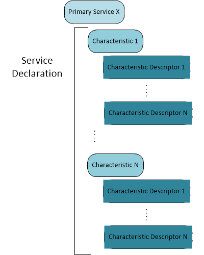
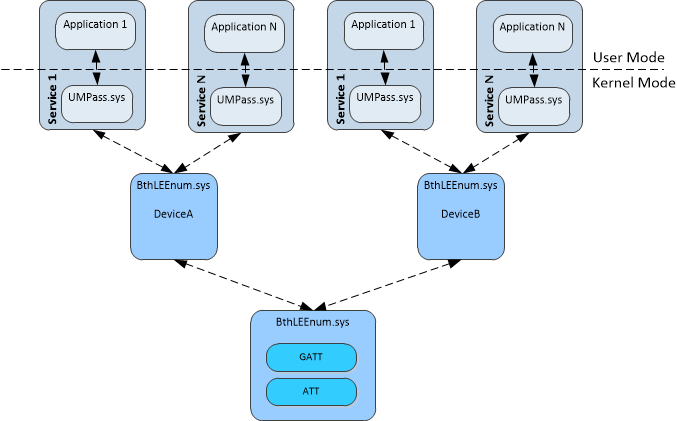

# Bluetooth Low Energy Overview

Windows 8 introduces support for the Bluetooth Low Energy technology.

Bluetooth Low Energy introduces a new physical layer that shares the same frequency space as Bluetooth Basic Rate. Profiles that are developed on this technology are organized into the Generic Attribute Profile (or GATT).

Each profile defines the use of one or more services to create a use case or scenario. Compliant service implementations are constructed from characteristics organized in a way that conforms to the established schema defined on the Bluetooth Special Interest Group [developer website](http://developer.bluetooth.org/gatt/services/Pages/ServicesHome.aspx).

The diagram below illustrates the way objects are structured inside a typical GATT service.

When a Bluetooth Low Energy device is paired with a Windows 8 machine, the device becomes part of the system and Windows will provide device objects to represent both the device and the primary services reported by the device.

Each device and its primary services are represented as device objects in Windows and these device objects can be queried and managed using the [device installation functions](https://msdn.microsoft.com/library/windows/hardware/ff549791) such as [**SetupDiEnumDeviceInfo**](https://msdn.microsoft.com/library/windows/hardware/ff551010), and [**SetupDiGetDeviceProperty**](https://msdn.microsoft.com/library/windows/hardware/ff551963).

In addition to the standard [Bluetooth Profile Driver functions](https://msdn.microsoft.com/library/windows/hardware/hh450828), Windows 8 introduces new [Bluetooth Low Energy functions](https://msdn.microsoft.com/library/windows/hardware/hh450825) which allows for the development of Bluetooth GATT client applications.

These functions allows for the enumeration of services and their objects (including services, characteristics and their descriptors) as well as read and write capabilities.

 

 

