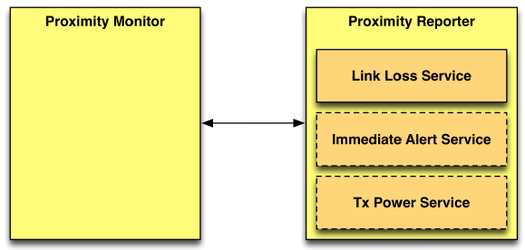

# Bluetooth Proximity Profile

The Proximity Profile defines two roles intended to allow devices to detect their proximity.

The two roles are called:

-   The Proximity Reporter
-   The Proximity Monitor

## Proximity Reporter

The Proximity Reporter is required to be a GATT server.

The Proximity Reporter supports the following GATT services:

-   Link Loss Service (mandatory)
-   Immediate Alert Service (optional)
-   Tx Power Service (optional)

## Proximity Monitor

The Proximity Monitor is the GATT client. It should create and maintain a connection to the proximity Reporter as well as monitor the Radio Signal Strength Information (or RSSI) of the connection to calculate the signal’s path loss. If the optional "Tx Power Service" is available on the Proximity Reporter, it can also use this additional information to normalize the RSSI value by subtracting the RSSI from the Tx Power Level.

##  Support for GATT in Windows 8.1

When a GATT device is paired with Windows 8.1, the device becomes part of the system and Windows will provide *device objects* to represent both the device and the primary services reported by the device.

The [**Windows.Devices.Bluetooth.GenericAttributeProfile namespace**](https://msdn.microsoft.com/library/windows/apps/dn297685). describes the Generic Attribute Profile APIs app developers can use in Windows 8.1.

One of the first steps when developing a device app is to identify which Bluetooth services the app needs in order to accomplish the scenarios a user cares about. For the Proximity Profile, the device app needs to use the "Link Loss Service" and optionally the "Immediate Alert Service" and "Tx Power Service".

In order for the device app to determine if any devices paired with Windows implement the "Link Loss Service" the app should use the APIs available in the [**Windows.Devices.Enumeration namespace**](https://msdn.microsoft.com/library/windows/apps/br225459), namely the DeviceInformation.FindAllAsync method.

The [**DeviceInformation.FindAllAsync method**](https://msdn.microsoft.com/library/windows/apps/br225433) takes an *AQS (Advanced Query Syntax)* device selector as a parameter in order to filter only devices which contain the "Link Loss Service". Device app developers can also use the [**GetDeviceSelectorFromUuid**](https://msdn.microsoft.com/library/windows/apps/dn297476) or [**GetDeviceSelectorFromShortId**](https://msdn.microsoft.com/library/windows/apps/dn297475) methods of the [**GattDeviceService**](https://msdn.microsoft.com/library/windows/apps/dn297468) class, so they don’t need to manually construct the AQS filter.

The "Link Loss Service" is a Bluetooth GATT service defined by the Bluetooth SIG, and as such a *Short Id* can be used instead of a *fully-qualified UUID*.

The *Short Id* service IDs assigned for a Proximity profile service are:

<table>
<colgroup>
<col width="50%" />
<col width="50%" />
</colgroup>
<thead>
<tr class="header">
<th align="left">Service Name</th>
<th align="left">Short Id</th>
</tr>
</thead>
<tbody>
<tr class="odd">
<td align="left">
Link Loss
</td>
<td align="left">
0x1803
</td>
</tr>
<tr class="even">
<td align="left">
Immediate Alert
</td>
<td align="left">
0x1802
</td>
</tr>
<tr class="odd">
<td align="left">
Tx Power
</td>
<td align="left">
0x1804
</td>
</tr>
</tbody>
</table>

 

The Bluetooth SIG maintains the most up to date [list of services](http://go.microsoft.com/fwlink/p/?linkid=320723).

After a developer has determined which service s/he wants to use, s/he can call [**GattDeviceService.FromIdAsync**](https://msdn.microsoft.com/library/windows/apps/dn297473) to obtain an instance of the service.

Once the developer has obtained a valid GattDeviceService object, s/he can use it to communicate with the device using the [**Windows.Devices.Bluetooth.GenericAttributeProfile**](https://msdn.microsoft.com/library/windows/apps/dn297685) API.

These APIs enable access to specific services and their objects (for example Included Services, Characteristics, and Descriptors), as well as read and write capabilities.

The [Bluetooth Generic Attribute Profile - Heart Rate Service](http://go.microsoft.com/fwlink/p/?linkid=301978) sample demonstrates some of these techniques.

## Using Power Efficiently

Support for Bluetooth Low Energy in Windows 8.1 has a strong focus on using power efficiently. This includes reducing the power consumption for the local Bluetooth radio adapter as well as using the CPU to be as little as possible.

Therefore, to establish a Bluetooth LE connection an app needs to register a handler for the [**GattCharacteristic.ValueChanged**](https://msdn.microsoft.com/library/windows/apps/dn263767) event. Alternately, the app must call any of the [**GattCharacteristic.ReadValueAsync**](https://msdn.microsoft.com/library/windows/apps/dn263752), [**GattCharacteristic.WriteValueAsync**](https://msdn.microsoft.com/library/windows/apps/dn263770) or [**GattCharacteristic.WriteClientCharacteristicConfigurationDescriptorAsync**](https://msdn.microsoft.com/library/windows/apps/dn263769) methods without specifying the BluetoothCacheMode.Cached option.

**Note**  In order to minimize power consumption, Windows does not actively monitor the RSSI value of the link by polling the local Bluetooth radio controller.

 

Power considerations are described in [Proximity Profile Implementation Details](proximity-profile-implementation-details.md).

 

 

