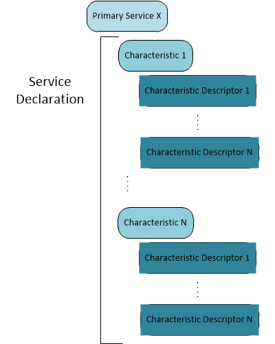

# Bluetooth LE Proximity Profile Devices and Apps

Proximity detection is a common use of Bluetooth Low Energy (LE). Windows 8.1 expands on the Bluetooth LE support introduced in Windows 8. This section provides guidelines to create a device implementation of the Proximity Profile that you can use to develop a Windows Store device app that's compatible with Windows 8.1.

Before you develop this app, you should be familiar with Bluetooth LE functions and the Bluetooth LE Proximity profile specification.

## Example Service Declaration

Bluetooth Low Energy introduced a new physical layer that shares the same frequency space as Bluetooth Basic Rate. Low Energy Profiles are organized into what’s called the Generic Attribute Profile (or GATT).

A GATT profile declares one or more services that define a use case or scenario. To develop a compliant service implementation, you must organize *characteristics* so that they conform to the established schema defined on the [Bluetooth Special Interest Group (SIG) developer website](http://go.microsoft.com/fwlink/p/?linkid=320723).

This diagram shows how *characteristics* are structured inside a typical GATT service.

An example proximity profile is described further in [Bluetooth Proximity Profile](bluetooth-proximity-profile.md).

 

 

[Send comments about this topic to Microsoft](mailto:wsddocfb@microsoft.com?subject=Documentation%20feedback%20[bltooth\bltooth]:%20Bluetooth%20LE%20Proximity%20Profile%20Devices%20and%20Apps%20%20RELEASE:%20%283/20/2017%29&body=%0A%0APRIVACY%20STATEMENT%0A%0AWe%20use%20your%20feedback%20to%20improve%20the%20documentation.%20We%20don't%20use%20your%20email%20address%20for%20any%20other%20purpose,%20and%20we'll%20remove%20your%20email%20address%20from%20our%20system%20after%20the%20issue%20that%20you're%20reporting%20is%20fixed.%20While%20we're%20working%20to%20fix%20this%20issue,%20we%20might%20send%20you%20an%20email%20message%20to%20ask%20for%20more%20info.%20Later,%20we%20might%20also%20send%20you%20an%20email%20message%20to%20let%20you%20know%20that%20we've%20addressed%20your%20feedback.%0A%0AFor%20more%20info%20about%20Microsoft's%20privacy%20policy,%20see%20http://privacy.microsoft.com/default.aspx. "Send comments about this topic to Microsoft")

