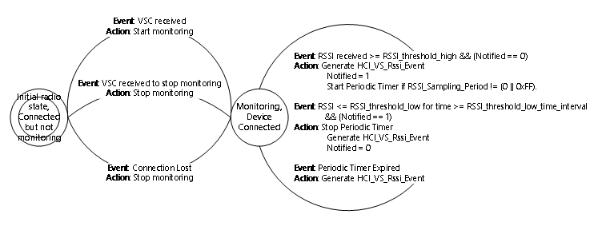
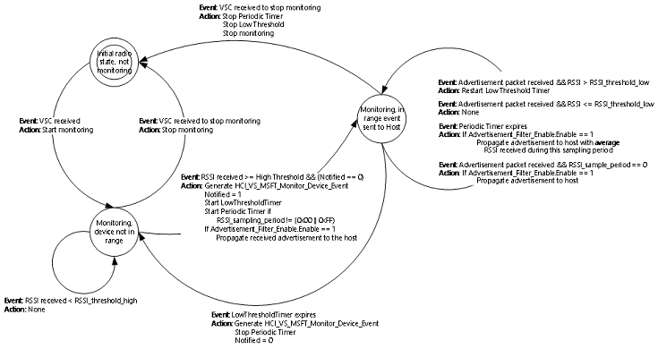
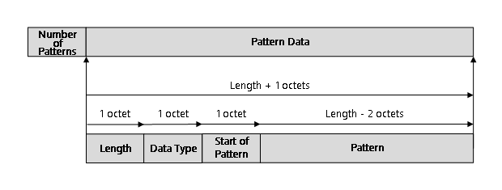

# Microsoft-defined Bluetooth HCI extensions
The Bluetooth Host-Controller Interface (HCI) specifies all interactions between a host and a Bluetooth radio controller. Bluetooth specifications allow vendor-defined HCI commands and events to enable non-standardized interaction between hosts and controllers. Microsoft defines vendor-specific HCI commands and events that are consumed by Windows. Bluetooth controller implementers can use these extensions to implement special features.

#### Requirements
Supported in Windows 10 for desktop editions (Home, Pro, Enterprise, and Education), Windows 10 Mobile, and later versions.

## Microsoft-defined HCI commands 

Bluetooth HCI commands are identified by a 16-bit command code. The Bluetooth organization defines values in the range 0x0000 through 0xFBFF. Vendors define values in the range 0xFC00 through 0xFFFF, allowing for 1024 different possible vendor-assigned command codes.

The vendor must choose the value of the Microsoft-defined command code. Microsoft can't choose a command code and assume that no other vendor uses the code for a conflicting purpose. It is unsafe to issue a vendor-specific command and depend on the controller to reject the command if it does not understand it. The controller could interpret the command as a destructive operation such as updating the controller’s firmware.

The vendor must communicate the chosen value through a method other than the controller. Microsoft does not specify how to get the chosen code.

|HCI Commands|Description|
|---|---|
|[HCI_VS_MSFT_Read_Supported_Features](#hcivsmsftreadsupportedfeatures) | HCI_VS_MSFT_Read_Supported_Features provides a bitmap that describes which Microsoft-defined features the controller supports, and specifies the prefix for Microsoft-defined events that are returned by the controller.|
|[HCI_VS_MSFT_Monitor_Rssi](#hcivsmsftmonitorrssi) | HCI_VS_MSFT_Monitor_Rssi requests that the controller starts monitoring the measured link RSSI for a specified connection, and generates an event when the connection's measured link RSSI goes outside of the specified bounds.|
|[HCI_VS_MSFT_Cancel_Monitor_Rssi](#hcivsmsftcancelmonitorrssi) |HCI_VS_MSFT_Cancel_Monitor_Rssi cancels a previously-issued HCI_VS_MSFT_Monitor_Rssi command.|
|[HCI_VS_MSFT_LE_Monitor_Advertisement](#hcivsmsftlemonitoradvertisement) | HCI_VS_MSFT_LE_Monitor_Advertisement requests that the controller starts monitoring for advertisements that fall within the specified RSSI range and also satisfy other requirements.|
|[HCI_VS_MSFT_LE_Cancel_Monitor_Advertisement](#hcivsmsftlecancelmonitoradvertisement) | HCI_VS_MSFT_LE_Cancel_Monitor_Advertisement cancels a previously-issued HCI_VS_MSFT_LE_Monitor_Advertisement command.|
[HCI_VS_MSFT_LE_Set_Advertisement_Filter_Enable](#hcivsmsftlesetadvertisementfilterenable) | HCI_VS_MSFT_LE_Set_Advertisement_Filter_Enable sets the state of the advertisement filters.|
|[HCI_VS_MSFT_Read_Absolute_RSSI](#hcivsmsftreadabsoluterssi) | HCI_VS_MSFT_Read_Absolute_RSSI reads the absolute Received Signal Strength Indication (RSSI) value for a BR/EDR connection from the controller.|


### Notifying Windows Bluetooth stack of the vendor specific command code
The Windows Bluetooth stack reads the vendor-specific command code from a registry key.

The VsMsftOpCode registry key has a type of REG_DWORD and the key data is the vendor specific opcode.

The registry path to the VsMsftOpCode key is:

HKEY_LOCAL_MACHINE\SYSTEM\CurrentControlSet\Enum\<Device instance path>\Device Parameters\VsMsftOpCode

This example command adds the registry value from the command line.

```cpp
REG ADD "HKEY_LOCAL_MACHINE\SYSTEM\CurrentControlSet\Enum\<Device instance path>\Device Parameters" /v VsMsftOpCode /t REG_DWORD /d <Vendor specific command code>
```

### Using INF to set the VsMsftOpCode registry key
The vendor-specific command code can also be added via INF Files. This sample shows how and where to add the vendor specific command code so that it is automatically added to the registry.

```cpp
[radio.NTamd64.HW]
AddReg=radio.NTamd64.HW.AddReg
[radio.NTamd64.HW.AddReg]
HKR,,"VsMsftOpCode",0x00010001,<Vendor Specific Opcode>
```
### Microsoft-defined HCI command and subcommands

The controller understands there is only one Microsoft-specific HCI command. The Microsoft-specific command set is extended through the use of an opcode. The first command parameter for the Microsoft-defined HCI command is an opcode that specifies the subcommand.

Controllers must support [HCI_VS_MSFT_Read_Supported_Features](#hcivsmsftreadsupportedfeatures) in order to support any other Microsoft HCI subcommands. Support for other commands is optional and depends on the values returned by HCI_VS_MSFT_Read_Supported_Features. Windows does not send any Microsoft-defined subcommands unless the controller indicates support for the subcommand through a response to HCI_VS_MSFT_Read_Supported_Features.

### HCI_VS_MSFT_Read_Supported_Features

HCI_VS_MSFT_Read_Supported_Features provides a bitmap that describes which Microsoft-defined features the controller supports, and specifies the prefix for Microsoft-defined events that are returned by the controller.

The controller shall always complete this command promptly with a Command Completed event.


|Command|Code|Command parameters|Return parameters|
|---|---|---|---|
|HCI_VS_MSFT_Read_Supported_Features|Chosen base code |Subcommand_opcode|<ul><li>Status</li><li>Subcommand_opcode</li><li>Supported_features</li><li>Microsoft_event_prefix_length</li><li>Microsoft_event_prefix</li></ul>|


#### Command_parameters

**Subcommand_opcode** (1 octet):

| Value  |  Parameter description |
|---|---|
|0x00   |  The subcommand opcode for HCI_VS_MSFT_Read_Supported_Features.|

#### Return_parameters
**Status** (1 octet):

| Value  |  Parameter description |
|---|---|
|  0x00 |  The command succeeded. |
| 0x01&#160;-&#160;0xFF  |  The command failed. See _Error Codes_ in the Bluetooth Core specification for details. |

**Subcommand_opcode** (1 octet):

| Value  |  Parameter description |
|---|---|
|0x00   |  The subcommand opcode for [HCI_VS_MSFT_Read_Supported_Features](#hcivsmsftreadsupportedfeatures).|

**Supported_features** (8 octets):

| Value  |  Parameter description |
|---|---|
|0x00000000&#160;00000001  |Controller supports the RSSI Monitoring feature for BR/EDR connections. In addition, the controller supports [HCI_VS_MSFT_Read_Absolute_RSSI](#hcivsmsftreadabsoluterssi) to read the absolute RSSI metric of a BR/EDR connection. |
|0x00000000&#160;00000002  |Controller supports the RSSI Monitoring feature for LE connections. |
|0x00000000&#160;00000004  |Controller supports the RSSI Monitoring of LE advertisements. |
|0x00000000&#160;00000008|Controller supports Advertising Monitoring of LE advertisements.|
|0x00000000&#160;00000010 |Controller supports verifying the validity of the public X and Y coordinates on the curve during the Secure Simple pairing process for P-192 and P-256. <p>For more information, see [Bluetooth Core Specification Erratum 10734](https://www.bluetooth.org/docman/handlers/downloaddoc.ashx?doc_id=447440).</p>|
|0x00000000 00000020|Controller supports Continuous Advertising Monitoring of LE advertisements performed concurrently with other radio activities.|
|0xFFFFFFFF&#160;FFFFFFF0|Bits reserved for future definition. Must be zero.|

**Microsoft_event_prefix_length** (1 octet):

| Value  |  Parameter description |
|---|---|
|0x00&#160;-&#160;0x20|Number of bytes in the Microsoft event prefix field as specified in the returned _Microsoft_event_prefix_. This is the number of bytes of constant information at the beginning of every Microsoft-specified HCI event.|

**Microsoft_event_prefix** (variable length):

| Value  |  Parameter description |
|---|---|
|Event&#160;prefix&#160;value| The constant information to expect at the beginning of each Microsoft-defined event. This information is used to distinguish Microsoft-defined events from other custom events.|

 ### HCI_VS_MSFT_Monitor_Rssi

HCI_VS_MSFT_Monitor_Rssi requests that the controller starts monitoring the measured link RSSI for a specified connection, and generates an event when the connection's measured link RSSI goes outside of the specified bounds.


|Command|Code|Command parameters|Return parameters|
|---|---|---|---|
|HCI_VS_MSFT_Read_Supported_Features|Chosen base code |<ul><li>Subcommand_opcode</li><li>Connection_handle</li><li>RSSI_threshold_high</li><li>RSSI_threshold_low</li><li>RSSI_threshold_low_time_interval</li><li>RSSI_sampling_period</li></ul>|<ul><li>Status</li><li>Subcommand_opcode</ul>|

The controller shall notify the host of the RSSI value with a periodically generated event (based on the _RSSI_sampling_period_). The measured link RSSI shall be the **absolute** receiver signal strength value in dBm for the BR/EDR connection.
In response to a HCI_VS_MSFT_Monitor_Rssi command, the controller shall generate a Command Complete event with status equaling zero if the controller can begin monitoring, or a non-zero status otherwise. If the status value is non-zero, the controller shall not generate an [HCI_VS_MSFT_Rssi_Event](#hcivsmsftrssievent) in response to this command.
The controller shall refuse the command if another HCI_VS_MSFT_Monitor_Rssi command with the same _Connection_handle_ is outstanding, or if the specified connection handle is invalid. The controller may also refuse the command for other reasons, such as resource exhaustion.

#### State_diagram

This state diagram shows the transition states on the controller when monitoring RSSI for a connection.
The controller shall generate an [HCI_VS_MSFT_Rssi_Event](#hcivsmsftrssievent) when the received RSSI is greater than or equal to the specified _RSSI_threshold_high_. After this event has been generated, the controller shall not generate a new HCI_VS_MSFT_Rssi_Event to specify that the _RSSI_threshold_high_ has been exceeded until it generates an HCI_VS_MSFT_Rssi_Event that specifies the RSSI has fallen below _RSSI_threshold_low_.

The controller shall generate an HCI_VS_MSFT_Rssi_Event when the received RSSI equals or falls below the specified _RSSI_threshold_low_ over the specified _RSSI_threshold_low_time_interval_. After this event has been generated, the controller shall not generate a new HCI_VS_MSFT_Rssi_Event to specify that the RSSI has fallen below the _RSSI_threshold_low_ until an HCI_VS_MSFT_Rssi_Event event is generated to specify that _RSSI_threshold_high_ has been reached or exceeded.

If the _RSSI_sampling_period_ is between 0x01 and 0xFE, the controller shall generate an HCI_VS_MSFT_Rssi_Event periodically every _RSSI_sampling_period_. This event shall contain the average of the RSSI calculated over the _RSSI_sampling_period_.
If the _RSSI_sampling_period_ is 0x00 or 0xFF, the controller shall **not** notify the host periodically with HCI_VS_MSFT_Rssi_Event.

#### Command_parameters

Subcommand_opcode (1 octet):

| Value  |  Parameter description |
|---|---|
|0x01   |  The subcommand opcode for HCI_VS_MSFT_Monitor_Rssi.|

Connection_handle (2 octets):

| Value  |  Parameter description |
|---|---|
|0x_XXXX   |  The handle for the connection whose RSSI must be monitored.|


RSSI_threshold_high (1 octet):

| Value  |  Parameter description |
|---|---|
|N_ = _High&#160;RSSI threshold&#160;value |  The maximum expected RSSI value. The controller will generate an event if the observed RSSI becomes greater than or equal to this value. For BR/EDR: <ul><li>Range: -128 &lt;= _N_ &lt;= 127 (signed integer)</li><li>Unit: dBm</li></ul>For LE:<ul><li>Range: -127 to 20 (signed integer)</li><li>Unit: dBm</li></ul>|

RSSI_threshold_low (1 octet):

| Value  |  Parameter description |
|---|---|
|N_ = _Low&#160;RSSI threshold&#160;value|The minimum expected RSSI value. The controller will generate an event if the observed RSSI becomes less than or equal to this value. For BR/EDR:<ul><li>Range: -128 &lt;= _N_ &lt;= 127 (signed integer)</li><li>Unit: dBm</li></ul>For LE:<ul><li>Range: -127 to 20 (signed integer)</li><li>Unit: dBm</li></ul>|

RSSI_threshold_low_time_interval (1 octet):

| Value  |  Parameter description |
|---|---|
|0x00|Reserved value.|
|N_&#160;=&#160;0x01&#160;-&#160;0x3C|Time period = _N_ * 1 secondThe time in seconds over which the RSSI value should be below _RSSI_threshold_low_ before an [HCI_VS_MSFT_Rssi_Event](#hcivsmsftrssievent) is generated.

RSSI_sampling_period (1 octet):

| Value  |  Parameter description |
|---|---|
|0x00|Reserved value.|
|_N_&#160;=&#160;0x01&#160;-&#160;0xFE|Time period = _N_ * 100 millisecondsThe sampling interval in milliseconds.|
|0xFF|Reserved value.|

#### Return_parameters
Status (1 octet):

| Value  |  Parameter description |
|---|---|
|  0x00 |  The command succeeded. |
| 0x01&#160;-&#160;0xFF  |  The command failed. See _Error Codes_ in the Bluetooth Core specification for details. |
|0x07|The controller shall return _Memory Capacity Exceeded_ if it does not have enough memory to process the command.|
|_Error&#160;code_| The command failed. See _Error Codes_ in the Bluetooth Core specification for details.|

Subcommand_opcod (1 octet):

| Value  |  Parameter description |
|---|---|
|0x01|The subcommand opcode for HCI_VS_MSFT_Monitor_Rssi.| 

#### Events_generated__unless_masked_away

The controller shall promptly generate a Command Complete event when the HCI_VS_MSFT_Monitor_Rssi command is received. If the Command Complete event returns a status of  0, the controller shall generate an [HCI_VS_MSFT_Rssi_Event](#hcivsmsftrssievent) when one of the following occurs.
-    The observed RSSI for the device over _RSSI_threshold_low_time_interval_ becomes equal to or less than the specified _RSSI_threshold_low_ value.

-    The observed RSSI for the device becomes greater than or equal to the specified _RSSI_threshold_high_ value. 

-    The _RSSI_sampling_period_ is valid and the sampling period expires.

The controller should do all necessary cleanup if connectivity with the specified device is lost. In this case, an [HCI_VS_MSFT_Cancel_Monitor_Rssi](#hcivsmsftcancelmonitorrssi) command is not sent to the controller.

### HCI_VS_MSFT_Cancel_Monitor_Rssi

HCI_VS_MSFT_Cancel_Monitor_Rssi cancels a previously-issued [HCI_VS_MSFT_Monitor_Rssi](#hcivsmsftmonitorrssi) command.
The controller shall promptly generate a Command Completed event in response to this command.


|Command|Code|Command parameters|Return parameters|
|---|---|---|---|
|HCI_VS_MSFT_Cancel_Monitor_Rssi|Chosen base code |<ul><li>Subcommand_opcode</li><li>Connection_handle</li>|<ul><li>Status</li><li>Subcommand_opcode</ul>|

#### Command_parameters

Subcommand_opcode (1 octet):

| Value  |  Parameter description |
|---|---|
|0x02   |  The subcommand opcode for HCI_VS_MSFT_Cancel_Monitor_Rssi.|

Connection_handle (1 octets):

| Value  |  Parameter description |
|---|---|
|0x_XXXX   |  The handle for the connection whose RSSI must be canceled.|

#### Return_parameters
Status (1 octet):

| Value  |  Parameter description |
|---|---|
|  0x00 |  The command succeeded. |
| 0x01&#160;-&#160;0xFF  |  The command failed. See _Error Codes_ in the Bluetooth Core specification for details. |

Subcommand_opcod (1 octet):

| Value  |  Parameter description |
|---|---|
|0x02|The subcommand opcode for HCI_VS_MSFT_Cancel_Monitor_Rssi.| 

#### Events_generated__unless_masked_away

The controller shall generate a Command Complete event when the HCI_VS_MSFT_Cancel_Monitor_RSSI command is received.

### HCI_VS_MSFT_LE_Monitor_Advertisement

HCI_VS_MSFT_LE_Monitor_Advertisement requests that the controller starts monitoring for advertisements that fall within the specified RSSI range and also satisfy one of the following conditions:

-    A specified pattern can be matched to the received advertisement packet.
-    A specified UUID can be matched to the received advertisement packe
-    A specified Identity Resolution Key (IRK) can be used to resolve the private address of the device from which the advertisement packet originated.
-    A specified Bluetooth Address can be matched to the received advertisement packet.


|Command|Code|Command parameters|Return parameters|
|---|---|---|---|
|HCI_VS_MSFT_LE_Monitor_Advertisement|Chosen base code |<ul><li>Subcommand_opcode</li><li>Connection_handle</li>|<ul><li>Status</li><li>Subcommand_opcode<li>Monitor_handle</li></ul>|


The controller shall generate a Command Complete event in response to this command. The status value should be set to zero if the controller can begin monitoring, or a non-zero status otherwise.
If the controller does not support RSSI monitoring for LE Advertisements, it shall ignore the _RSSI_threshold_high_, _RSSI_threshold_low_, _RSSI_threshold_low_time_interval_, and _RSSI_sampling_period_ parameter values.

##### State_diagram

This state diagram shows the transition states on the controller when monitoring RSSI for an advertisement. . The controller shall propagate the first advertisement packet to the host only when the received RSSI is greater than or equal to _RSSI_threshold_high_ for a particular device. The controller shall generate an [HCI_VS_MSFT_LE_Monitor_Device_Event](#hcivsmsftlemonitordeviceevent) with _Monitor_state_ set to 1 and _Monitor_handle_ set to the handle for this _Condition_, to notify the host that the controller is monitoring this particular device for _Condition_.
The controller shall stop monitoring for _Condition_ if the RSSI of the received advertisements equals or falls below  _RSSI_threshold_low_ over _RSSI_threshold_low_interval_ for the particular device. The controller shall generate an [HCI_VS_MSFT_LE_Monitor_Device_Event](#hcivsmsftlemonitordeviceevent) with _Monitor_state_ set to 0 to notify the host that the controller has stopped monitoring the particular device for the _Condition_. After the controller specifies the HCI_VS_MSFT_LE_Monitor_Device_Event with _Monitor_state_ set to 0, the controller shall not allow further advertisement packets to flow to the host for the device until the controller has notified the host that the RSSI for the particular device has risen to or above _RSSI_threshold_high_ for the particular device for the _Condition_.
Additionally, the controller shall generate an [HCI_VS_MSFT_LE_Monitor_Device_Event](#hcivsmsftlemonitordeviceevent) with _Monitor_state_ set to 0 to notify the host that the controller has stopped monitoring the device for the _Condition_ if the specified _RSSI_threshold_low_time_interval_ expires without receiving any advertising packets from the device. If the controller is monitoring a device for a particular condition, the following statements are true.

-    If RSSI_sampling_period_ is set to 0xFF, the controller shall not allow further advertisement packets to flow to the host for the device for the _Condition_ until the controller has notified the host that the particular device’s RSSI has fallen below _RSSI_threshold_low_ for _RSSI_threshold_low_time_interval_ for the particular device for this _Condition_. This notification is done by generating an [HCI_VS_MSFT_LE_Monitor_Device_Event](#hcivsmsftlemonitordeviceevent) with _Monitor_state_ set to 0.
-    If the _RSSI_sampling_period_ is set to 0x0, the controller shall propagate all received advertisement packets to the host for the device for this _Condition_ unless the controller previously received an [HCI_VS_MSFT_LE_Set_Advertisement_Filter_Enable](#hcivsmsftlesetadvertisementfilterenable) command with _Enable_ set to 0x00. The controller shall propagate an advertisement packet to the host even if the received RSSI is less than or equal to _RSSI_threshold_low_ as long as _RSSI_threshold_low_time_interval_ has not expired for the particular device for this _Condition_. The RSSI value of this advertisement packet shall be the RSSI value of the received advertisement.

If _RSSI_sampling_period_ is between 0x01 and 0xFE, the controller shall propagate advertisement packets to the host every _RSSI_sampling_period_ specified unless the controller previously received an [HCI_VS_MSFT_LE_Set_Advertisement_Filter_Enable](#hcivsmsftlesetadvertisementfilterenable) command with _Enable_ set to 0x00. The RSSI value specified for the advertisement shall be the average of the RSSI value received during this sampling interval. If the controller does not receive an advertisement packet during the sampling period, it shall not propagate an advertisement to the host. It is possible that _RSSI_sampling_period_ is less than _RSSI_threshold_low_time_interval_ and all advertisements received during the _RSSI_sampling_period_ have RSSI below _RSSI_threshold_low_. The controller shall still propagate the advertisement with the average of the RSSI value received during this sampling interval.

If the controller previously received an [HCI_VS_MSFT_LE_Set_Advertisement_Filter_Enable](#hcivsmsftlesetadvertisementfilterenable) command with _Enable_ set to 0x00, the sampling period timer shall not be stopped. See Example: HCI_VS_MSFT_LE_Set_Advertisement_Filter_Enable on filters with sampling period for more information.
If the controller receives non-duplicate advertisement packets from the same device, it shall match each advertisement packet against the Conditions stored on the controller.

If the controller receives an advertisement packet from a device that matches multiple Conditions, then the controller shall generate an [HCI_VS_MSFT_LE_Monitor_Device_Event](#hcivsmsftlemonitordeviceevent) for each _Condition_ that matched, with _Monitor_handle_ set to the _Condition_ that matched.

If the controller is unable to monitor the RSSI values for all devices in range that match the _Condition_, it will keep monitoring as many devices as it can. The decision on what devices should be monitored will depend on the RSSI values of the received advertisements. The controller shall monitor devices with the greater received signal strength.

If the controller has notified the host about a particular device (_A_) and it is monitoring devices at maximum hardware capacity, and if another device (_B_) comes into range with a higher RSSI value, then the controller shall notify the host that it has stopped monitoring the device (_A_) by generating an [HCI_VS_MSFT_LE_Monitor_Device_Event](#hcivsmsftlemonitordeviceevent) with _Monitor_state_ set to 0. The controller shall also generate an HCI_VS_MSFT_LE_Monitor_Device_Event with _Monitor_state_ set to 1 to notify the host that the device (_B_) is now being monitored.

#### Condition_type_and_Condition_parameters

The _Condition_type_ parameter specifies whether the _Condition_ parameter specifies a pattern, UUID, IRK, or BD_ADDR.
If the _Condition_type_ parameter specifies a pattern, the _Condition_ contains 2 sections which contain the number of patterns present within the _Condition_, and the pattern data.
_Number of Patterns_ specifies the number of patterns that need to be matched.

_Pattern Data_ has the following format.

-    _Length_ specifies the length of this pattern include the data type and start byte of the pattern.
-    _AD Type_ specifies the AD Type field.
-    _Start of Pattern_ specifies the starting byte position of the pattern immediately following AD Type.
-    _Pattern_ has a size of (_Length_ - 0x2) and is the pattern to be matched for the specified AD Type within the advertisement packet from the specified starting byte.

If there are multiple patterns specified, the controller shall ensure that at least one pattern matches the received advertisement.

If the _Condition_type_ parameter specifies a UUID, the _Condition_ parameter contains a UUID Type and a UUID. The UUID Type specifies whether the UUID is 16-bit, 32-bit, or 128-bit. The controller shall parse the Service UUID of the advertisement packet to check for the specified UUID. If UUID Type is defined as 0x01, the controller shall parse the Incomplete List of 16-bit service UUIDs and complete list of 16-bit service UUIDs specified in the Service UUID AD Type. If the UUID Type is defined as 0x02, the controller shall parse the Incomplete List of 32-bit service UUIDs and complete list of 32-bit UUIDs specified in the Service UUID AD Type. If the UUID Type specified is 0x03, the controller shall parse the Incomplete List of 128-bit Service UUIDs and complete list of 128-bit Service UUIDs specified in the Service UUID AD Type.

If the _Condition_type_ parameter specifies an IRK, the _Condition_ parameter contains the IRK.

If the _Condition_type_ parameter specifies a Bluetooth Address, the _Condition_ parameter contains the address type and BD_ADDR.

The controller shall keep monitoring based on the conditions, even when scanning (Active or Passive) is enabled.
When active scanning is enabled, the scan response for an advertisement matching a filter shall be propagated to the host.

If the controller receives a HCI_VS_MSFT_LE_Monitor_Advertisement command when the filters are disabled (due to  a previously received [HCI_VS_MSFT_LE_Set_Advertisement_Filter_Enable](#hcivsmsftlesetadvertisementfilterenable) command with _Enable_ set to 0x00), the controller shall accept the command if it can, but set it to a disabled state.
The controller may also refuse the command for other reasons such as resource exhaustion.


#### Command_parameters

Subcommand_opcode (1 octet):

| Value  |  Parameter description |
|---|---|
|0x03   |  The subcommand opcode for HCI_VS_MSFT_LE_Monitor_Advertisement.|

RSSI_threshold_high (1 octet):

| Value  |  Parameter description |
|---|---|
|High RSSI threshold value|  The maximum expected RSSI value. The controller will generate an event if the observed RSSI becomes greater than or equal to this value. For LE:<ul><li>Range: -127 to 20 (signed integer)</li><li>Unit: dBm</li></ul>|

RSSI_threshold_low (1 octet):

| Value  |  Parameter description |
|---|---|
|Low RSSI threshold value|The minimum expected RSSI value. The controller will generate an event if the observed RSSI becomes less than or equal to this value. For LE:<ul><li>Range: -127 to 20 (signed integer)</li><li>Unit: dBm</li></ul>|

RSSI_threshold_low_time_interval (1 octet):

| Value  |  Parameter description |
|---|---|
|0x00|Reserved value.|
|N_&#160;=&#160;0x01&#160;-&#160;0x3C|Time period = _N_ * 1 second. The time in seconds over which the RSSI value should be below _RSSI_threshold_low_ before an [HCI_VS_MSFT_Rssi_Event](#hcivsmsftrssievent) is generated.

RSSI_sampling_period (1 octet):

| Value  |  Parameter description |
|---|---|
|0x00|Reserved value.|
|_N_&#160;=&#160;0x01&#160;-&#160;0xFE|Time period = _N_ * 100 milliseconds. The sampling interval in milliseconds.|
|0xFF|The controller should not propagate any of the received advertisements to the host.|

Condition_type (1 octet):

| Value  |  Parameter description |
|---|---|
|0x01|The condition is a pattern that has to be matched on the advertisement.|
|0x02|The condition is a UUID Type and a UUID.| 
|0x03|The condition is the resolution of an IRK.| 
|0x04|The condition is a Bluetooth address.|

Condition:
The applicable fields for Condition depends on the value of Condition_type. See the Condition_type and Condition parameters section for more information.

Number_of_patterns (1 octet):

|Value | Parameter description| 
|---|---|
|0xXX| The number of patterns specified within the Pattern_data parameter.|

Pattern_data (>3 octets):

|Value | Parameter description| 
|---|---|
|Length|Length of this pattern.|
|Data type| Data Type of the advertisement section. The values are listed in the Bluetooth Assigned Numbers document.|
|Start byte| Starting position of the pattern to be matched for the specified Data Type.|
|Pattern| Pattern to be matched (size of Length – 0x2 bytes).|

UUID_type (1 octet):

|Value | Parameter description| 
|---|---|
|0x01| The UUID is a 16-bit service.|
|0x02| The UUID is a 32-bit service.| 
|0x03| The UUID is a 128-bit service.|

UUID (2, 4, or 16 octets):

|Value | Parameter description| 
|---|---|
|0xXXXX| <p>2 bytes if UUID_type is 0x01.<p><p>4 bytes if UUID_type is 0x02.</p><p>16 bytes if UUID_type is 0x03.</p>|

IRK (16 octets):

| Value  |  Parameter description |
|---|---|
|<p>0xXXXXXXXX XXXXXXXX</p><p>XXXXXXXX XXXXXXXX</p>|The IRK to be used to resolve the private address.|

Address_type (1 octet):

| Value  |  Parameter description |
|---|---|
|0x00| Public Device Address.|
|0x01| Random Device Address.| 
|0x02 - 0xFF| Reserved values for future use.|

Address_type (1 octet):

| Value  |  Parameter description |
|---|---|
|0xXXXXXXXXXXXX|The Bluetooth address of the device to be monitored.|

#### Return_parameters
Status (1 octet):

| Value  |  Parameter description |
|---|---|
|  0x00 |  The command succeeded. |
|0x07|The controller shall return Memory Capacity Exceeded if it does not have enough memory to process the command.|
| Error code  |  The command failed. See _Error Codes_ in the Bluetooth Core specification for details. |

Subcommand_opcode (1 octet):

| Value  |  Parameter description |
|---|---|
|0x03| The subcommand opcode for HCI_VS_MSFT_LE_Monitor_Advertisement. |

Monitor_handle (1 octet):

| Value  |  Parameter description |
|---|---|
|0x00 - 0xFF|The handle to this rule. This handle is used as a parameter for HCI_VS_MSFT_LE_Cancel_Monitor_Advertisement to cancel monitoring the advertisement. This parameter is only valid if Status is 0x00.|

#### Events_generated__unless_masked_away

When the HCI_VS_MSFT_LE_Monitor_Advertisement command is received, the controller shall generate a Command Complete event.


### HCI_VS_MSFT_LE_Cancel_Monitor_Advertisement

HCI_VS_MSFT_LE_Cancel_Monitor_Advertisement cancels a previously-issued [HCI_VS_MSFT_LE_Monitor_Advertisement](#hcivsmsftlemonitoradvertisement) command.


|Command|Code|Command parameters|Return parameters|
|---|---|---|---|
|HCI_VS_MSFT_LE_Cancel_Monitor_Advertisement|Chosen base code |<ul><li>Subcommand_opcode</li><li>Monitor_handle</li>|<ul><li>Status</li><li>Subcommand_opcode</ul>|

The controller shall promptly generate a Command Completed event in response to this command.

#### Command_parameters

Subcommand_opcode (1 octet):

| Value  |  Parameter description |
|---|---|
|0x04   |  The subcommand opcode for HCI_VS_MSFT_LE_Cancel_Monitor_Advertisement.|

Connection_handle (1 octet):

| Value  |  Parameter description |
|---|---|
|0xXX| The handle to the filter that is being cancelled.|


#### Return_parameters

Status (1 octet):

| Value  |  Parameter description |
|---|---|
|  0x00 |  The command succeeded. |
|0x07|The controller shall return Memory Capacity Exceeded if it does not have enough memory to process the command.|
| Error code  |  The command failed. See _Error Codes_ in the Bluetooth Core specification for details. |

Subcommand_opcode (1 octet):

| Value  |  Parameter description |
|---|---|
|0x04| The subcommand opcode for HCI_VS_MSFT_LE_Cancel_Monitor_Adver. |


#### Events_generated__unless_masked_away

The controller shall generate a Command Complete event when the HCI_VS_MSFT_LE_Cancel_Monitor_Advertisement command is received.


### HCI_VS_MSFT_LE_Set_Advertisement_Filter_Enable

HCI_VS_MSFT_LE_Set_Advertisement_Filter_Enable sets the state of the advertisement filters.

|Command|Code|Command parameters|Return parameters|
|---|---|---|---|
|HCI_VS_MSFT_LE_Set_Advertisement_Filter_Enable|Chosen base code |<ul><li>Subcommand_opcode</li><li>Enable</li>|<ul><li>Status</li><li>Subcommand_opcode</ul>|


If _Enable_ is set to 0x00, the controller shall propagate received advertisements to the host based on existing white list settings. The controller shall continue monitoring the devices that are currently being monitored and generate an [HCI_VS_MSFT_LE_Monitor_Device_Event](#hcivsmsftlemonitordeviceevent) with _Monitor_state_ set to 0 if the device is no longer being monitored. The controller shall generate an HCI_VS_MSFT_LE_Monitor_Device_Event with _Monitor_state_ set to 1 if a new device is being monitored. The host may issue HCI_VS_MSFT_LE_Set_Advertisement_Filter_Enable with _Enable_ set to 0x01 to reenable all the filter conditions.

If _Enable_ is set to 0x01, this command enables all filters that were set with a previously-issued [HCI_VS_MSFT_LE_Monitor_Advertisement](#hcivsmsftlemonitoradvertisement) command. The controller shall reject an HCI_VS_MSFT_LE_Set_Advertisement_Filter_Enable command if it does not toggle the filter state:

-    The controller shall reject an HCI_VS_MSFT_LE_Set_Advertisement_Filter_Enable command with _Enable_ set to 0x01 if it previously received an HCI_VS_MSFT_LE_Set_Advertisement_Filter_Enable command with _Enable_ set to 0x01.
- The controller shall reject the HCI_VS_MSFT_LE_Set_Advertisement_Filter_Enable command with _Enable_ set to 0x00 if it previously received an HCI_VS_MSFT_LE_Set_Advertisement_Filter_Enable command with _Enable_ set to 0x00.

The default state of the advertisement filter shall be off. This state is equivalent to the controller previously receiving a HCI_VS_MSFT_LE_Set_Advertisement_Filter_Enable command with _Enable_ set to 0x00.
The controller shall promptly generate a Command Completed event in response to this command.

#### Command_parameters

Subcommand_opcode (1 octet):

| Value  |  Parameter description |
|---|---|
|0x05|  The subcommand opcode for HCI_VS_MSFT_LE_Set_Advertisement_Filter_Enable.|

Enable (1 octet):

| Value  |  Parameter description |
|---|---|
|0x00| Revert to current white list behavior, but continue monitoring devices based on the _Condition_s from  [HCI_VS_MSFT_LE_Monitor_Advertisement](#hcivsmsftlemonitoradvertisement) commands.|
|0x01|Enable all issued HCI_VS_MSFT_LE_Monitor_Advertisement commands on the controller.|

#### Return_parameter

Status (1 octet):

|Value|Parameter description|
|---|---|
|0x00|The command succeeded.|
|0x0C|The controller shall return _Command Disallowed_ if the controller rejected the command because it previously saw an HCI_VS_MSFT_LE_Set_Advertisement_Filter_Enable command with _Enable_ set to the same value as this command.|
|Error&#160;code|The command failed. See _Error Codes_ in the Bluetooth Core specification for details.|

Subcommand_opcode (1 octet):

|Value|Parameter description|
|---|---|
|0x05|The subcommand opcode for HCI_VS_MSFT_LE_Set_Advertisement_Filter_Enable.|

#### Events_generated__unless_masked_away

The controller shall generate a Command Complete event when the HCI_VS_MSFT_LE_Set_Advertisement_Filter_Enable command is received.


#### HCI_VS_MSFT_Read_Absolute_RSSI

HCI_VS_MSFT_Read_Absolute_RSSI reads the **absolute** Received Signal Strength Indication (RSSI) value for a BR/EDR connection from the controller.

|Command|Code|Command parameters|Return parameters|
|---|---|---|---|
|HCI_VS_MSFT_Read_Absolute_RSSI|Chosen base code |<ul><li>Subcommand_opcode</li><li>Handle</li>|<ul><li>Status</li><li>Subcommand_opcode</li><li>Handle</li><li>RSSI</li></ul>|


A connection handle is provided as both a command and return parameter to identify the ACL connection whose RSSI is being read. The RSSI metric is the **absolute** receiver signal strength in dBm to ± 6 dB accuracy. If the RSSI cannot be read, the RSSI metric shall be set to 127.
The controller shall always complete this command promptly with a Command Completed event.

#### Command_parameters

Subcommand_opcode (1 octet):

| Value  |  Parameter description |
|---|---|
|0x06|  The subcommand opcode for HCI_VS_MSFT_Read_Absolute_RSSI.|

Handle (2 octets):

| Value  |  Parameter description |
|---|---|
|0x_XXXX_|The handle for the BR/EDR connection whose RSSI has to be read.|

#### Return_parameters

Status (1 octet):

|Value|Parameter description|
|---|---|
|0x00|The command succeeded.|
|0x01 - 0xFF|The command failed. See _Error Codes_ in the Bluetooth Core specification for details.|

Subcommand_opcode (1 octet):

|Value|Parameter description|
|---|---|
|0x06|The subcommand opcode for HCI_VS_MSFT_Read_Absolute_RSSI.|

Handle (2 octets):

|Value|Parameter description|
|---|---|
|0xXXXX| The handle for the BR/EDR connection whose RSSI was read.|

RSSI (1 octet):


|     Value      |                                                  Parameter description                                                   |
|----------------|--------------------------------------------------------------------------------------------------------------------------|
| N = RSSI value | The RSSI value for the BR/EDR connection.<ul><li>Range: -128 &lt;= *N* &lt;= 127 (signed integer)</li><li>Unit: dBm</li> |

#### Events_generated__unless_masked_away
The controller shall generate a Command Complete event when the HCI_VS_MSFT_Read_Absolute_RSSI command has completed. 

## Microsoft-defined Bluetooth HCI events

All Microsoft-defined Bluetooth HCI events are vendor-defined events and use event code 0xFF. The event data for Microsoft events always starts with a constant string of bytes to distinguish the Microsoft-defined events from other vendor-defined events. The length and value of the constant string are defined by the controller implementer and returned in response to [HCI_VS_MSFT_Read_Supported_Features](#hcivsmsftreadsupportedfeatures).

|HCI event|Description|
|---|---|
|[HCI_VS_MSFT_Rssi_Event](#hcivsmsftrssievent)|HCI_VS_MSFT_RSSI_Event indicates that an [HCI_VS_MSFT_Monitor_Rssi](#hcivsmsftmonitorrssi) command has completed.|
|[HCI_VS_MSFT_LE_Monitor_Device_Event](#hcivsmsftlemonitordeviceevent)|HCI_VS_MSFT_LE_Monitor_Device_Event indicates that the controller has either started or stopped monitoring a Bluetooth LE device.|

### HCI_VS_MSFT_RSSI_Event

HCI_VS_MSFT_RSSI_Event indicates that an [HCI_VS_MSFT_Monitor_Rssi](#hcivsmsftmonitorrssi) command has completed.
If the _Status_ parameter is zero, the command completed because the RSSI value for the remote device changed to a value outside of the specified range. If the _Status_ parameter is non-zero, the command completed because the RSSI value of the connection can no longer be monitored.


|Event|Event Code|Microsoft event code|Event parameters|
|---|---|---|---|
|HCI_VS_MSFT_RSSI_Event|0xFF|0x01|<p>Event_prefix</p><p>Microsoft_event_code</p><p>Status</p><p>Connection_handle</p><p>RSSI</p>

#### Event_parameters

Event_prefix (variable size):

|Value|Parameter description|
|---|---|
|Event prefix|The event prefix that flags this event as Microsoft-defined. The size and value are as returned by the [HCI_VS_MSFT_Read_Supported_Features](#hcivsmsftreadsupportedfeatures) command.|

Microsoft_event_code (1 octet):

|Value|Parameter description|
|---|---|
|0x01|The event code for HCI_VS_MSFT_RSSI_Event.|


Status (1 octet):

|Value|Parameter description|
|---|---|
|0x00|Success. The RSSI value of the connection has met one of the following conditions.<ul><li>The RSSI reached or exceeded _RSSI_threshold_high_.</li><li>The RSSI reached or dropped below _RSSI_threshold_low_ over _RSSI_threshold_low_time_interval_ seconds.</li><li>The _RSSI_sampling_period_ has expired and this event was generated to notify the host of the RSSI value.</li></ul>|
|0x01&#160;-&#160;0xFF|Failure. The RSSI value of the connection can no longer be monitored. The error code is usually one of codes that describes why the underlying ACL connection was lost.|

Connection_handle (2 octets):

|Value|Parameter description|
|---|---|
|0x_XXXX_|The handle for the connection whose RSSI is to be monitored.|

RSSI (1 octet):

|Value|Parameter description|
|---|---|
|_N_ = _RSSI&#160;value_|The measured link RSSI value for the connection. For BR/EDR:<ul><li>Range: -128 &lt;= _N_ &lt;= 127 (signed integer)</li><li>Unit: dBm</li></ul>For LE:<ul><li>Range: -127 to 20 (signed integer)</li><li>Unit: dBm</li></ul>|

### HCI_VS_MSFT_LE_Monitor_Device_Event

HCI_VS_MSFT_LE_Monitor_Device_Event indicates that the controller has either started or stopped monitoring a Bluetooth LE device. 

If the _Monitor_state_ parameter value is 1, the controller started monitoring the Bluetooth device with the specified BD_ADDR. If the _Monitor_state_ parameter value is 0, the controller stopped monitoring the Bluetooth device with the specified BD_ADDR.

|Event|Event Code|Microsoft event code|Event parameters|
|---|---|---|---|
|HCI_VS_MSFT_LE_Monitor_Device_Event|0xFF|0x02|<p>Event_prefix</p><p>Microsoft_event_code</p><p>Address_type</p><p>BD_ADDR</p><p>Monitor_handle</p><p>Monitor_state</p>

The controller shall not generate an HCI_VS_MSFT_LE_Monitor_Device_Event with the _Monitor_state_ parameter set to 0 if it has not already generated an HCI_VS_MSFT_LE_Monitor_Device_Event with _Monitor_state_ set to 1.

#### Event_parameters

Event_prefix (variable size):

|Value|Parameter description|
|---|---|
|Event prefix|The event prefix that flags this event as Microsoft-defined. The size and value are as returned by the [HCI_VS_MSFT_Read_Supported_Features](#hcivsmsftreadsupportedfeatures) command.


Microsoft_event_code (1 octet):

|Value|Parameter description|
|---|---|
|0x02|The event code for HCI_VS_MSFT_LE_Monitor_Device_Event.|

Address_type (1 octet):

|Value|Parameter description|
|---|---|
|0x00|Public Device Address.|
|0x01|Random Device Address.|
|0x02&#160;-&#160;0xFF|Reserved values for future use.|


BD_ADDR (6 octets):

|Value|Parameter description|
|---|---|
|0x_XXXXXXXXXXXX_|The Bluetooth address of the device.|

Monitor_handle (1 octet):

|Value|Parameter description|
|---|---|
|0x_XX_|The handle to the filter that was specified for the [HCI_VS_MSFT_LE_Monitor_Advertisement](#hcivsmsftlemonitoradvertisement) command.|

Monitor_state (1 octet):

|Value|Parameter description|
|---|---|
|0x00|The controller stopped monitoring the device specified by _BD_ADDR_ and _Monitor_handle_.|
|0x01|The controller started monitoring the device specified by _BD_ADDR_ and _Monitor_handle_.|


