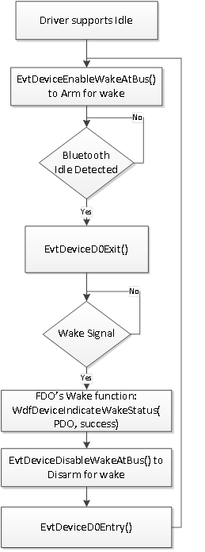

# Serial Bus Driver Layer


The serial bus driver is loaded based on a PDO created by ACPI, and can query and access the system resources, such as GPIO and I2C controllers to perform signaling control.

## <span id="Sample_Mechanism_for_Power_Control"></span><span id="sample_mechanism_for_power_control"></span><span id="SAMPLE_MECHANISM_FOR_POWER_CONTROL"></span>Sample Mechanism for Power Control


Bluetooth over USB has a built-in mechanism for inband signaling to support sleep (i.e. USB selective suspend) and wake. However, in a SoC platform, the mechanism to support power control can be more flexible (and customizable) using various controllers.

The following is a sample implementation to walk through idle and wake signaling

-   A GPIO interrupt HOST\_WAKE line - to signal by the Bluetooth controller when it needs to wake the host to service a request from a remote device (e.g. remote connection)
-   A GPIO signal line BT\_ENABLE line - set by a bus driver and is asserted when the radio is active (core stack in D0) or is de-asserted when Bluetooth core stack has detected idleness (entering into D2).

These two GPIO lines in the form of system resources will be reported to the serial bus driver during driver loading as a regular interrupt and a new GPIO signal. Its interconnection properties will be defined in the ACPI table by the system integrator and the Bluetooth chipset vendor (IHV). A serial bus driver can query and cache these dependent controller’s connection IDs in order to open and access their resources.

## <span id="Startup_to_Enable_Idle_"></span><span id="startup_to_enable_idle_"></span><span id="STARTUP_TO_ENABLE_IDLE_"></span>Startup to Enable Idle


The serial bus driver is required to perform the following tasks for supporting idle in the S0 sytem power state:

1.  Report PnP and power management capabilities; as an integrated device, its Removeable flag for the child PDO should be set to WdfFalse.
2.  Report that it can support idle to its function driver (Bluetooth core driver).
3.  Handle arm and disarm for wake, and wake signal.
4.  Receive device power state notification and synchronize I/O completion with current device power state.

**Power Management Capabilities**

The child PDO created by the bus driver sets power capabilities to enable idle state support and will be managed by the Power Manager, including settings to indicate such as:

-   Its capability to support D2 device state.
-   Its capability to enter idle and wake from D2.
-   Its mapping of system state to device states and be in sync with the Bluetooth core driver.

``` syntax
WDF_DEVICE_POWER_CAPABILITIES_INIT(&PowerCaps);
…
PowerCaps.DeviceD1 = WdfFalse;
PowerCaps.DeviceD2 = WdfTrue;
…
PowerCaps.DeviceWake = PowerDeviceD2;

PowerCaps.DeviceState[PowerSystemWorking]   = PowerDeviceD0;
PowerCaps.DeviceState[PowerSystemSleeping1] = PowerDeviceD2;
PowerCaps.DeviceState[PowerSystemSleeping2] = PowerDeviceD2;
PowerCaps.DeviceState[PowerSystemSleeping3] = PowerDeviceD2;
PowerCaps.DeviceState[PowerSystemHibernate] = PowerDeviceD2;
PowerCaps.DeviceState[PowerSystemShutdown]  = PowerDeviceD3;
..
WdfDeviceSetPowerCapabilities(ChildDevice, &PowerCaps);
```

The child PDO creates a WDF queue to receive IOCTL (I/O Control) request from the Bluetooth core driver. Such requests do come to query for the interface version and static capabilities prior to the device being started; therefore, this queue must not be power managed.

``` syntax
QueueConfig.PowerManaged = WdfFalse;

QueueConfig.EvtIoDeviceControl = PdoIoQuDeviceControl;

Status = WdfIoQueueCreate(ChildDevice, 
                          &QueueConfig, 
                          WDF_NO_OBJECT_ATTRIBUTES,
                          &Queue);
```

**Bluetooth Transport Specific Query for Idle Capability**

In addition to reporting power management capabilities (as highlighted in the prior section), the child PDO also responds to the Bluetooth core driver’s query for its capabilities to enter the idle state. In order to support idle in S0, this flag is set:

``` syntax
FdoExtension->BthXCaps.IsDeviceIdleCapable = TRUE;
```

**Arm and Disarm for Wake**

A requirement for idle support is the ability to receive a wake request from a remote Bluetooth device. The setup for such a wake request involves being armed for wake. The PDO for the Bluetooth function can register to receive callbacks to accomplish arm/disarm actions:

``` syntax
WDF_PDO_EVENT_CALLBACKS_INIT(&Callbacks);

// Receive this callback to arming the device for wake
Callbacks.EvtDeviceEnableWakeAtBus  = PdoDevEnableWakeAtBus;

// Receive this callback to disarming the device for wake
Callbacks.EvtDeviceDisableWakeAtBus = PdoDevDisableWakeAtBus;

WdfPdoInitSetEventCallbacks(DeviceInit, &Callbacks);
```

With the above mechanisms supported, the Bluetooth core driver can then enable idle and wake support.

**Device Power State Notification**

Child PDO registers to receive a callback to enter and exit D0 in order to be notified of the device power state transition. The current device power state is used to synchronize IO completion – i.e. normal IO completion should only be completed in D0.

``` syntax
    //
    // Register to receive device power state change notification
    //
    WDF_PNPPOWER_EVENT_CALLBACKS_INIT(&PnpPowerCallbacks);  

    PnpPowerCallbacks.EvtDeviceD0Entry = PdoDevD0Entry;
    PnpPowerCallbacks.EvtDeviceD0Exit  = PdoDevD0Exit; 

    
    WdfDeviceInitSetPnpPowerEventCallbacks(DeviceInit, 
                                           &PnpPowerCallbacks);
```

## <span id="Arm_for_Wake"></span><span id="arm_for_wake"></span><span id="ARM_FOR_WAKE"></span>Arm for Wake


Prior to entering idle, the serial bus driver will receive the callback [**EvtDeviceEnableWakeAtBus**](https://msdn.microsoft.com/library/windows/hardware/ff540866) to arm for wake.

The mechanism to arm for wake is vendor specific for SoC platforms and is thus outside the scope of this section. However, Windows expects that the bus driver will be prepared to receive a wake signal, and there will be a callback function (e.g. ISR) to process such a signal.

## <span id="Enter_Idle"></span><span id="enter_idle"></span><span id="ENTER_IDLE"></span>Enter Idle


The Bluetooth core driver enables a time-based idle detection mechanism. Upon satisfying idle requirements, the core driver starts to initiate the stack to enter the idle state. It invokes [**PoRequestPowerIrp**](https://msdn.microsoft.com/library/windows/hardware/ff559734) to set the power to go into D2 along with a completion function. After the bus driver has completed the IRP, this completion function is invoked. It is at this time, the transition to D2 gets completed.

While transitioning into idle state, the Bluetooth core driver will cancel all pending read requests and restart them when resuming to active. An empty power managed queue is required in order for the serial bus driver itself to enter idle.

In addition to idle timeout, the Bluetooth core driver takes into consideration many different situations before entering into the idle state, such as:

-   Wait for the completion of an HCI Command that it has just issued. Note: the Bluetooth core driver will not enter idle until its completion.
-   All connected devices are in sniff mode.

In this idle state, the multifunction controller has the option to throttle down its power by the Bluetooth function, but it must continue to supply power to maintain its volatile settings and configuration. It can then rely on its wake mechanism to wake the stack back to active (D0) state after which I/O communication can resume.

## <span id="Wake_from_Sleep"></span><span id="wake_from_sleep"></span><span id="WAKE_FROM_SLEEP"></span>Wake from Sleep


While the Bluetooth function has been paired with one or more devices and is in the sleep state, its radio is periodically scanning for requests from its paired devices. When a paired device initiates a request and gets received by the Bluetooth radio, the process to resume to active state begins. Once the device stack has resumed to active (D0), the drivers can begin servicing this remote request.

This remote request is processed by the wake-signal processing function in the bus driver as discussed in the last section. This wake-signal processing function should ensure that the PDO’s device state is indeed in D2 state and then invoke [**WdfDeviceIndicateWakeStatus**](https://msdn.microsoft.com/library/windows/hardware/ff546025) (PDO, success status) to notify KMDF to complete the W/W (Wait Wake) IRP. It is at this time when the completion function of this W/W IRP can be invoked and get processed by its initiator - the Bluetooth core driver and the power policy owner.

The completion of the W/W IRP triggers the Bluetooth core driver to initiate a transition to D0. It requests a [**PoRequestPowerIrp**](https://msdn.microsoft.com/library/windows/hardware/ff559734) with a completion function to set the device power state to D0.

Prior to resuming to the active D0 state, the serial bus driver may receive a notification [**EvtDeviceDisableWakeAtBus**](https://msdn.microsoft.com/library/windows/hardware/ff540858) to disable wake – this completes the process to reverse what [**EvtDeviceEnableWakeAtBus**](https://msdn.microsoft.com/library/windows/hardware/ff540866) did earlier.

After Bluetooth driver stack resumes to D0, the serial bus driver can then complete the remote device request.

Some events need to be synchronized in the serial bus driver, such as:

-   While entering D2, there should already be a pending W/W Irp. This is when arming for wake to receive the wake signal should take place instead of when receiving a W/W Irp. The wake signal is only actionable while in D2 state.
-   If data is arriving (to form a packet) while entering D2 and there is no pending read request in the queue, the bus driver can cache the incoming data and enter D2. It can then complete the W/W Irp (with success) to wake the system back to D0 to re-pend and complete the read request.
-   Bthport cancels all pending read requests and waits for their completion before entering D2. At the same time, the serial bus driver may have received a complete HCI packet and has de-queued a read request to return this HCI packet. The serial bus driver should complete this request, and will then be initiated to enter D2.

An action initiated by a Bluetooth application on the host side can also wake the stack from idle. In this case, only the device power state transition is required, and this action is initiated by the Bluetooth core driver.

In order to reduce power up time, the callback functions (e.g. the EnterD0 and wake) in the serial bus driver should not be marked pageable.

## <span id="A_flowchart_to_express_the__idle_wake__arm_disarm__and_device_power_state_transitions"></span><span id="a_flowchart_to_express_the__idle_wake__arm_disarm__and_device_power_state_transitions"></span><span id="A_FLOWCHART_TO_EXPRESS_THE__IDLE_WAKE__ARM_DISARM__AND_DEVICE_POWER_STATE_TRANSITIONS"></span>A flowchart to express the idle/wake, arm/disarm, and device power state transitions


The following is a simplified flowchart to illustrate a typical sequence and logic for idle and wake support. This logic spans many drivers and threads, and there are exceptions as well as corner cases that are not expressed (e.g. an application on the host side can also wake the stack from idle state).



## <span id="Bus_Driver_s_own_Power_Management"></span><span id="bus_driver_s_own_power_management"></span><span id="BUS_DRIVER_S_OWN_POWER_MANAGEMENT"></span>Bus Driver’s own Power Management


The serial bus driver is a function driver (FD) and the power policy owner (PPO) of its layer. Thus, it needs to handle its own power management. After all of its children have entered lower device power states, it can then enter into a lower power state itself. When it’s ready to enter this lower power state, it can cancel any pending I/O requests to the UART controller driver – this will allow the UART driver to also enter a lower power state. However, the UART driver should persist and restore its device settings (including the baud rate) when its power state is later resumed to active.

 

 


