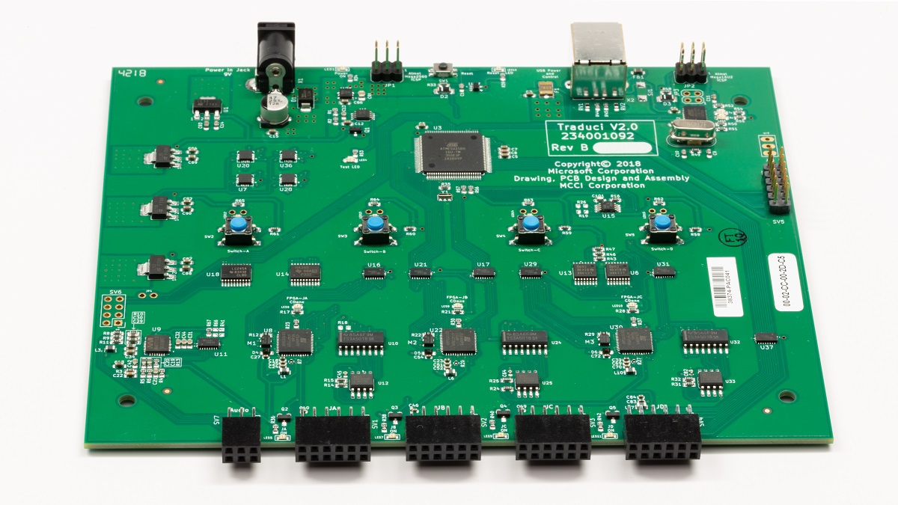

# Microsoft Bluetooth Test Platform (BTP)

The Bluetooth Test Platform (BTP) package is designed to be used for automated testing of bluetooth hardware & software. It can be used to exercise both host and peripheral radios as well as the OS stack. The Bluetooth Test Platform (BTP) is the software component of Microsoft's latest automated Bluetooth testing. The Traduci is the hardware platform that the BTP runs on and supports peripheral radios to be plugged into it. The package consists of software tests, a firmware package, a provisioning tool  the Traduci board and a set of peripheral radios used for testing basic functionality.

As this time the only supported radio is the RN42. Purchasing information for the Traduci, RN42 and future radios can be found below.

### Devices ###

Traduci board
[**MCCI**](https://mcci.com/usb/dev-tools/model-2411/)

RN42 Radio Sled
[**Digilent**](https://store.digilentinc.com/pmod-bt2-bluetooth-interface/)

### Setting up Traduci Hardware ###

Using the supplied USB A-to-B cable plug the Traduci into a USB port on the system under test (SUT). Performance is best if the USB A port on the PC is directly powered & not on an internal hub. Orient the Traduci so that LEDs and buttons are face up. Next orient the RN42 radio sled such that the printed label on the radio containing the MAC address is face up. Keeping this orientation, plug the RN42 radio in the 12 Pin port labeled JB.

#### Getting TAEF ####

Follow the instructions to download TAEF from [**docs.microsoft.com**](https://docs.microsoft.com/en-us/windows-hardware/drivers/taef/getting-started)

To enable the use of the scripts for running tests, copy the TAEF binaries to:

- `c:\Taef`

#### Getting BTP binaries ####

Download the test binaries from link
  
Extract the files from the zip file to:
- `c:\BTP`

### Setting up the System ###

- Disable secure boot (if enabled) in order to enable test signing. From an elevated command line on the SUT, run `setup-test.bat` to enable test signing and to reboot the machine.

## Test Scripts ##

### Pairing Script ###

Once the system has rebooted, check that the green power indicator & the 3 orange LEDs on the Traduci are on. Confirm that the SUT's Bluetooth Radio is powered on. Then from an elevated command prompt, run `test-pair.bat` to run the pairing tests with the RN42.  

This script will check the firmware version to ensure that the latest version is present on the Traduci. If the version in the package is newer, the script will update it. Once the firmware has been checked, the pairing test will run. The red LED next to the 12 pin adapter will turn on once the command from the test to power the radio has been sent. This LED will be turned off at the end of every test. If it is on at the start of the next test due the previous test failing, we will attempt to power it down and power it back on to return it to a known state. If the power cycle fails, the test will fail due to the radio being in an unknown state.

### HID Script ##
Once the system has rebooted, check that the green power indicator & the 3 orange LEDs on the Traduci are on. Confirm that the SUT's Bluetooth Radio is powered on. Then from an elevated command prompt, run `test-hid.bat` to run the HID tests with the RN42.  

This script will check the firmware version to ensure that the latest version is present on the Traduci. If the version in the package is newer, the script will update it. Once the firmware has been checked, the HID test will run. The red LED next to the 12 pin adapter will turn on once the command from the test to power the radio has been sent. This LED will be turned off at the end of every test. If it is on at the start of the next test due the previous test failing, we will attempt to power it down and power it back on to return it to a known state. If the power cycle fails, the test will fail due to the radio being in an unknown state.

### Capturing Logs ###

To capture the Bluetooth logs, follow the instructions at https://aka.ms/BluetoothTracing.

### Support ###

Questions and comments about the tests should be sent to BTPSupport@microsoft.com.

#### Known issues ####

- Power: If the device is plugged into a non-powered hub or VCC is not able to supply 5V intermittent failures may be seen. Please remedy by using a powered USB hub or use a 9V AC-DC Barrel adapter.

- Stress tests: If the test is run in a tight loop there an issue where the radios will not have finished disconnecting after the pairing test reports success before the next test attempts to pair resulting in a failure.