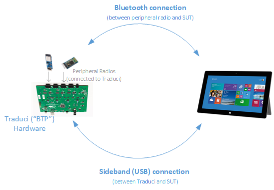
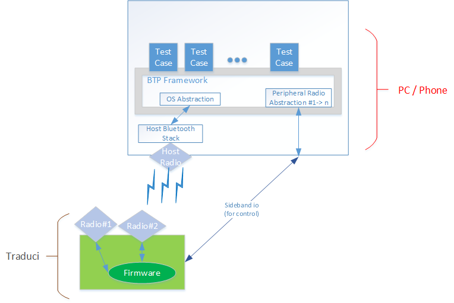

# Bluetooth Test Platform (BTP) Overview

The Bluetooth Test Platform (BTP) is designed for automating testing of Bluetooth hardware, drivers, and software. BTP can be used to exercise Bluetooth radios both in the host (PC) and peripheral devices, and is intended to be an extensible framework.

- Hardware for the BTP is detailed in [Supported BTP Hardware](testing-BTP-hw.md).
- Supported tests and and testing processes are detailed in [BTP Tests](testing-BTP-Tests.md).

 BTP consists of Traduci hardware platform combined with supporting software from Microsoft. The Traduci hardware platform supports power management and sideband control of peripheral devices connected to it, while the software package consists of tests, a firmware package, and a provisioning tool.

