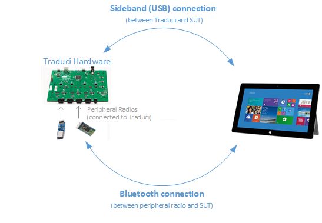

# Bluetooth Test Platform (BTP)

The **B**luetooth **T**est **P**latform (BTP) is designed for automating testing of Bluetooth hardware, drivers, and software. BTP can be used to exercise Bluetooth radios in the host (inside the PC) and peripheral radios. BTP is intended to be an extensible framework. Additional guidance can be found in the following documents:

- Adding support for new peripheral radios or customizing BTP hardware is covered in [supported BTP hardware](testing-BTP-hw.md).
- Customizing or adding new tests is documented in [BTP tests](testing-BTP-Tests.md).

The Bluetooth Test Platform (BTP) is the software component of Microsoft's latest automated Bluetooth testing. The Traduci is a hardware platform used by BTP that supports power management and sideband control of peripheral radios plugged into it. The package consists of software tests, a firmware package, a provisioning tool, the Traduci board, and a set of peripheral radios used for testing basic functionality.

