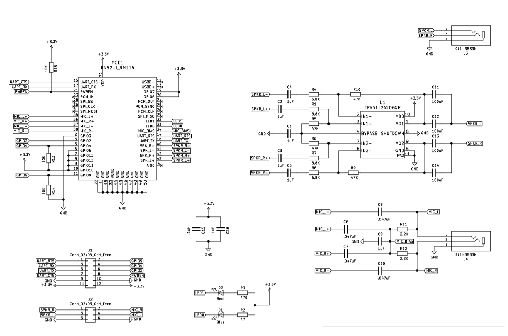

# BTP Suported Hardware

The Bluetooth Test Platform (BTP) requires external Bluetooth radios to simulate peripheral is the software component of Microsoft's latest automated Bluetooth testing. The Traduci is the hardware platform that the BTP runs on and supports peripheral radios to be plugged into it. The package consists of software tests, a firmware package, a provisioning tool  the Traduci board and a set of peripheral radios used for testing basic functionality.

At this time the only supported radio is the RN42. Purchasing information for the Traduci, RN42 and future radios can be found below.

# Devices #

## Audio Sled ##
[**Digilent**](https://store.digilentinc.com/pmod-bt2-bluetooth-interface/)

The Traduci requires a 12-pin connector to communicate with any radio module. The Audio Sled takes the RN52 module and breaks out the necessary pins to a 12 pin layout. These sleds are purchasable via Digilent. Click the link above for more purchasing information. The schematic is available below.

### Audio Sled Schematic ###

### RN52 Module ###
[**MicroChip**](https://www.microchip.com/wwwproducts/en/RN52)

- UART data connection with AT commands to configure software
- Supports SPP, A2DP, HFP/HSP, and AVRCP profiles
- Version 3.0 audio module
- Fully certified Class 2 BR Bluetooth 2.1+EDR
- Small form factor, low power, surface mount module

