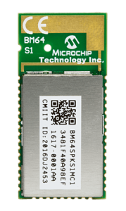

# Audio Capable Peripheral Radios

The Bluetooth Test Platform (BTP) Traduci board requires a 12-pin connector to communicate with any radio module. The audio radios and breakouts listed here take a radio module and break out the necessary pins to the required 12-pin layout.

| Radio | Capabilities | Parameter |
| --- | --- | --- |
| RN52 | Basic Rate (BR) radio | rn52 (ex. RunPairingTests.bat rn52) |
| BM64 | Dual Mode radio | bm64 (ex. RunPairingTests.bat bm64) |

## Audio Sled (RN52 radio)

The RN52 is a Basic Rate (BR) radio from Roving Networks capable of behaving as an Audio peripheral such as a speaker or headset). It is currently planned to be supported upcoming BTP audio tests. More information can be found via the RN52 page from [**MicroChip**](https://www.microchip.com/wwwproducts/en/RN52). This sled breaks out the audio out data from the radio and routes it to an audio codec and audio processing FPGA on the Traduci in order to aid with validation.

## Acquire Hardware 

MCCC sells a PMOD version of the RN52 Audio Sled [here](https://store.mcci.com/collections/frontpage/products/rn52-sled).

### RN52 Radio

### RN52 Radio on BTP-compatible sled

> [!NOTE]
> The RN52 radio can **only** be plugged into the Traduci board 12-pin port labeled 'JA'.

- UART data connection with AT commands to configure software
- Supports SPP, A2DP, HFP, and AVRCP profiles
- Version 3.0 audio module
- Fully certified Class 2 BR Bluetooth 2.1+EDR
- Small form factor, low power, surface mount module

## BM-64-EVB-C2 (BM64 Radio)

The BM64 is a dual-mode Bluetooth v5.0 radio designed for use in headsets, speaker, or multi-speaker peripherals.
More information can be found via the BM64 page from [**Microchip**](https://www.microchip.com/wwwproducts/en/BM64).
The BM-64-EVB allows the BM64 to be utilized as a stand-alone device, allowing for connection to a test machine without the need for a Traduci.
More information can be found via the BM-64-EVB page from [**Microchip**](https://www.microchip.com/DevelopmentTools/ProductDetails/PartNO/BM-64-EVB-C2).

> [!NOTE]
> The BM-64-EVB development occurred with the Class 2 stereo audio module version (BM-64-EVB-C2) but should be compatible with the Class 1 audio module (BM-64-EVB-C1).

### BM64 Radio

### BM64 Radio on BM64 Evaluation Board

### Features

- UART data connection with custom packet structure
- Supports SPP, A2DP, HFP, and AVRCP profiles
- Bluetooth v5.0
- Supports Bluetooth dual-mode (BDR/EDR/BLE)
- Supports AAC and SBC codecs
- Heavily featured, surface mount module
- Using BM-64-EVB does not require a Traduci
