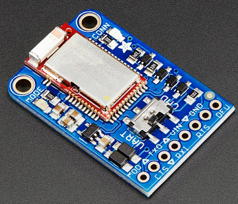

# Bluefruit LE UART Friend (nRF51822)

## Overview

The nRF51 is a Low Energy (LE) radio from Nordic Semiconductor capable of behaving as a HID peripheral (like a keyboard or mouse) among other things. More information can be found at [Adafruit](https://www.adafruit.com/product/2479) and through the [Nordic Semiconductor](https://www.nordicsemi.com/Products/Low-power-short-range-wireless/nRF51822) nRF51822 reference.

| Device Name | Parameter | Usage Example |
| --- | --- | --- |
| Bluefruit Friend | bluefruit | RunPairingTests.bat bluefruit |

## Suported Tests
- [Pairing tests](testing-BTP-tests-pairing.md)
- [Human Interface Device (HID) tests](testing-BTP-tests-hid.md) 
- [Battery tests](testing-BTP-tests-battery.md)
- [Audio & HID tests](testing-BTP-tests-audio-hid.md) (as a HID device)

## Hardware

The Bluefruit LE UART Friend can be purchased via [MCCI](https://store.mcci.com/products/bluefruit-radio-sled-for-btp). It can also be purchased via [Adafruit](https://www.adafruit.com/product/2479) and adapted to work with the Traduci.

## Getting Started

1. If purchased from MCCI, the board will arrive with a 12 pin pmod adapter already attached and ready to be programmed. If the device was purchased via Adafruit you will need to make an adapter for the radio to attach to the Traduci. Please conntact btpsupport@microsoft.com for further help at this time.
2. Install the [Bluefruit Connect app](https://learn.adafruit.com/bluefruit-le-connect) by Adafruit on an Android device or iPhone.
3. Move the switch on the Bluefruit Friend device to UART mode for firmware update and then plug the Bluefruit into the Bluetooth Test Platform Traduci board port labeled 'JC'. & power it on from a cmd prompt using TraduciCMD.exe: `TraduciCmd.exe -power 3 3`. The red led on port JC should light up, as well as the blue led on the Bluefruit Friend device.
4. Open the app and select your device. Then wait for a prompt to update your device & update the device. Do not power off either device until 100% complete. 
5. Power off the device using TraduciCMD.exe: `TraduciCmd.exe -power 3 0` and then move the switch on the Bluefruit Friend device back to CMD mode. 

> [!NOTE]
> The Bluefruit device can **only** be plugged into Bluetooth Test Platform Traduci board port labeled 'JC'.

## Fetures 
- UART data connection
- Supports HID and other GATT based services
- Fully certified Low Energy Bluetooth 4.1 radio
- Configurable ATT database
- Small form factor, low power, surface mount module

## Trouble shooting
- No prompt to update OR blue light indicating pairing does not turn on during test passes after initial update 
    - If does not immediately prompt for Update you will have to factory reset the Radio.  
    - Place radio back in UART mode via switch.  
    - Connect Pin 5 on the 12 Pin adapter to GND 
    - Connect Pin 6 on the 12 Pin adapter to 3.3V PWR. You can use the traduci for this process only connecting Pins 5 & 6 & the power commands from the setupabove, but do not plug the radio into the Traduci directly.
    - Once radio is powered on, connect a jumper wire from Pin 11 (GND) on the 12 pin adapter to Pin 8 (DFU) on the Bluefruit board. Male to female jumper wire is easiest to use. Hold the connection for 4 (ish) seconds. The red LED should light up, then the blue LED and then  they should flash back and forth numerous times.  Once the blue LED stops flashing  break the connection. If you maintain the connection, the system will continue to reset the chip just pull the jumper once the red is solid state and you no longer have a disco light. 
    Follow from step 4 above.  

If still not working, email btpsupport@microsoft.com 