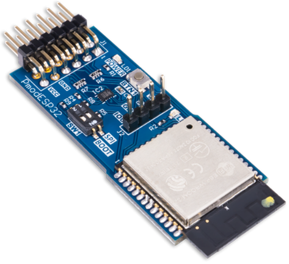
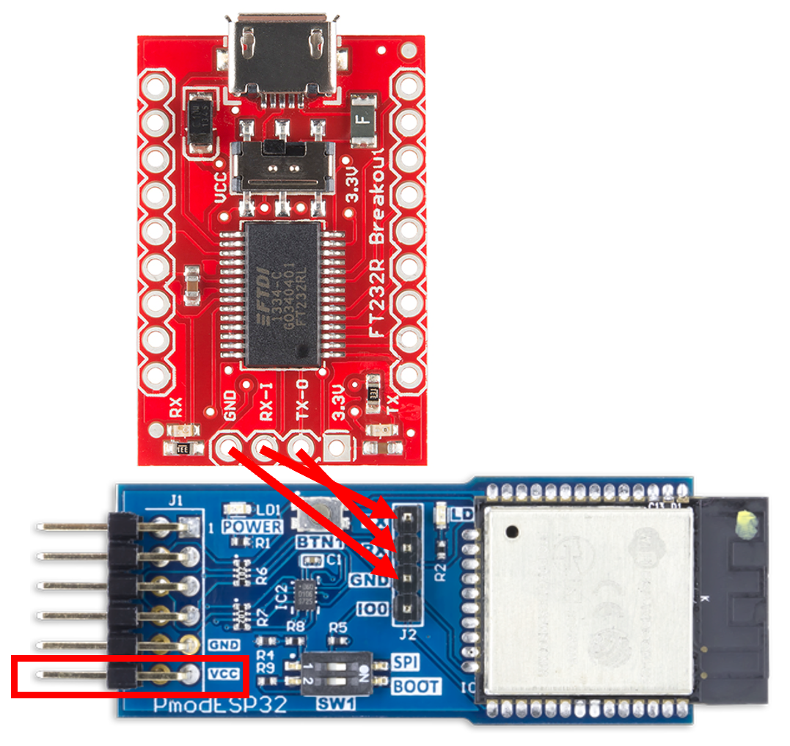
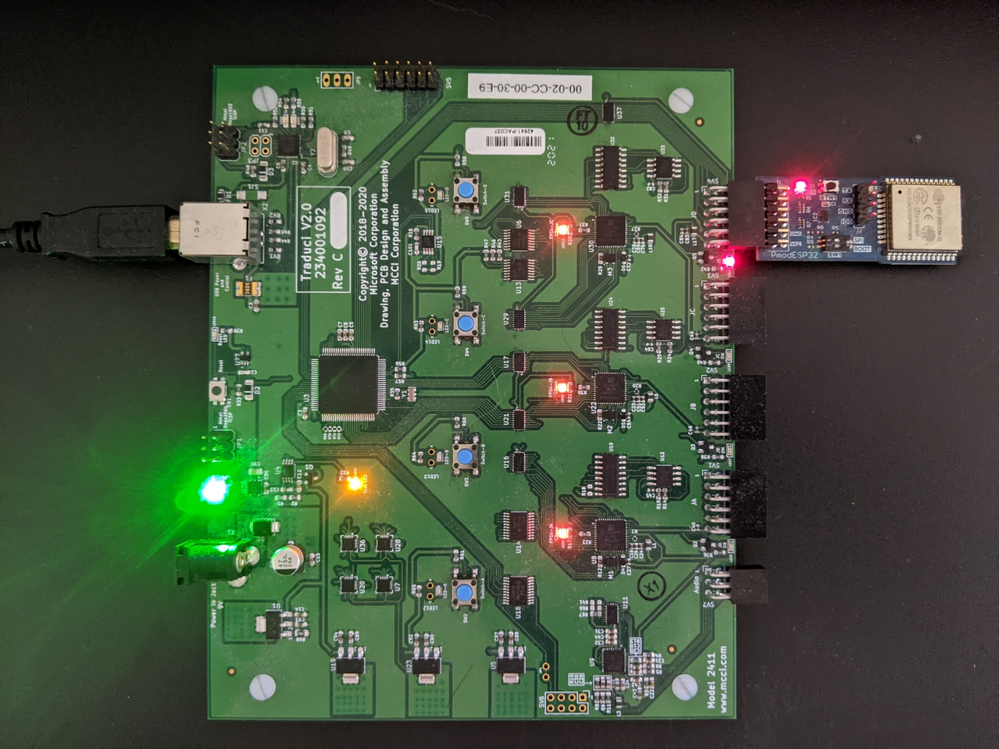
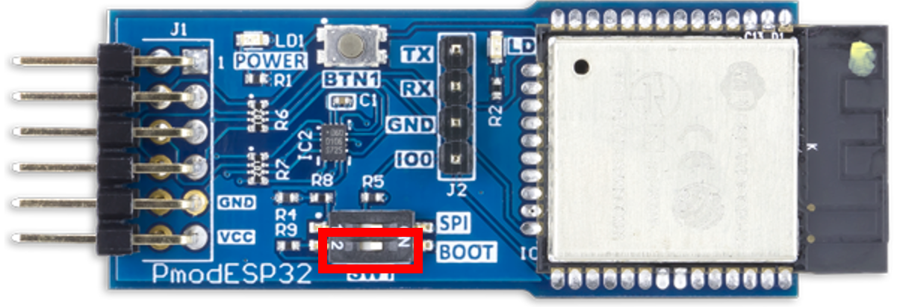
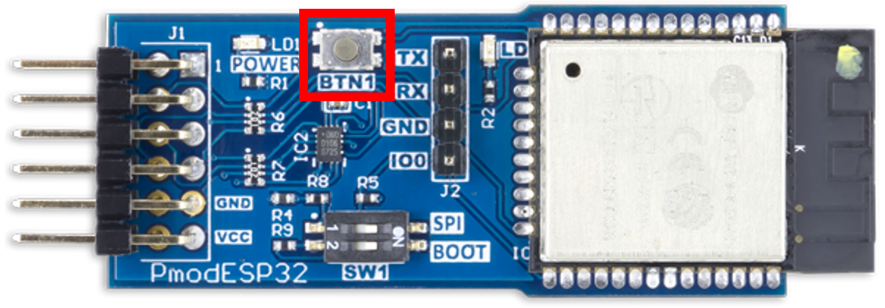

# Model 2433 ESP32

## Overview

The Model 2433 ESP32 is a custom ESP32 board with a 12 pin adapter fit for the Traduci that exercises WiFi connections for BTP. For more about the benefits of the ESP32, refer to the [WiFi Capable Radios](testing-BTP-hw-wifi.md).
  
This section will cover how to set up and use a Model 2433 ESP32 for testing with BTP.

# Uploading Firmware to the ESP32 through Traduci CMD

If the ESP32 already has BTP firmware installed, updates can be delivered through the Traduci by plugging the ESP32 into port JD and running:
- `TraduciCmd.exe -updateesp32firmware`

This flashing process will take longer than manually flashing the firmware, but does not require the use of a UART to USB Serial board. If this is the first time the ESP32 is receiving BTP firmware, follow the instructions below.

# Uploading Firmware to the ESP32 manually

## Step 1. Acquire Hardware 

Digilent sells a PMOD version of the ESP32 [here](https://store.digilentinc.com/pmod-esp32-wireless-communication-module/).

MCCC sells a PMOD version of the ESP32 [here](https://store.mcci.com/products/esp32-sled/).

## Step 2. Set up Arduino-CLI
Get the latest version of Arduino-CLI [here](https://arduino.github.io/arduino-cli/latest/installation/#download)

Run the following commands to aquire ESP32 board packages
- `arduino-cli config init`
- `arduino-cli core update-index`
- `arduino-cli core update-index --additional-urls https://dl.espressif.com/dl/package_esp32_index.json`
- `arduino-cli core install esp32:esp32 --additional-urls https://dl.espressif.com/dl/package_esp32_index.json`

## Step 3. Configure the Hardware 

Using a UART to USB Serial board connected to the host machine, connect RX to the ESP32 TX, TX to the ESP32 RX, and GND to the ESP32 GND.  

Use the Traduci to power the ESP32 by powering on a Traduci port (Send the command `TraduciCmd.exe -power 4 3`) while the ESP32 sled is connected to port JD. 

Run `arduino-cli board list` to detect which COM port is associated with the UART to USB Serial board.

Once everything is wired correctly, and the COM port is identified, switch the ESP32 into boot mode by moving SW1 to the ON position.

## Step 4. Upload the Firmware
Run `arduino-cli upload -p <COM port from previous step here> --fqbn esp32:esp32:esp32 --input-file C:\BTP\<version>\DeviceFirmware\WiFi-ESP32.ino.bin`

Wait for “Connecting ….____....” to show up on the terminal.

Press BTN1 to reset the board.

Once the upload is done, switch boot mode off by moving SW1 to the OFF position.

Press BTN1 again to reset the board and start the program.

