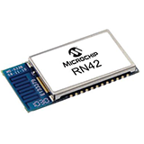
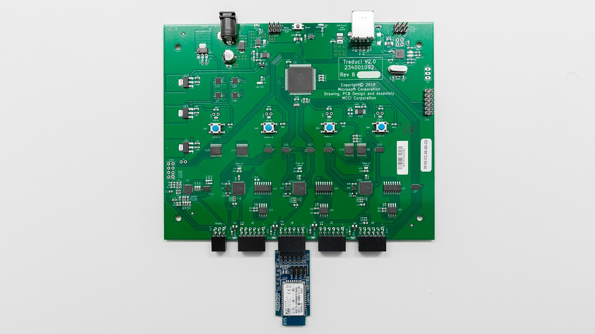

# HID Capable Peripheral Devices

The Bluetooth Test Platform (BTP) Traduci requires a 12-pin connector to communicate with any device module. The HID devices and breakouts listed here take a radio module and break out the necessary pins to a 12-pin layout.

| Device | Capabilities | Parameter |
| --- | --- | --- |
| RN42 | Basic Rate (BR) radio | rn42 (ex. RunPairingTests.bat rn42) |
| Bluefruit | Low Energy (LE) radio | bluefruit (ex. RunPairingTests.bat bluefruit) |

## PMOD BT2 (RN42 device)

The RN42 is a Basic Rate (BR) radio from Roving Networks capable of behaving as a HID peripheral such as a keyboard or mouse. It is currently supported by the BTP pairing and HID tests. More info can be found at [Digilent](https://store.digilentinc.com/pmod-bt2-bluetooth-interface/) and through the [**MicroChip**](https://www.microchip.com/wwwproducts/en/RN42) RN42 reference.

The Pmod BT2 device can be purchased via [Digilent](https://store.digilentinc.com/pmod-bt2-bluetooth-interface/)

### RN42 Device

### Bluetooth Test Platform Traduci Board and Diligent sled

> [!NOTE]
> The RN42 device can **only** be plugged into Bluetooth Test Platform Traduci board port labeled 'JB'.

- UART data connection
- Supports HID profile and Bluetooth data links
- Fully certified Class 2 BR Bluetooth 2.1+
- Small form factor, low power, surface mount module

## Bluefruit LE UART Friend (nRF51 device)

The nRF51 is a Low Energy (LE) radio from Nordic Semiconductor capable of behaving as a HID peripheral (like a keyboard or mouse) among other things. It is currently supported by the BTP pairing and HID tests. More information can be found at [Adafruit](https://www.adafruit.com/product/2479) and through the [Nordic Semiconductor](https://www.nordicsemi.com/Products/Low-power-short-range-wireless/nRF51822) nRF51822 reference.

The Bluefruit LE UART Friend can be purchased via [Adafruit](https://www.adafruit.com/product/2479)

> [!NOTE]
> The Bluefruit device can **only** be plugged into Bluetooth Test Platform Traduci board port labeled 'JC'.

- UART data connection
- Supports HID and other GATT based services
- Fully certified Low Energy Bluetooth 4.1 radio
- Configurable ATT database
- Small form factor, low power, surface mount module
