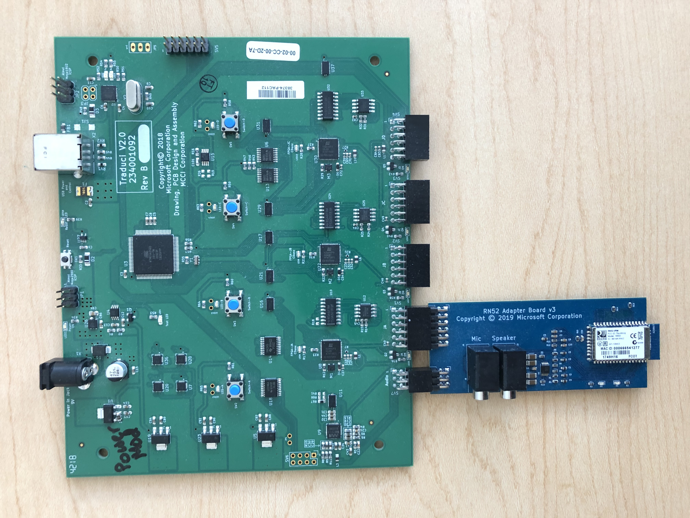

# RN52 device

## Overview

The RN52 is a Basic Rate (BR) radio from Roving Networks capable of behaving as an Audio peripheral such as a speaker or headset). It is currently planned to be supported upcoming BTP audio tests. More information can be found via the RN52 page from [**MicroChip**](https://www.microchip.com/wwwproducts/en/RN52). This sled breaks out the audio out data from the radio and routes it to an audio codec and audio processing FPGA on the Traduci in order to aid with validation.

| Device | Capabilities | Parameter |
| --- | --- | --- |
| RN52 | Basic Rate (BR) radio | rn52 (ex. RunPairingTests.bat rn52) |

### RN52 Device

### RN52 Device on BTP-compatible sled

> [!NOTE]
> The RN52 device can **only** be plugged into the Traduci board 12-pin port labeled 'JA'.

- UART data connection with AT commands to configure software
- Supports SPP, A2DP, HFP, and AVRCP profiles
- Version 3.0 audio module
- Fully certified Class 2 BR Bluetooth 2.1+EDR
- Small form factor, low power, surface mount module
