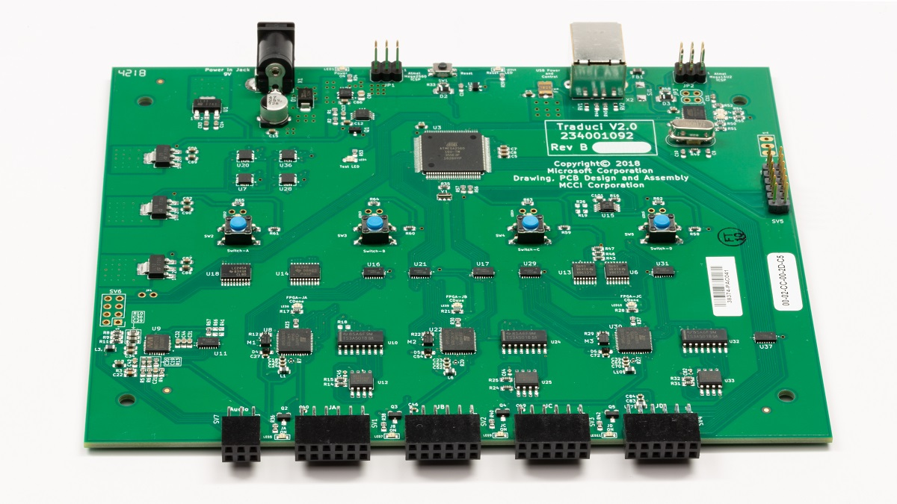

# Bluetooth Testing Platform Supported Hardware

The Bluetooth Test Platform (BTP) makes use of specialized hardware to make Bluetooth testing easier. The Traduci board is used to more easily allow software on a host device (like a PC) to communicate with external radios over a sideband.

For example, an LE pairing test requires a peripheral radio to be powered on, have certain IO capabilities, and be advertising as connectable/discoverable before it can be paired to. The peripheral radio has well defined commands that can make this happen, so the BTP software on the host sends these commands over USB to the Traduci which in turn routes it to the appropriate radio. After successful completion of the commands, the BTP software would then proceed with the test by requesting that the host pair to the peripheral radio which is now ready to accept the pairing.

In the above scenario the Traduci makes several things simpler: It is able to provide and cut-off power with the correct voltage to the radios, it can route different commands to different radios, and it will mediate this communication through the correct protocols and baud rate.

Additionally, it is important to note that BTP tests do not have a tight dependency on the Traduci. If other external hardware is needed for a test, the BTP is designed to allow easy extensibility to support that scenario.

## Traduci board

The Traduci board is provided by [MCCI](https://mcci.com/usb/dev-tools/model-2411/)

- 4 12-pin ports to support 4 radios simultaneously
- Able to route data to and from multiple radios simultaneously
- 3 FPGAs connected to ports 1, 2, and 3 respectively
- Supports audio testing via the integrated audio codec
- Unlabled pins can easily be statically assigned to HIGH or LOW depending on the needs of the radio plugged into the port
- The Traduci does not currently support hardware handshaking using CTS and RTS

## Supported radios

More information about officially supported radios can be reviewed at the following pages:

- [HID Capable Peripheral Radios](testing-BTP-hw-hid.md)
- [Audio Capable Peripheral Radios](testing-BTP-hw-audio.md)
- [BM-64-EVB board](testing-BTP-hw-bm64.md)
