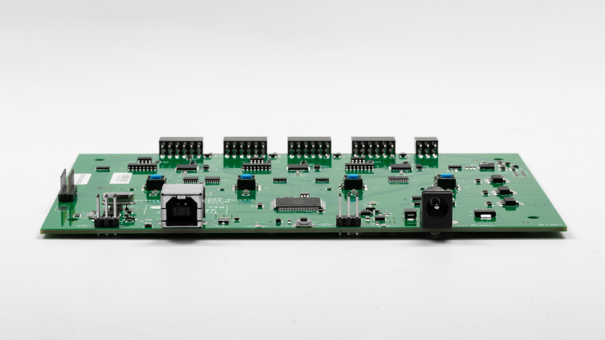
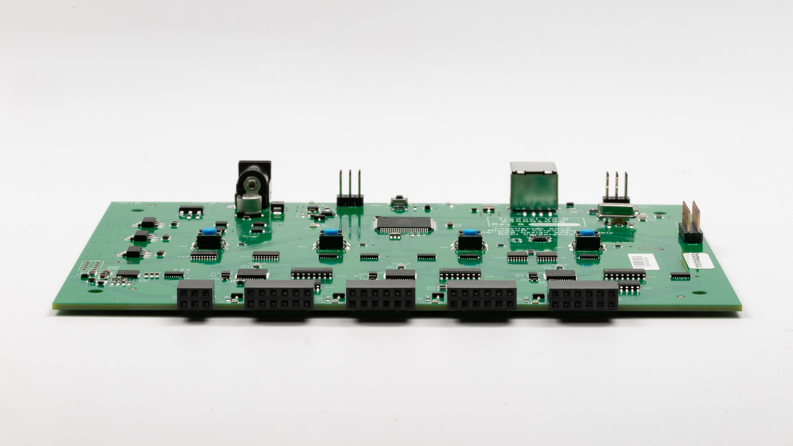

# Setting up BTP
## Hardware setup 
### Connecting Traduci to the PC 
Using the supplied USB A-to-B cable plug the Traduci into a USB port on the system under test (SUT). Performance is best if the Traduci is plgged directly into an A port on the PC and the Traduci is powered through the barrel connector to the right of the USB connector.  Do not connect the Traduci to a USB hub.

### Connecting peripherals to the Traduci 
The Traduci has four 12 pin ports (labeled JA, JB, JC, JD) that used for periphals.

To plug a peruipheral radio into a port on the Tradui, orient the Traduci so that LEDs and buttons are face up. Next orient the RN42 radio sled such that the printed label on the radio containing the MAC address is face up. Keeping this orientation, plug the RN42 radio in the 12 Pin port labeled JB.

## Software setup 

#### Getting TAEF ####

Follow the instructions to download TAEF from [**docs.microsoft.com**](https://docs.microsoft.com/en-us/windows-hardware/drivers/taef/getting-started)

To enable the use of the scripts for running tests, copy the TAEF binaries to:

- `c:\Taef`

#### Getting BTP binaries ####

Download the test binaries from link
  
Extract the files from the zip file to:
- `c:\BTP`

### Setting up the System ###

- Disable secure boot (if enabled) in order to enable test signing. From an elevated command line on the SUT, run `setup-test.bat` to enable test signing and to reboot the machine.

#### Known issues ####

- Power: If the device is plugged into a non-powered hub or VCC is not able to supply 5V intermittent failures may be seen. Please remedy by using a powered USB hub or use a 9V AC-DC Barrel adapter.
