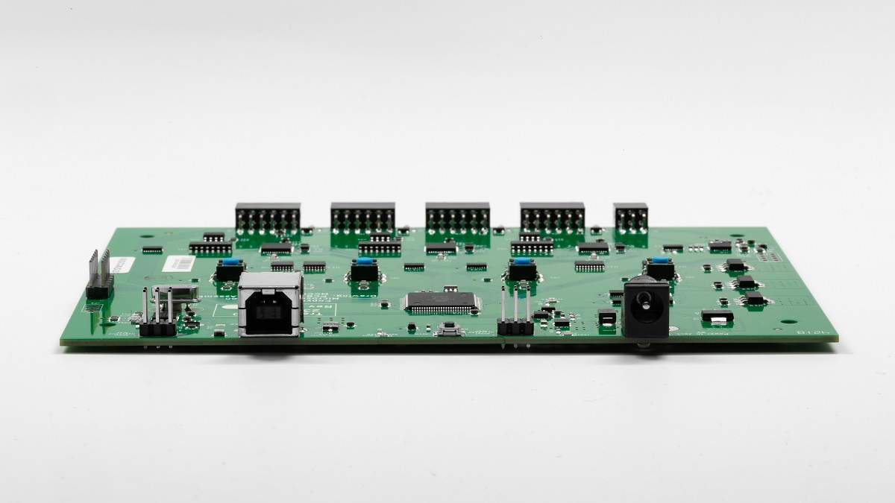

# Setting up the Bluetooth Test Platform (BTP)

## Hardware setup

### Connecting Traduci to the PC

Using the supplied USB A-to-B cable, plug the Traduci into a USB port on the system under test (SUT). Performance is best if the Traduci is plugged directly into an A port on the PC and the Traduci is powered by a [9v, 2A power adapter](https://www.digikey.com/product-detail/en/qualtek/QFWB-18-9-US01/Q1181-ND/8260129) through the barrel connector to the right of the USB connector. Do not connect the Traduci to a USB hub.

### Connecting peripherals to the Traduci

The Traduci has four 12 pin ports (labeled JA, JB, JC, JD) used for test peripherals.

To plug a peripheral radio into a port on the Traduci, orient the Traduci so that LEDs and buttons are face up. Next orient the radio sled such that the printed label on the radio containing the MAC address and any switches are face up. Keeping this orientation, plug the peripheral radio in the appropriate 12 pin port.

> [!NOTE]
> Some peripherals may only plug into certain ports.  Please refer to the [supported hardware page](testing-BTP-hw.md) for more information.

## Software Setup

1. Download the [BTP software package](testing-BTP-software-package.md), which will install all required files to the `C:\BTP` directory.

2. Ensure [Secure boot](/windows-hardware/design/device-experiences/oem-secure-boot) **disabled**.

3. Ensure BitLocker is **disabled**.

4. Ensure the Traduci board is plugged into the SUT.

5. From an elevated command line on the SUT, navigate to the `C:\BTP` directory and run `ConfigureMachineForBTP.bat` to configure the test machine. A reboot may be required.

6. Refer to [BTP tests](testing-BTP-Tests.md) for running test scripts in the package.

## Known issues

- Power: Intermittent failures may be seen if the device is plugged into a non-powered hub or VCC is not able to supply 5V. In these cases use a powered USB hub or use a 9V AC-DC barrel adapter.
